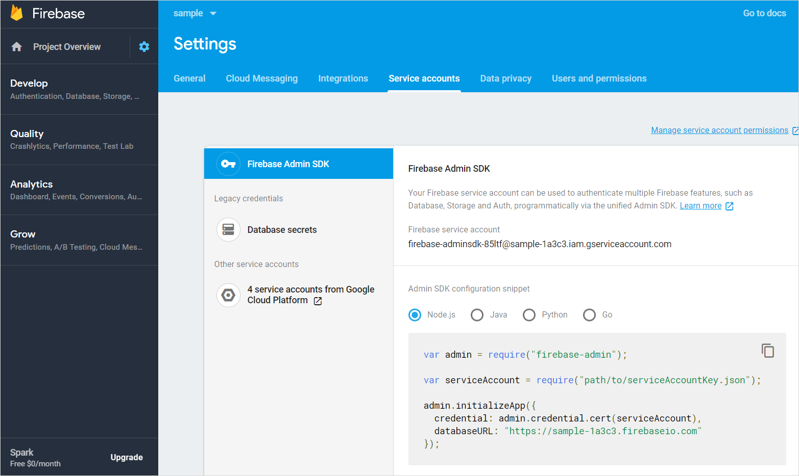

## 1 Introduction

You can use Google's Firebase Cloud Messaging (FCM) service to send push notifications to both Android and iOS devices. To send push notifications using FCM from the Push Notifications Connector module, you must set up a Firebase account with FCM enabled. This how-to will teach you how to register for FCM and configure the service in your app.

## 2 Prerequisites

Before starting this how-to, make sure you have completed the following prerequisites:

* Have a Firebase account (https://firebase.google.com)

## 3 Setting up a Firebase Project

There are two possible scenarios: you can create a new FCM project, or you can update your existing GCM project to FCM. Both scenarios are described below.

### 3.1 Migrating a GCM project to FCM

To prevent the degraded reliability of push notifications delivery, you should migrate existing GCM projects to FCM and upgrade credentials if needed.

#### 3.1.1 Sign into the Developer's Console

Open the [Firebase developer's console](https://console.firebase.google.com/) and sign in with your Google ID.

#### 3.1.2 Importing the Project

To import your project, do the following:

1. In the Firebase console, select **Import Google Project**. 
1.  Select your GCM project from the list of existing projects, select a region, and click **Add Firebase**:

	{}{}

With that done, continue with [Configuring APNs Credentials](#configuring) below.

### 3.2 Creating a New FCM Project

#### 3.2.1 Signing into the Developers Console

Open up the [Firebase developers console](https://console.firebase.google.com/) and sign in with your Google ID.

#### 3.2.2 Creating the Project

To create a project, do the following:

1. Click **Create new project**.
1. Fill in your application's project name and region. 
1.  Click **Create**"

	{}{}

## 4 Adding an Android or iOS App {#native-apps}

Before you add an app to FCM, you must retrieve your app's bundle ID. Its location depends on your type of your mobile app.

For a native mobile app, your bundle ID will be what you specify for the **App identifier** in the NBUI. You can find this ID later in your generated GitHub repo:

* For Android, open *android/app/build.gradle* and consult **applicationId** to find your ID 
* For iOS, open *ios/Config/config.xcconfig* and consult **BUNDLE_IDENTIFIER** to find your ID

Click **Deploy**, then **Mobile App**. Your ID is listed as **App Identifier**:

{}{}

Do the following to add your app to FCM:

1.  Click the **Project Overview** cogwheel and select **Project settings**:

	{}{}

1.  Go to the **General** tab and click **Add app**:

	{}{}

1.  Select Android and, fill in the bundle_id, and skip the rest of the steps: 

	{}{}

Bundle ID must be matching with your package ID. Make sure to repeat this step for iOS as well.

## 5 Configuring APNs Credentials (Optional) {#configuring}

If you wish to send push notifications to iOS devices through FCM, you will need to configure your APNs credentials:

1. Click in the upper-left corner of the screen and select **Project settings**.
1.  Navigate to the **Cloud messaging** tab:

	{}{}

1. On this tab, upload either your APNs key or your APNs certificate(s) as configured in your [Apple Developer account](https://developer.apple.com).

## 6 Setting Up a Service Account {#setting-up-a-service-account}

In the upper-left corner of the screen, click the cogwheel and select **Project settings**. Then navigate to the **Service accounts** tab.

{}{}

On this page, press **Generate new private key**. Store the resulting file in a secure location. You will use this file when configuring FCM in the back-end of your Mendix application.

The file you just created gives API access to all available Firebase services for your app. If you want a more restrictive service account, click **Manage all service accounts** in the top-right of the screen, then create a service account that is restricted to using the Cloud Messaging functionality.

## 7 Downloading the Google Services Config Files {#downloading-the-google-services-config-files}

In addition to the back-end configuration set up in the previous steps, you will need additional files that will be bundled as part of your mobile application. To obtain these, again click the cogwheel in the upper-left of the screen and select **Project settings**. Then navigate to the **General** tab:

{}{}

The list at the bottom shows the Android and iOS applications that you have configured for your Firebase project. Select the Android application and click *google-services.json*. Then click the iOS application and click *GoogleService-Info.plist*. Store both files in a secure location. You will need these when building your mobile application.

{}
Only create an iOS application in your Firebase project when you plan on using FCM for sending push notifications to iOS devices. If you plan on keeping using APNS to send push notifications to iOS devices, you do not have to create an iOS application in your Firebase project, and you do not have to download a *GoogleService-Info.plist* config file.
{}

## 8 Read More

* [Set Up Push Notifications](notifications)
* [Set Up Hybrid Push Notifications](setting-up-hybrid-push-notifications)