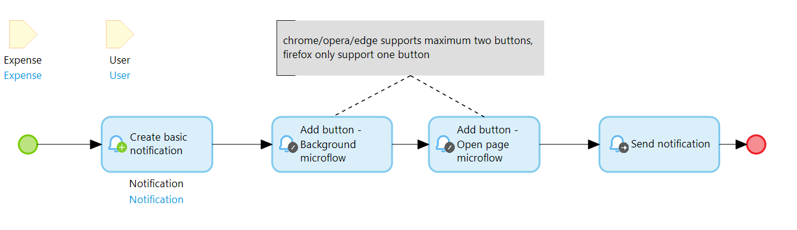

## 1 Introduction

Depending on your use case it might be good to add buttons to the notification which the user can click to perform certain tasks.

Web push notifications module supports the following buttons:

| Microflow To Add Button | Description |
| --- | --- |
| Background Microflow | When the user clicks this button a microflow is triggered in your app. The notification is then closed without requiring further interaction from the user. Usefull to let users take action on a notification without having to open and login to the app, for example to approve a request. |
| Open Page Microflow | When the user clicks this button they are redirected to a page in your app. This could be the home page or another specific page. |
| Open URL | When the user clicks this button they are redirected to this URL. The primary goal is to redirect users to other websites/apps. |
| Close | When the user clicks this button the notification is closed without any further interaction. |

## 2 Configuring a button

Adding a button to the notification is done after the Notification object is created and before the Notification is sent. 

Up to two buttons can be added to one notification. Each button has a caption and an icon. Additionally, some buttons accept additional parameters which are described in the respective java actions.

For a complete example check the microflow: WebPusNotifications > _SAMPLE_ > Example.

