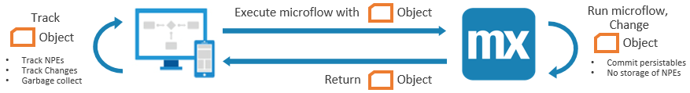
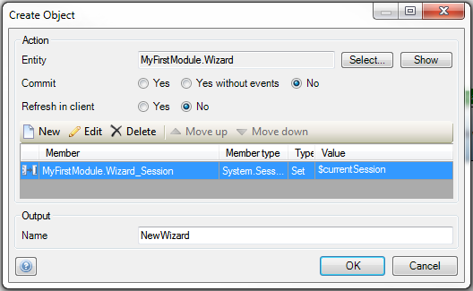

In Mendix 7, we introduced a completely new stateless architecture. All the application state that was kept in the runtime in earlier versions, will now be kept by the client in the browser. By “state”, we mean non-persistable entities (NPEs) and persistable entities that have not yet been committed to the database. The new approach has important advantages, such as the ability to easily scale the app horizontally. However, there are also some new things to keep in mind when developing for this new architecture, in order to prevent performance degradation of the client.

## Overview

The stateless architecture of Mendix 7 means that all temporary objects are stored in the client (browser), instead of in the runtime. However, since the objects are used in microflows, the runtime will need them to be able to execute a microflow. For this reason, the state is transferred by the browser to the server when a request is sent.

The Mendix client that runs in the browser determines which objects are relevant for the current page and microflow you want to execute. It does this based on the possibility to retrieve objects from the microflow parameters by following the relations from that object. Only the objects that can be retrieved are transferred to the server to optimize performance. However, since there are many flexible ways to retrieve objects, Mendix must be conservative in this. There will often be more objects sent than are strictly necessary to be able to execute a microflow.

After the microflow has run, any new objects or updates to existing objects that were made are returned to the client. The client can then update its state and refresh any objects on the current page if necessary. This is only done for NPEs and for persistable objects that are on the current page.

The following diagram shows the flow of objects in the new architecture in detail:

## Limiting the Number of Objects

Because all objects necessary for a microflow are transferred between client and server for each request, the network traffic will grow when more objects are used at the same time. Especially on mobile devices, this can become a bottleneck. This leads us to the primary new best practice for Mendix 7.

{}

Minimize the number of in-use objects in your session.

{}

By in-use objects we mean non-persistable objects and uncommitted persistable objects.

Of course, it is not possible to eliminate the need for in-use objects entirely, unless you want your app to be completely read-only. However, there are several common ways to inadvertently create more objects than necessary. The rest of this document will discuss some best practices to reduce the number of in-use objects.

## Changed Objects

To the Mendix Runtime there is very little difference between a non-persistable object and a persistable object that is changed but not committed. Any changes that are not committed at the end of a browser request will be sent to the client for use in future requests. To minimize the number of objects for which this is the case, we recommend the following:

{}

Commit or roll back the changes to persistable objects before the end of the main microflow.

{}

Any changes that are not committed when a main microflow ends will be sent to the client and become part of the client state which is stored there. In that case, they will also contribute to the size of future requests where they need to be sent back to the Runtime.

If you make sure to commit any changes to persistable objects, they do not need to be sent to the client if they are not shown on a page. When they are subsequently needed in a microflow, they do not need to be sent by the client, because the Runtime can just retrieve them from the database.

In other words: by reducing the number of requests during which objects are not committed, you reduce the network traffic necessary to use the app.

## Workflow Objects

If an object is used during a workflow that spans multiple pages, but is not displayed on every one of those pages, the client could incorrectly determine that the object is not necessary anymore. This situation can also happen if you allow users to navigate backwards through a workflow using *Close* buttons or a browser's *back* button. In that case, the objects on the page that was previously displayed might have been removed already.

To prevent this from occurring, you can:

{}

Link non-persistable objects that have long life spans to the current Session object.

{}

To do this, first create a reference between your entity and the Session entity in the System module, as shown in the following image:

Then link the object to the current session when you create it in a microflow, as shown in this image:

Because it is always possible to look at the current session object, any objects related to the current session can also always be retrieved. The client must then always keep these objects around; they will never be removed.

Of course, there is a drawback here as well: since the objects will never be removed, they will be in memory indefinitely. It is very important to remove these objects as soon as they are not necessary any more.

## Integrations

When dealing with web- or app-service integrations, you will often use non-persistable entities to model requests and responses. For more complex integrations, this can quickly become a complex domain model with a lot of entities. When calling the service, many objects can be created. We often encounter cases where developers map an entire web service response to a large domain model, only to use a small part of the message in a microflow.

In Mendix 7, building an integration as described above will cause all objects that are created to be sent to the client as well. We recommend to:

{}

Map only those parts of a web service integration that are necessary.

{}

By minimizing the number and size of objects that are created, you reduce the amount of objects that are necessary for the client.

In some cases, there will be objects that are necessary for a microflow to function, but that are not shown on any page in the app. In that case, they will still be sent to the client, since Mendix cannot always determine if they will not be used by widgets and such. For that reason, we also recommend to:

{}

Delete non-persistable objects as soon as they are no longer necessary.

{}

This goes especially for microflows related to integrations: as soon as the message has been sent, or the response has been processed, remove the objects related to the call. Of course, you should keep objects that are subsequently displayed on a page, but be aware of what was said in the chapter on [Workflow Objects](#workflow-objects). A useful way to easily remove everything related to a service call is to apply delete behavior in your domain model.

## Layouts

Be careful when using non-persistable objects in layouts. Since layouts can be used for many pages in your app, objects in layouts can be on the screen for a long time. If you use non-persistable objects here, these will be sent back and forth between the client and Runtime very often, since they are always available. We recommend the following:

{}

Don’t use non-persistable objects in layouts.

{}

This will reduce the number of in-use objects. The same goes for non-persistable objects that are not directly used in a layout, but have a reference to objects in a layout. Since they can be retrieved via the object in the layout, they will live as long as that object. This too should be avoided.

## Summary

Mendix 7 introduces a new stateless architecture, where the application is kept by the client in the browser. All temporary objects are stored in the browser instead of the Runtime. State is transferred by the browser to the server when a request is sent, and back when the request finishes.

We have identified some best practices for Mendix developers that go along with this new architecture:

*	Minimize the number of in-use objects in your session
*	Commit or roll back all changes to persistable objects before the end of the main microflow
*	Link non-persistable objects that have long life spans to the current Session object
*	Map only those parts of a web service integration that are necessary
*	Delete any non-persistable objects as soon as they are no longer necessary
*	Don’t use non-persistable objects in layouts
