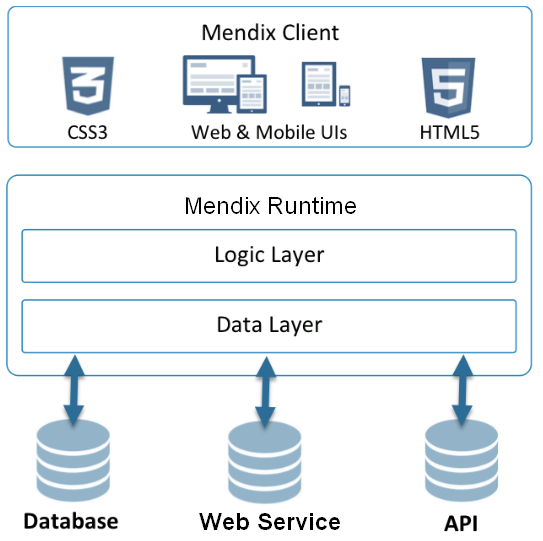
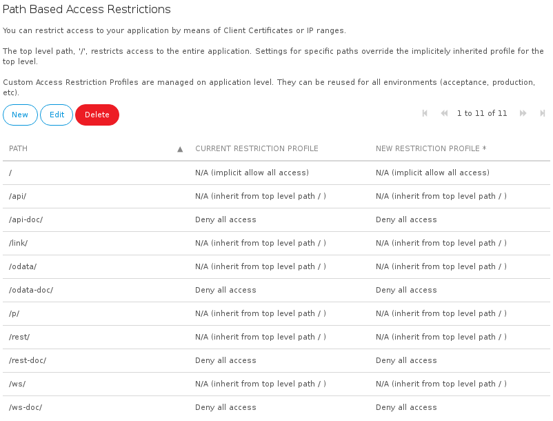

## 1 Introduction

Security is one of the most important aspects of an application, because misconfiguration or failing security can have great consequences to the stakeholders of the application. The Mendix Runtime protects your application and data according to your model, where the Mendix Cloud handles security at infrastructural level. This page describes the common aspects where a Mendix developer should think of when delivering an application within the Mendix Cloud.

## 2 Access Rules

The Mendix architecture involves a client that can compose its own queries (generated by widgets) and send them to the Mendix Runtime. If the Mendix Runtime would execute these queries without touching them, a client would be able to request data the user shouldn’t be allowed to see.

When designing an application, a developer can specify access rules on an entity, see [Create A Secure App](/howto6/create-a-secure-app) for more info. These access rules are applied whenever a query (received from a client) should be executed and therefore constrain the data returned to the client. For example, users with the *Customer* role can only view *Orders* that are associated to the customer this user is part of. While the data that should be viewable and editable in which role is application specific, we offer the following key guidelines:

* Attributes that are determined by the system (like the status of an order) should never be writeable
* If an anonymous user is allowed to create objects, constrain these objects to the owner (an anonymous user is actually a *System.User* object that is created on the fly)
* Don’t set a default rule to read and write access, this forces a developer to think about each attribute that is added to an entity
* Security constraints should be formed as entity access rules, visibility constraints in page components (grids, list views, data views)
* Keep your attributes editable within data views. If an access rule prohibits write access, your client will display it as non-editable. This way you are aware, as developer, about the (correct) working of an access rule

## 3 Avoid Injection

Injection occurs when (user) input can be misused to influence the behavior of a system. Common cases are parameters for queries (which influence the result of a database query) or HTML with JavaScript contents (to influence the behavior of browsers).
When using Mendix native components, you don’t have any concerns about the possibility of injection. Queries (like XPath) are parametrized and therefore always escaped, making SQL injection impossible. The other way around, retrieved data shown in the user interface, is escaped to HTML format.

If you are assembling an application, App Store components and external interfaces may be used. You have to consider that variables, which value originates from user input or another system, should be escaped to avoid injection (and for proper displaying).
Common cases are:

*	HTML content, usually derived from an HTML editor and displayed using an HTML viewer, Format String or an email client. Ways to avoid abuse this include:
    *	Using the XSSSanitize action from the [CommunityCommons](https://appstore.home.mendix.com/link/app/170/Mendix/Community-Commons-Function-Library) module to strip malicious code from entered HTML
    *	Displaying the value of an attribute as HTML or using the HTMLEncode function from the [CommunityCommons](https://appstore.home.mendix.com/link/app/170/Mendix/Community-Commons-Function-Library) module
*	Database connections, for example using a [Database Connector](https://appstore.home.mendix.com/link/app/2888/Mendix/Database-Connector), where user input is being used within constraints. Ways to avoid abuse this include:
    *	Using prepared statements, which will cause the database-specific connector to take care of escaping the value
    *	Sanity checking your user input, for example, use a regular expression to check if your user input only contains alphanumeric characters, spaces and dashes

## 4 Apply Access Restrictions to Unnecessary Request Handlers

A Mendix application offers various endpoints that can be used to obtain information about offered services. The paths used by these endpoints end in `-doc`. By default, access to these endpoints is disabled when deploying to a cloud node.

Access restrictions can be configured within the Developer Portal. They can be found at the **Environment details** of your cloud node. This is an example of this overview showing the default settings after deploying to a new environment:

Examples are the `ws-doc` or `rest-doc` endpoints that enumerate all the published web and REST services of the application. An attacker could use this information to discover possible areas to exploit.

As a Mendix developer, you can take the following preventative measures:

* Disable unused endpoints within the Mendix Cloud Portal completely by applying a "deny all access" preset on them
* Apply IP filtering or client certificate authentication to restrict access

Keep the following in mind:

* If there are other application-specific request handlers that should have an access restriction applied, then click **New** to add them as additional paths
* The URLs of test and acceptance environments can easily be guessed; in order to take effective measures, the restrictions should be applied to these environments also

## 5 Apply Authentication on Services

When publishing a web or REST service, you should consider whether this service should be consumable by everybody (anonymous) or by a limited set of users or systems. Whenever a limited set of users should be allowed, a Mendix (web service) user should be created for each consumer of this service. The option of creating (fine grained instead of generic) users enables an application to:

* Identify which user caused a change in your application (traceability)
* Constrain access on user (role) level
* Log usage of your service

Mendix offers the following options to provide authentication for your services:

* Username and password validation, specified within the Mendix Modeler, see [Published Web Services](/refguide/published-web-services)
* Client certificates and IP ranges, which are specified in the Mendix Cloud. This can be found at the network tab of your node’s environment details as *Access Restriction Profiles*

## 6 Use the Encryption Module When Storing Sensitive Information

Your application might require sensitive information which should be extra encrypted. Examples are:

* Connection information for consumed services (like credentials, service locations or keys)
* Personal information (like bank account numbers or social security numbers)

This data is defined within the domain model and stored within the database of your application. To minimize the impact of this information when it is leaked, we recommend storing this data in an (symmetric) encrypted manner. The [Encryption module](https://appstore.home.mendix.com/link/app/1011/Mendix/Encryption) provides a way to encrypt this sensitive information in a database record based on an encryption key that is stored at the Mendix application server.

## 7 Use a Third Party Identity Provider

When developing an application, authentication is one of the basic considerations. Even though Mendix comes with a basic authentication mechanism, your application’s security is improved when authentication is delegated to an enterprise grade identity provider like ADFS.

Mendix offers a range of modules that enable your application to be connected with these services, including:

* [SAML](https://appstore.home.mendix.com/link/app/1174/Mendix/SAML)
* [LDAP](https://appstore.home.mendix.com/link/app/24/Mendix/LDAP-Synchronization-module)
* [Kerberos](https://appstore.home.mendix.com/link/app/25/Mendix/Kerberos-Single-Sign-On)

Your application can gain several benefits from using an identity provider, like:

* User management is centralized (for example within Active Directory) which simplifies the on- and off boarding of new employees or changed roles
* The Mendix application doesn’t contain (hashed) passwords
* Identity providers can add extra layers of security like two-factor authentication.
* Apply stronger password policies
* Improved user experience by facilitating single sign-on

## 8 Apply a Strong Password Policy

By default Mendix forces a strong password policy. The same password policy that is configured in the Mendix Modeler is also used for apps running in a hosted environment (for example, on test/acceptance/production).
It is very tempting to simplify the password constraints for development purposes (making it possible to use a single character to login). However, we recommend avoiding this approach so deployments will continue to force a strong password policy.
The password policy can be set by following the [Password Policy Guide](/refguide/password-policy).

## 9 Rename the Administrator User

Each application requires power users who should be able to administer technical functions (like configuring SSO). By default, the user who has these capabilities is called *MxAdmin* and is part of the *Administrator* role.

This information can be exploited by an attacker (for example, by trying to guess the password). Even though Mendix will block the user for  about 5 minutes after three unsuccessful login attempts, it is recommended to rename the default *MxAdmin* user.
The user name of the administrator can be changed at the project security settings under the *Administrator* tab.

When deployed to the MendixCloud, you can activate the changed username by successfully changing the password with the "Change admin password" button on the environment.

## 10 Use SSL on Consumed Web Services Whenever Possible

Most applications consume (web) services that could be located within an organization itself or at an external third party. When such a service is consumed by an application, your request crosses multiple networks and devices before it reaches its endpoint (the service). A potential attacker in between would be able to read and manipulate the conversation between the application and the service.

By using an SSL connection and adding the public key of the endpoint within your application, you will ensure that:

* The conversation between you and the service hasn’t been tampered with
* The conversation isn’t readable if it was ever intercepted
* The identity of your endpoint is confirmed

There are several scenarios possible for protecting your outgoing connections using encryption, that depend on the infrastructure possibilities and protocols used. This article describes it perfectly: [Securing Outgoing Connections For Your Application](/deployment/mendixcloud/securing-outgoing-connections-from-your-application).

You can add individual certificates in your project’s settings in the Mendix Modeler. Test, acceptance and production environments require their certificates to be uploaded to the [Mendix Cloud](/deployment/mendixcloud/certificates).

## 11 Prevent Embedding of Your App Within an IFrame

Applications that can be embedded within an Iframe can be misused by attackers. By using an overlay, it could trick users into clicking on buttons and make them perform actions within the application on their behalf without knowing it. This approach is called [clickjacking](https://www.owasp.org/index.php/Clickjacking).

By sending a header to the user’s browser, it can block the use of the Mendix application within an Iframe, and avoid this type of attack. This header can easily be configured (and is enabled by default) within the Mendix Cloud Portal at your node’s environment details at *Prevent embedding your app in an Iframe*.

## 12 Maintain a High Level of Project Hygiene

As an application grows in functionality, it also increases the chance of containing logic that could be exploitable for an attacker. Also, over time, vulnerabilities within logic can be discovered. Keeping your project hygiene at a high level will reduce the chances of a vulnerable application.

To keep this at a good level, perform the following steps:

* Remove unused modules, widgets and Java libraries
* Remove microflows that aren’t used. These appear as warnings in the Mendix Modeler
* Avoid using components with known vulnerabilities (like Java or JavaScript libraries)

A good source of known vulnerabilities is the [Common Vulnerabilities and Exposures website](https://cve.mitre.org/).

## 13 User Roles and Access

Which users and roles are defined within an application is different per app and project. However, there are some key guidelines to keep in mind when validating the user security:

* Anonymous access should be disabled if it has no function within the application. Some applications have anonymous access enabled, solely to serve a custom login form. This can be replaced by modifying the default *login.html* within your theme (and also improves the user experience by improved loading time)
* Roles managing other user roles should be as strict as possible (*User management* within the project’s security)
* The role of the project’s administrator user (default *MxAdmin*) should only be able to create the actual administrative accounts (or configure SSO)
