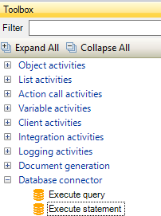
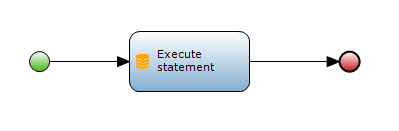

The Mendix Platform offers many ways to integrate with external data, but integrating with external databases has not been a seamless experience until now. The **Database connector** module can be used to seamlessly connect to external databases without limiting you in your choice of database or SQL dialect, enabling you to incorporate your external data directly in your Mendix application.
This document will focus on executing an SQL (_Structured Query Language_) _Statement_ on **relational external databases**.

The **Execute statement** action (present in the Database Connector module) provides a consistent environment for Mendix projects to perform an arbitrary SQL _Statement_ on relational external databases.
JDBC (_Java Database Connectivity_) API, a standard Java API, is used when this Java action attempts to connect with a Relational Database for which a JDBC driver exists.

**After completing this how-to you will know:**

*   How to execute SQL statements on relational external databases with the help of Database connector module.
*   How to configure 'Execute statement' action.

## 1. Prerequisites for Execute statement action

Before you can start with this how-to, please make sure you have completed the following prerequisites.

*   A database **URL** address that points to your database.
*   The **username** for logging into the database, relative to the database URL address.
*   The **password** for logging into the database, relative to the database URL address.
*   The SQL **statement** to execute, relative to the database type (_SQL dialect_ differs for different databases).
*   The JDBC driver jar, for the database you want to connect to.

## 2\. Preparation

The JDBC driver jars, for the databases you want to connect to, must be placed inside the userlib directory of your Mendix application. So if you want to connect to Amazon RDS PostgreSQL database (For e.g. `jdbc:postgresql://xyz-rds-instance.ccnapcvoeosh.eu-west-1.rds.amazonaws.com:5432/postgres`), you need to place PostgreSQL Jdbc driver jar inside the userlib folder.

## 3\. Using Execute statement action in a microflow

1. Look for the Database connector in the Toolbox.
2. Drag and drop the 'Execute statement' action to your microflow.

    

    

3. Provide all the valid arguments to the _Execute statement_ action and specify output variable name of your choice, which in below mentioned case is `amountOfInsertedRows`.
    `amountOfInsertedRows` is also the output of the SQL Statement which you provided for the `sql` argument within the connector.

**The Execute statement action's result is either an Integer or a Long value which usually represents the amount of affected rows.**

## 4\. Remarks

*   This database connector can be used for CREATE, INSERT, UPDATE, STORED PROCEDURE, DELETE or DDL SQL statements.
*   This database connector should not be used for SELECT SQL queries.
*   The jdbcUrl argument, in the Execute statement connector, must specify a database URL that points to your relational database and is dependent upon the particular database and JDBC driver. It will always begin with "jdbc:" protocol text, but the rest is up to particular vendor.
    For example 'jdbc:<a rel="nofollow">mysql://hostname/databaseName'</a> jdbcUrl format can be used for MySQL databases.

*   Proper security must be applied as this action can allow SQL Injection in your Mendix application.

## 5\. Related content

*   [How to execute an SQL statement on an external database](how-to-execute-an-sql-statement-on-an-external-database)
