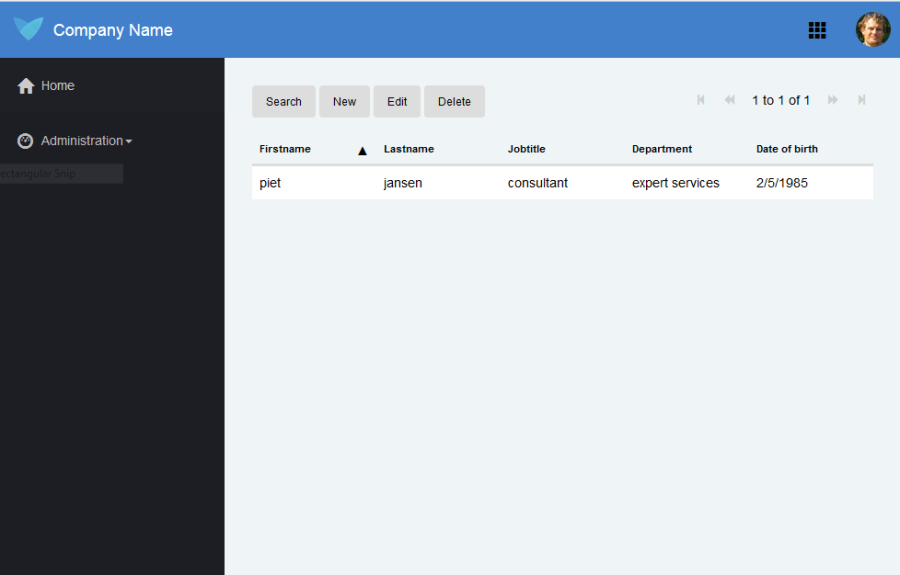

# Introduction

This document outlines the communication patterns used by the Mendix runtime environment for some typical application use cases.
Goal for this document:

*   The reader should be able to assess the quality of the Mendix runtime environment regarding efficiency of communication.
*   Developers on the Mendix App Platform should be able to determine the impact of their design decisions on communication efficiency and performance.

This document was written to address the missing information required by SIG to assess the performance efficiency of communication of Mendix applications. The last section of the document outlines the SIG scoring on this subject, and how this document addresses these requirements.

# Outline of communication within Mendix runtime environment

The Mendix App Platform consists of the following components:

*   Mendix App Platform – completely integrated application Platform as a Service (aPaaS) offering to design, build, deploy and manage enterprise apps.
*   Launchpad – The Launchpad is the central place for end users and developers to access Mendix apps.
*   Dev Center – Web based collaborative environment for design, development and deployment of apps.
*   App Store – portal with hundreds of publicly available building blocks to speed up app development.
*   Buzz – online collaboration portal.
*   Mendix Modeler - multi-user modeling studio of the Mendix App Platform.
*   Team Server - a central repository to manage and version application models.
*   Build Server - creates deployment packages from artifacts – such as models, style sheets, custom java classes.
*   MxID - a user management and provisioning service that applies the OpenID standard.
*   Cloud Portal - manage users and environments, deploy apps to the cloud with a single click and manage and monitor their performance.
*   Runtime environment – runs applications using a server part, Mendix Runtime, and a client part, Mendix Client.

The focus of this document is on the last component, the Mendix runtime environment. More specifically the collaboration between the following parts:

*   Mendix Client - JavaScript client running in the browser of a user.
*   Mendix Runtime - Java/Scala runtime running on a server, responsible for executing Microflow Logic, business rules, and persisting the objects.
*   RDBMS where the data is persisted.
*   Optionally a state store to share state between horizontally scaled runtime instances.

Communication between these components is as follows:

*   The Mendix Client issues 2 types of requests:
    *   Static resources like pages, stylesheets, widgets, images, etc.
    *   Application data related communication. This includes CRUD commands on data, and logic that may require data.
*   The Mendix Runtime communicates with different RDBMSs using SQL statements handled by a JDBC library. Application data is stored in a ER-model in an RDBMS.

# Basic CRUD communication pattern

The core of most Mendix applications involves variations on the CRUD pattern – Create, Read, Update, Delete of data stored in Mendix entities.
This basic scenario can be modeled in Mendix using the following two pages:

*   An overview page displaying a table of data for a specific entity (see first screenshot),
*   A details page where a specific object of an entity can be edited (second screenshot).

The second page can be reached from the first page using the new and edit buttons.

 

The following sections outline the actions involved when executing these pages. As stated earlier, this pattern can be seen in many Mendix applications, but the exact runtime result depends on many details and design decisions taken while building the application using the Mendix Modeler. More advanced data models and pages will result in more (complex) queries.

## Read object required to display object table

Displaying a table of objects consists of the following steps:

*   Get the definition of the page (if not already cached by the browser),
*   Get the data to be displayed in the page,
*   Update the page.


A basic sequence diagram would like this:

The Mendix Client uses a REST-like protocol to request data from the Mendix Runtime. The following example shows what this looks like when requesting objects from the Employees entity:

```java
{
   "action":"retrieve_by_xpath",
   "params":{
      "xpath":"//MyFirstModule.Employee",
      "schema":{
         "id":"a2916c7c-af2f-4267-a8e9-99604f045861",
         "offset":0,
         "sort":[
            [
               "Firstname",
               "asc"
            ]
         ],
         "amount":20
      },
      "count":true,
      "aggregates":false
   },
   "context":[
   ],
   "profiledata":{
      "204ee5ad0c056a0":15
   }
}
```

The XPath expression states which data is needed: this can be an entity, or just some attributes of an entities, as required by the application.

The schema section can be used to specify additional restrictions on what data is required: what attributes, how many records. This approach ensures that the amount of data transferred between Mendix Runtime and Mendix Client is minimized.

This retrieve action results in 2 SQL queries, one to retrieve the data, and one to retrieve the total number of objects.

```sql
 SELECT "myfirstmodule$employee"."id",
 "myfirstmodule$employee"."dateofbirth",
 "myfirstmodule$employee"."department",
 "myfirstmodule$employee"."firstname",
 "myfirstmodule$employee"."jobtitle",
 "myfirstmodule$employee"."lastname"
 FROM "myfirstmodule$employee"
 ORDER BY "myfirstmodule$employee"."firstname" ASC,
 "myfirstmodule$employee"."id" ASC LIMIT 20
 SELECT COUNT(*)
 FROM "myfirstmodule$employee"
```

Depending on the data displayed and the domain model (usage of inheritance and row or attribute security), a retrieve may result in more queries or additional where clauses.

The response of the Mendix Runtime to the Mendix Client is as follows:

```sql
{"count":2,"mxobjects":[{"objectType":"MyFirstModule.Employee","guid":"281474976710757","attributes":{"Firstname":{"value":"peter1"},"DateOfBirth":{"value":-315622800000},"Jobtitle":{"value":"sales"},"Department":{"value":"sales"},"Lastname":{"value":"jones"&#125;&#125;},{"objectType":"MyFirstModule.Employee","guid":"281474976710657","attributes":{"Firstname":{"value":"piet"},"DateOfBirth":{"value":476406000000},"Jobtitle":{"value":"consultant"},"Department":{"value":"expert services"},"Lastname":{"value":"jansen"&#125;&#125;}]}
```

## Create new object

The typical create new object flow consists of a number of steps:

*   Instantiate a new object (primary key is generated by the database, Mendix Runtime keeps a cache of pks),
*   Get the edit form (if not already cached by the browser),
*   Save updated object in Mendix Runtime,
*   Commit updated object to the database.


Create a new object:

```java
{
   "action":"instantiate",
   "params":{
      "objecttype":"MyFirstModule.Employee",
      "preventCache":1455032246146
   },
   "context":[
   ],
   "profiledata":{
      "204ee68c92aea60":27
   }
}
```

Save the object to the database:

```java
{
   "action":"change",
   "params":{
      "281474976710757":{
         "Firstname":"peter",
         "Lastname":"jones",
         "Jobtitle":"sales",
         "Department":"sales",
         "DateOfBirth":-315622800000
      }
   },
   "context":[
   ],
   "profiledata":{
      "204ee6970d53960":18
   }
}
```

Commit the updates to the database:

```java
{"action":"commit","params":{"guid":"281474976710757"},"context":[],"profiledata":{"204ee6e9b5eddc0":25&#125;&#125;
```

The commit will cause the Mendix Runtime to save the object to the RDBMS. Before the commit, the data is only kept in the Mendix Runtime to optimize performance and minimize impact on the database.

```sql
 INSERT INTO "myfirstmodule$employee" ("id",
 "firstname",
 "dateofbirth",
 "jobtitle",
 "department",
 "lastname")
 VALUES (?,
 ?,
 ?,
 ?,
 ?,
 ?)
```

## Edit an existing object

The typical _edit existing object_ flow consists of a number of steps:

*   Select an object in a table of objects page (overview page),
*   Get the edit form (if not already cached by the browser),
*   Show object values already available in the browser in the form,
*   Save changed attributes of the object to the Mendix Runtime,
*   Retrieve object from database,
*   Validate object changes,
*   Commit the changes in the database.


Save the changes to the database:

```java
{"action":"change","params":{"281474976710757":{"Firstname":"peter1"&#125;&#125;,"context":[],"profiledata":{"204ee8bb633f9a0":25&#125;&#125;
```

This will trigger the following actions on the database:

*   Get the original object from the database,
*   Update the attribute changed by the user in the runtime.

The first step is required to determine all the data business logic and validations defined on the entity.

```sql
 SELECT "myfirstmodule$employee"."id",
 "myfirstmodule$employee"."firstname",
 "myfirstmodule$employee"."dateofbirth",
 "myfirstmodule$employee"."jobtitle",
 "myfirstmodule$employee"."department",
 "myfirstmodule$employee"."lastname"
 FROM "myfirstmodule$employee"
 WHERE "myfirstmodule$employee"."id" = (281474976710857)
```

If all validations run correctly the client can commit the changes to the database:

```java
{"action":"commit","params":{"guid":"281474976710757"},"context":[],"profiledata":{"204ee8ca8f775a0":20&#125;&#125;
```

This will trigger the actual database update and commit.

```sql
 UPDATE "myfirstmodule$employee"
 SET "dateofbirth" = ?
 WHERE "id" = ?
```

## Delete an existing object

The typical delete flow consists of a number of steps:

*   Select an object in a table of objects (overview page),
*   Send a delete request to the Mendix Runtime,
*   Mendix Runtime validates the delete request,
*   Mendix Runtime deletes object from database,
*   Commit the changes in the database,
*   Inform client that delete has succeeded,
*   Refresh data and update page.

The following sequence diagram outlines the typical delete scenario:


Delete the object

```java
{"action":"delete","params":{"guids":["281474976710757"]},"context":[],"profiledata":{"204eeae128284c0":323&#125;&#125;
```

Get the object to enable running of business logic, rules and events before the actual deletion of the data.

```sql
 SELECT "myfirstmodule$employee"."id",
 "myfirstmodule$employee"."firstname",
 "myfirstmodule$employee"."dateofbirth",
 "myfirstmodule$employee"."jobtitle",
 "myfirstmodule$employee"."department",
 "myfirstmodule$employee"."lastname"
 FROM "myfirstmodule$employee"
 WHERE "myfirstmodule$employee"."id" = (281474976710857)
```

Delete object from database:

```sql
DELETE FROM "myfirstmodule$employee"
WHERE "id" = ?
```

Refesh the datagrid

```java
{"action":"retrieve_by_xpath","params":{"xpath":"//MyFirstModule.Employee","schema":{"id":"a2916c7c-af2f-4267-a8e9-99604f045861","offset":0,"sort":[["Firstname","asc"]],"amount":20},"count":true,"aggregates":false},"context":[],"releaseids":["281474976710757"],"profiledata":{"204eeb2972550c0":28&#125;&#125;
```

# Executing business logic

Business logic is modeled using microflows in Mendix. Following is a description of some typical flows involving microflows.

## Displaying grid of data retrieved by microflow

A data grid on a page is often directly linked to an entity in the domain model. An alternative approach is to use a microflow to create a list of objects to be displayed in a data grid.

A microflow retrieving all objects from an entity can be modeled as follows:
 

In this situation, all objects are transported to the browser in one request. A user can page through all the objects without triggering communication to the Mendix Runtime.

High level sequence diagram for this scenario looks like this:

Json action executed from Mendix Client to Mendix Runtime:

```java
{"action":"executeaction","params":{"actionname":"MyFirstModule.GetAllEmployees","applyto":"none"},"context":[],"profiledata":{"204f418ba05e7c0":55&#125;&#125;
```

SQL statement executed on the database:

```sql
SELECT "myfirstmodule$employee"."id",
"myfirstmodule$employee"."firstname",
"myfirstmodule$employee"."dateofbirth",
"myfirstmodule$employee"."jobtitle",
"myfirstmodule$employee"."department",
"myfirstmodule$employee"."lastname"
FROM "myfirstmodule$employee"
```

Response from the Mendix Runtime to the Mendix client:

```java
{"actionResult":[{"objectType":"MyFirstModule.Employee","guid":"281474976710657","attributes":{"Firstname":{"value":"piet"},"DateOfBirth":{"value":476406000000},"Jobtitle":{"value":"consultant"},"Department":{"value":"expert services"},"Lastname":{"value":"jansen"&#125;&#125;},{"objectType":"MyFirstModule.Employee","guid":"281474976710957","attributes":{"Firstname":{"value":"wee"},"DateOfBirth":{"value":1454886000000},"Jobtitle":{"value":"ewji"},"Department":{"value":"wew"},"Lastname":{"value":"ewfeew"&#125;&#125;},{"objectType":"MyFirstModule.Employee","guid":"281474976710958
…
}]}
```

# Mendix Runtime internals

As can be seen in the description of the CRUD scenario, the Mendix Platform ensures efficiency while running the application in a number of ways:

*   Only data required for user actions is involved in communication and processing.
*   An efficient transport protocol is used when communicating between different processes: terse JSON format between Mendix Client and Mendix Runtime, native SQL protocol for RDBMS communication.
*   Data already available in the Mendix Client is reused if possible (see edit scenario where the data fetched for the data grid is reused in the edit form).

## Data transformation

Data is transported between Mendix Client and database as required. The following transformation are applied when going full circle from Mendix Client to database and back again:

*   Data entered by a user in a form is stored in JavaScript objects.
*   For communication to the Mendix Runtime JavaScript objects are serialized to JSON.
*   The Mendix Runtime transforms the JSON objects to java MxObjects.
*   MxObject properties are bound to SQL statement parameters as needed by SQL queries.
*   JDBC result set data is transformed to MxObjects.
*   MxObjects are serialized to JSON when send to the Mendix Client.

## State

To facilitate (horizontal) scalability, the Mendix Platform minimizes the state kept in the Mendix Runtime memory. The overall strategy is to only have _dirty objects_ in memory, other objects are cleaned up at the end of a request. Objects are considered dirty if they have been changed, but the changes have not yet been persisted to the RDBMS. The state is maintained per session.


## Persistency

Mendix automatically takes care of the translation of an application specific entity model (domain model), to a technical RDBMS specific ER-model. As illustrated in the read part of the CRUD scenarios, data retrieval is expressed by an easy to understand XPath construct.
For example, to retrieve all employee objects, the following XPath can be used:
//MyFirstModule.Employee
This XPath expression is processed in a number of steps to a database query:

*   XPath is translated to an internal OQL syntax. OQL is similar to SQL, but still expresses application data in terms of the application domain model entities, instead of technical tables.
*   Additional required expressions are added to the OQL statement as specified in the domain model, for example to add information from a superclass entity.
*   Domain model security constraints are applies to the OQL statement.
*   OQL is translated to SQL and executed through JDBC on the configured RDBMS.

## Scalability

The Mendix Runtime can run as a single process, or it can be horizontally scaled to facilitate more concurrent users, and improve availability. In this scenario multiple Mendix Modeler instances are running. These instances run independently, there will not be any communication between the processes.

### Single instance

Within a single instance, the Scala Akka actor model is used to handle all processing in the Mendix Runtime efficiently.
Using an actor model for concurrency has the following benefits:

*   The number of concurrent users that can be processed is not limited by the amount of threads available. Threads are not allocated per request, but rather by processing responsibility.

To process Mendix Client requests received by the Mendix Runtime, the actions required are dispatched to an Akka actor. This actor has a dedicated thread pool. Every (Microflow) action is handled by a separate message to the Action dispatcher actor. This optimizes usage of threads for blocking actions. For example, if an action part of a Microflow calls an external web service and is blocked waiting for a response, this only impacts the threadpool for the Action dispatcher, not for the HTTP request handler.

### Multi instance

When running in a horizontally scaled scenario, Mendix Runtime state is coordinated via a Redis statestore. At the end of every request all the dirty objects of a session are written to the Redis statestore. At the start of a new request this state is read from the Redis statestore.


