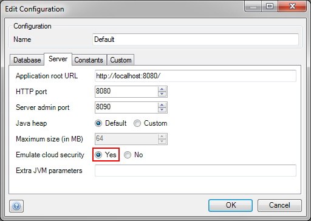

Projects with Java actions can be deployed to the Mendix Cloud. For security reasons, the capabilities of Java actions in Mendix Cloud v3 are constrained. Applications should not be able to access resources of other applications or compromise the cloud server in any way. In Mendix Cloud v4, there are no restrictions on Java actions.

Java offers the [Java Security Manager](http://download.oracle.com/javase/tutorial/essential/environment/security.html "Java Security Manager") to configure programs to behave correctly. For each application a policy file is created to instruct the correct behavior.

## 1 Restrictions For Java Actions

To ensure application safety the following permissions are disabled for Java actions in the cloud:

*   Accessing and manipulating arbitrary files and file streams.
*   Custom class loading and class reflection.
*   Executing arbitrary OS commands.
*   System property access.
*   Thread modification.
*   Socket access (disabled by default, exceptions can be requested).

A complete list with detailed access information can be found [here](http://download.oracle.com/javase/6/docs/technotes/guides/security/permissions.html#PermsAndMethods "Restriction details").

Exceptions on these restrictions are:

*   Calls to the Mendix runtime codebase (i.e. when using the `com.mendix.modules.webservices.WebserviceModule` class to call a web service socket access is allowed).
*   Granted sockets
*   Reading files in the temp folder or its subfolders (`%PROJECT_DEPLOYMENT_DIR%/data/tmp/`).
*   Writing files in the temp folder or its subfolders (`%PROJECT_DEPLOYMENT_DIR%/data/tmp/`)
*   Reading files in the resources folder or its subfolders .(`%PROJECT_DEPLOYMENT_DIR%/model/resources/`).

Most applications should be able to function fully with these restrictions. However if you feel your application needs extra capabilities please [log a support ticket](https://support.mendix.com/), so that we can address your specific needs.

## 2 Requesting Property Permissions

In case your application needs to access certain PropertyPermissions from java actions, you can use the [Mendix Support Portal](https://support.mendix.com/) to send us a list of required properties. We will then make a security exception.

## 3 Emulating Cloud Security

Before deploying to the cloud, it is strongly recommended to first locally test your Java actions by emulating cloud security. This will make sure you encounter no surprises with regard to cloud security when the application is actually deployed to the Cloud. This will potentially save a lot of time, as it is much harder to debug these kind of issues in the Cloud than locally.

Cloud security can be emulated locally using the following steps:

*   Open the project settings window by double-clicking 'Settings' in the Project Explorer.

*   In the 'Configurations' tab select the configuration for which you would like to emulate cloud security and click the 'Edit' button.

*   Set 'Emulate cloud security' to 'Yes' and click 'OK' twice to save your settings.

*   Select the configuration for which you enabled cloud security emulation in the menu bar and hit the 'Run' button (F5).

