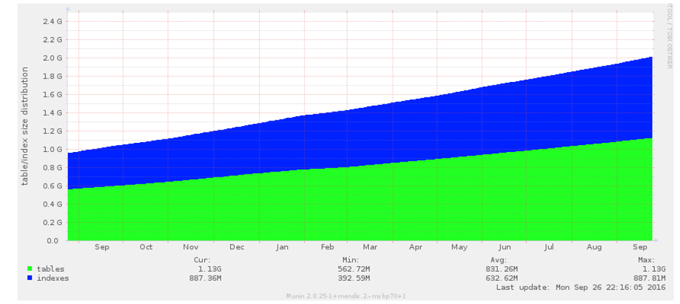

## 1 Introduction

The average database of a Mendix application in the Mendix Cloud looks something like this:

The data grows in a steady fashion. Major releases where entities are removed can show a decrease in the size of the database, but on average the direction will be upwards. The primary reason for this is that even when you delete records from the database, the physical space on the hard disk is not freed up. Instead, the now empty records are kept in place so that they can be reused once new records are inserted (created) into the database. This is helpful because it means database records on the hard disk remain physically close to each other, which in turn means disk read operations are on average going to perform better. 

However there might be instances where physically reclaiming the lost space is important. For example to have 90% disk usage alerts go away. Let’s explore this option.

### 2 Restoring Physical Disk Space: Creating And Restoring A Backup Of The Database

A database restore does a full physical rewrite of the database. It will compress the database to fit just the "living" records and fully optimize the physical placement of files on the actual hard disk to maximimize the performance of disk read operations.

You can create and restore a backup in the Mendix Cloud Portal on the Deploy -> Backup page.

## 3 Conclusion

To physically reclaim (currently unused) space that was created by deleting records from the database you can execute a backup and restore of the database in the Mendix Cloud Portal. However if you expect the database to grow back to (nearly) its previous size in the future, the benefit of this action might be limited, so keep that in mind.
