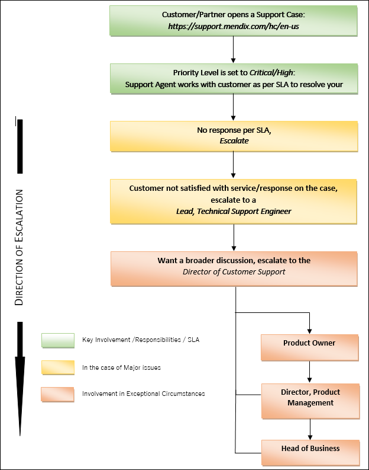

## 1 Introduction

The Mendix Support escalation process ensures that Mendix provides customers and partners with the means to give an issue broader attention. We are committed to delivering high-quality support to all our customers and partners. If you need to escalate a case, our technical team is ready and available to help you quickly bring your issue to closure.

Our efficient escalation management process is designed to keep you informed of your escalated case status at every step of the way. A lead and/or manager is assigned to every escalation to oversee the case from a holistic viewpoint. This member is responsible for evaluating the situation, facilitating the issue, and acting as an advocate on your behalf.

## 2 Types of Escalation

Escalations occur in support centers for a variety of reasons. An escalation management system allows an organization to identify, track, monitor, and manage situations that require increased awareness and swift action. Mendix provides our customers and partners with the two types of escalation described below.

### 2.1 Functional Escalation

We use this process when the Mendix Support team is unable to resolve the issue or stay within the agreed timeline (meaning, the targeted time for resolution is exceeded). We assign the issue to another team based on the skill set required to resolve the issue.

### 2.2 Hierarchical Escalation

We use this process as a communicative means to inform all the parties involved in a proactive manner of a potential SLA breach.

The essence of our escalation management is to bring order, structure, focused management attention, and additional resources to those customer situations which could otherwise result in a high level of customer dissatisfaction and/or damage to the service provider's reputation.                                                                                   

## 3 Escalation Process Overview

## 4 When Should an Escalation Be Initiated

For customers and partners who hold a valid support services contract, an escalation may be initiated anytime after the SLA response time. If you have worked through our standard support processes and with our teams and you are not satisfied with the level or timeliness of service you received, you can escalate accordingly. Additionally, an escalation should be initiated when there is tangible impact to your production environment, or there is high risk to the business operations.

Listed below are some examples of reasons to initiate an escalation:

* Management of a major problem, especially where impact to business is high and the problem is taking too long to isolate the cause of the incidents
* A prolonged outage that exceeds or threaten to exceed the SLA or timeframe
* Frequently recurring or multiple related hig-priority incidents where the priority is related to business impact and urgency
* Security breaches identified or reported by a customer without a workaround that is mutually agreed upon
* Risk of potential or actual damage to the customer's or provider's reputation
* Data loss or risk of potential data loss
* Common sense

## 5 What Is the Process for Escalating My Case?

The entry point into the Mendix escalation process is through your support case. Please note that for an issue to be escalated, a support case must be created (we will not accept escalations solely based on communications via email). The reason behind this is to get multiple teams involved if need be in a consolidated manner. All communication between the engineer and case owner from the conception of the case should be documented within the case notes so all involved teams can view the progression of the issue.

This is the normal process for a support case:

1. Navigate to the [Mendix Support homepage](https://support.mendix.com/hc/en-us).
2. Submit a request:

  

3. Once the ticket has been submitted, this incoming ticket is assigned to a Support Engineer.
4. This engineer will come to a solution most of the time, sometimes after discussion with a Technical Support Lead and, if needed, with our second-line team (as in, Modeler, Client, Core, or Expert Services).
5.	If the gap between the customer's expectation and the Mendix possibilities cannot be solved, the escalation is started.

## 6 Methods to Escalate My Support Case

### 6.1 Via Email

Send an email to **escalation@mendix.com** (and CC your Customer Success Manager). Ensure you add the following details to your email for an effective event-based escalation process:

* Case number
* Organization name
* Technical contact details (full name, email address, and phone number)
* The affected application URL and environment
* Documentation of the issue in its entirety (the problem, replication steps, what has been done so far, and the last status of the case from the assignee)

### 6.2 Through the Support Ticket

In the case notes, CC **escalation@mendix.com** and in the case note, do the following:

*	Document the problem description
*	Provide the business use case for the escalation
*	The next steps provided by the assigned Technical Support Engineer

## 7 What Can I Expect During an Escalated Status?

You will be contacted by the assigned Lead or Manager and we will collaborate and develop a communication plan. As needed, a technical plan of action will be co-developed to ensure resolution of the issue. The Lead or Manager will also update your account team (Customer Success Manager and/or Account Executive) of the case progression. The assigned Leads will work as advocates internally and become a virtual member of your own problem-resolution team.

## 8 What Criteria Does Mendix Use for Closing My Escalation?

An escalation will be considered closed if it meets one or more of the following requirements:

* The objectives that were initially agreed upon have been achieved
* A satisfactory monitoring period has elapsed without problem recurrence
* The escalation has been reviewed and an agreement reached to downgrade the case severity level
* You have agreed that the issue is resolved
* A mutually accountable decision has been made that the issue cannot or will not be resolved and this has been communicated to all parties

As part of our continuous improvement process, your escalation will be documented and reviewed to help Mendix determine the steps that led to the escalation and how to avoid the issue from reoccurring.

## 9 De-Escalation Process

Once resolved to the customer's satisfaction, the situation is monitored for an agreed-upon period. The escalation team remains on standby and available in case the problem reoccurs during the monitoring period.

The de-escalation process follows these steps:

1. Once the monitoring period is successfully completed, the escalation is closed by the Escalation Manager after seeking agreement with the customer.
2. Once the escalation is closed, a post-escalation review is conducted and added to the escalation record.
