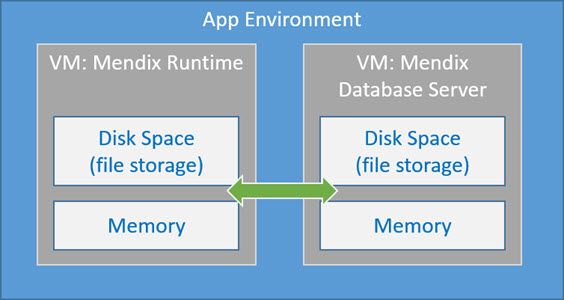
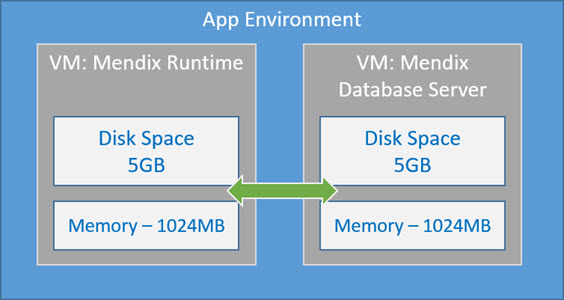
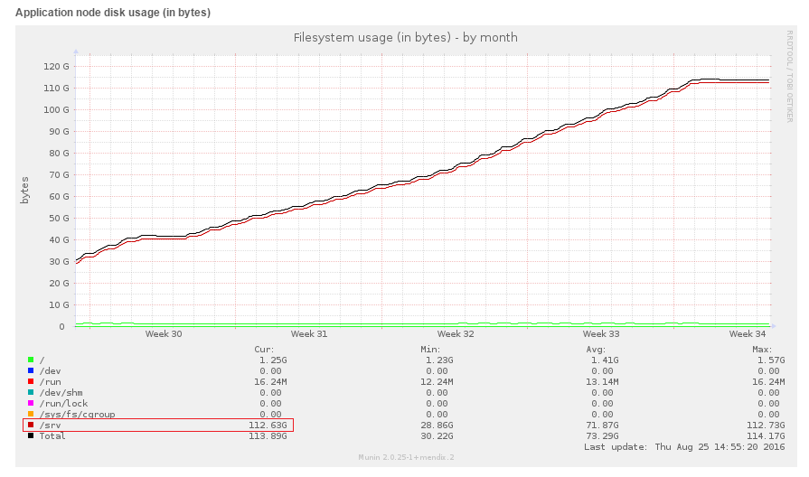
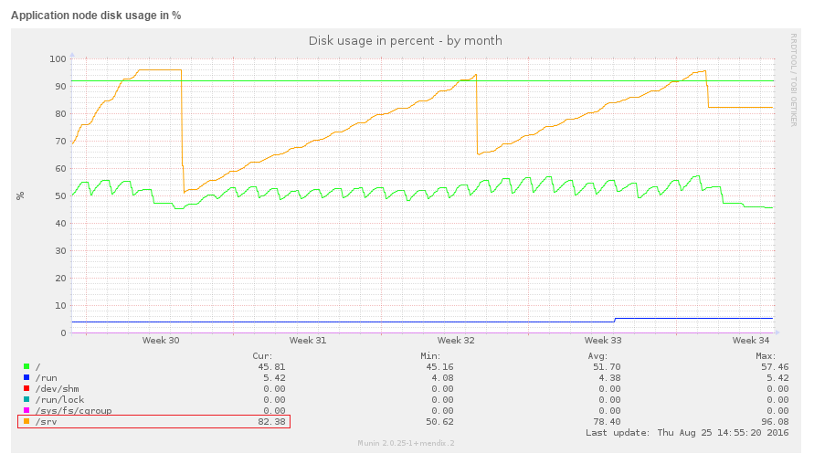
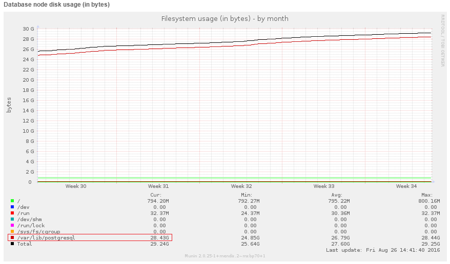
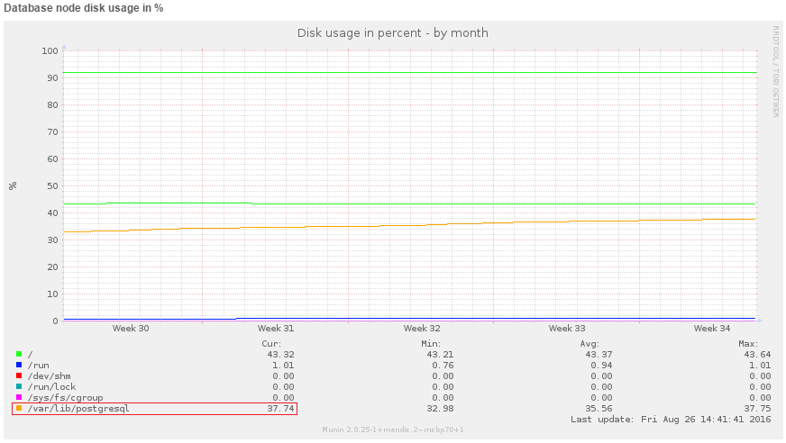

## 1 Introduction

In this how-to you will learn how-to calculate the total amount of disk space in gigabytes (GB) on a Mendix Cloud environment for both app-node and db-node.

Each Mendix environment consists of an application server (app-node) and a database server (db-node). Every server is equipped with memory (RAM) and disk space (File/DB storage).

All Mendix Cloud environments are running on an **'S'** container by default.
An **'S'** container consists of:

  *   10GB disk space
  *   1 GB Mx RAM
  *   1 GB DB RAM

The disk space is always divided evenly between the app-node and the db-node.

## 2 Prerequisites

Before starting this how-to, make sure you have completed the following prerequisites:

* A Mendix Cloud app environment

## 3 Calculate The Disk Space

In order to calculate the total amount of file storage, you need to look at 2 graphs: **Application node disk usage (in bytes)** and **Application node disk usage in %**.

You can calculate the total amount of disk usage with the this formula: ``(Disk usage in Gigs (/srv) * 100)/(Disk usage in % (/srv))``

### 3.1 Calculation Example
From the graph below you need the amount of disk usage in GB from the **/srv** folder. You should always use the current disk usage amount in order to calculate the total amount. In this graph it is **112.63** GB.

And from the graph below you need the amount of disk usage in percentage from the **/srv** folder. You should always use the current disk usage percentage in order to calculate the total amount. In this graph it is **82.38** %.

Using the formula above, the total amount of disk space for this app is: ``(112.63 * 100) / 82.38 = 136.7 GB``

## 4 Database Node Disk Space (DB Storage)

In order to calculate the total amount of DB storage you need to look at 2 graphs: **Database node disk usage (in bytes)** and **Database node disk usage in %**.

You can calculate the total amount of disk usage with the formula below: ``(Disk usage in Gigs (/var) * 100)/(Disk usage in % (/var))``

### 4.1 Calculation Example:

From the **Database node disk usage (in bytes)** graph you need the amount of disk usage in GB from the **/var** folder. You should always use the current disk usage amount in order to calculate the total amount. In this graph it is **28.43** GB.

 

From the **Database node disk usage in %** graph below you need the amount of disk usage in percentage from the **/var** folder. You should always use the current disk usage percentage in order to calculate the total amount. In this graph it is **37.74** %.

 

The total amount of disk space for this app is: ``(28.43 * 100) / 37.74 = 75.3 GB``
