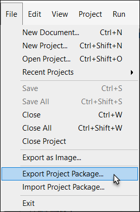
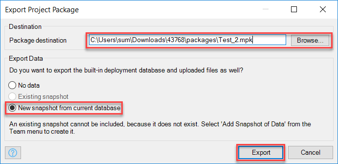

## 1 Introduction
In this how-to you will learn how to export a Mendix project package (.mpk) from the Mendix Modeler. You can export a project package for backup purposes or to share it with other Mendix developers.

**This how-to will teach you how to do the following:**

*   How to export a Mendix project to a Mendix Package file
*   How to exclude data from the export
*   How to include data in the export

## 2 Prerequisites
Before starting this how-to, make sure you have completed the following prerequisites:

* A Mendix project

## 3 Export A Project Package
Mendix project packages can be exported to a Mendix Package file (.mpk). To download a project package, folllow these steps:

### 3.1 Export With No Data
You can choose to include data from the built-in database in the Mendix Package. Follow these steps to download a package without data:

1. Open your project in the Mendix Modeler.
2. Go to **File** and select **Export Project Package...**.

  

4. Select the **Package destination**.
5.  Select **No data** in the *Export Data* section.
6.  Click **Export**.

The package will be exported to the selected package destination.

### 3.2 Export With A Snapshot
There are two snapshot options in the export dialog window. The *Existing snapshot* option will include the existing database snapshot in the export. The *New snapshot from current database* option will create a new snapshot from the database and include it in the export.

1. Open your project in the Mendix Modeler.
2. Go to **File** and select **Export Project Package...**.

  

4. Select the **Package destination**.
5. Select **New snapshot from current database**.
6. Click **Export**.

