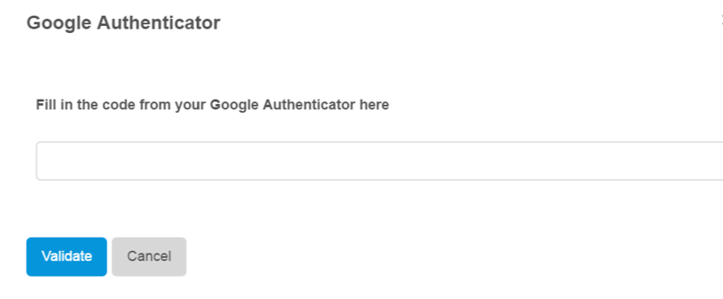

## 1 Introduction
Two-factor authentication (2FA) validates your password and is required for Mendix Cloud node activities done in a production environment. 2FA ensures that you are authenticated when performing sensitive activities, such as deploying packages and monitoring the production environment.

In this how-to you will learn how to set up 2FA. The Google Authenticator and SMS are two types of 2FA Mendix uses for Mendix Cloud Portal security.

Technical Conctacts are required to use 2FA with their Mendix account when they access licensed cloud node details, specifically for transporting MDA files (deployment archives) to the production environment.

**This how-to will teach you how to do the following:**

*   How to set up two-factor authentication

## 2 Prerequisites

Before starting this how-to, make sure you have completed the following prerequisites:

*   A Mendix account - create one at [http://www.mendix.com/try-now/?utm_source=documentation&utm_medium=community&utm_campaign=signup](http://www.mendix.com/try-now/?utm_source=documentation&utm_medium=community&utm_campaign=signup)
*   A computer and smartphone
*   Google Authenticator and QR code reader installed and configured on your smartphone

## 3 Set Up Google Authenticator

If you want to transport your deployment package into the production environment, follow these steps:

1.  Open your project in the Developer Portal (https://sprintr.home.mendix.com/index.html).
2.  Go to the **Deploy** tab.
3.  Click **Deploy** below the package you want to deploy.
4.  In the _Environments_ section click **Transport to Production** for the deployment package you want to transfer from your test environment to acceptance and then to production.
5.  Click **Use Google Authenticator** in the dialog box that opens.

    > The installation screens are different per smartphone type. The following steps are based on an Android phone.

6.  Open the **Google Authenticator** app on your smartphone.
7.  Select **Set up cccount** on the main page.
8.  Select **Scan a barcode** or **Enter provided key**.
9.  Scan the barcode or enter the six-digit time-based code.
10. Once Google Authenticator is set up you will be asked to confirm by entering the Google Authenticator code.

    

Your account is now secured with 2FA and ready to use. You will get a six-digit number that expires every minute. You will need to enter that number to validate your account every time you access production.
