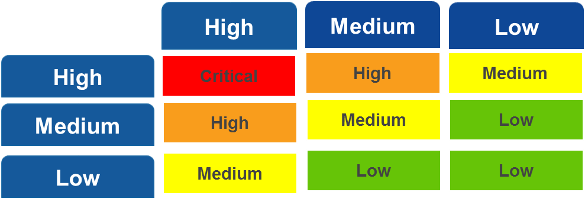

## 1 Introduction
The Priority Levels are determined based on Impact and Urgency.

## 2 Priority

Impact  | Description
------- |
High    | A high priority production issue with a high impact on the customer’s business, impacting (almost) all users.
Medium  | A production issue with intermediate impact on the customer’s business, impacting a group of users.
Low     | A trivial production issue with no impact on the customer’s business.

Urgency | Description
------- |
High    | The operational functionality is *severely* disrupted.
Medium  | The operational functionality is *fairly* disrupted.
Low     | The operational functionality is *hardly* disrupted.

## 3 Priority Matrix

If Mendix provides a workaround the Priority can never be higher than Medium.
