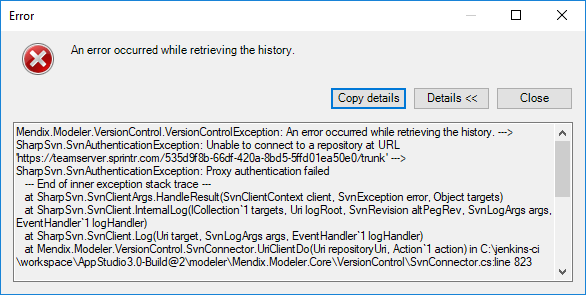
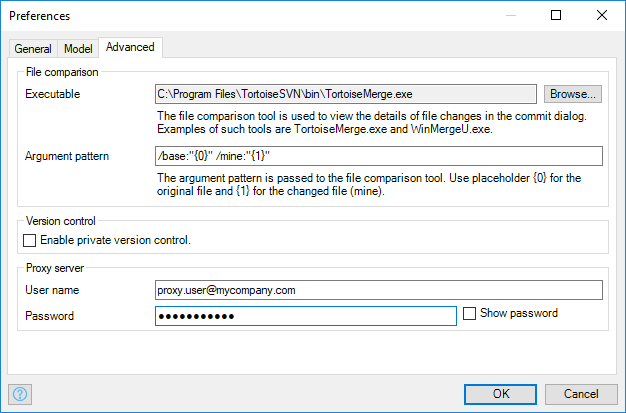

## 1 Introduction

The Mendix Modeler contains a version control system that supports collaborating with team members. This document presents fixes that can be used when version control problems arise.

## 2 Known Problems & Fixes

Below is a list of known problems and steps to fix them.

### 2.1 Getting an error that contains `SharpSvn.SvnAuthenticationException: Proxy authentication failed`

This error means that the Modeler has problems reaching the version control server because of a proxy server.

The proxy settings can be changed in the Modeler by selecting **Edit** > **Preferences** and then the **Advanced** tab. In the **Proxy server** section, you can change the proxy authentication settings. Fill in the correct **User name** and **Password** for the proxy server.

### 2.2 Getting an error that contains another `SharpSvn.SvnAuthenticationException`

If you are using the Desktop Modeler version 7.18 or higher, sign out and then sign back in.

If you are using a Desktop Modeler version lower than 7.18, follow these steps:

1. Remove all the files from the *\Users\<your username>\AppData\Roaming\Subversion\auth\svn.simple* folder.
2. Remove all the files from the *\Users\<your username>\AppData\Local\Mendix\svnconfig\auth\svn.simple* folder.

### 2.3 Getting an error with the message `Connection timed out`

If you are using the Desktop Modeler version 7.18 or higher, follow these steps:

1. Open the *\Users\<username>\AppData\Roaming\Subversion\servers* file with any text editor.
2. Add the text `http-timeout = 5000` under the section `[global]`.
3. Save the file.

### 2.4 Getting an error with the message `<project folder> is already locked`

1. Install TortoiseSVN as we suggest in System Requirements (https://docs.mendix.com/refguide/system-requirements). Please use version 1.7.x which can be downloaded from https://sourceforge.net/projects/tortoisesvn/files/1.7.15/
2. Go to the parent directory (folder) of your project, this is the folder with the <folder_name> from the error message.
3. Open the folder context menu (right click)
4. On the **TortoiseSVN** sub-menu select **Clean up**.

## 3 Other Problems

If the solutions here do not work for your version control problems, please submit a request with [Mendix Support](https://support.mendix.com/).

## 4 Related Content

* [How to Submit Support Requests](how-to-submit-support-requests)
