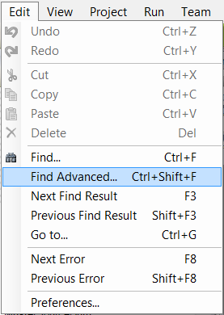
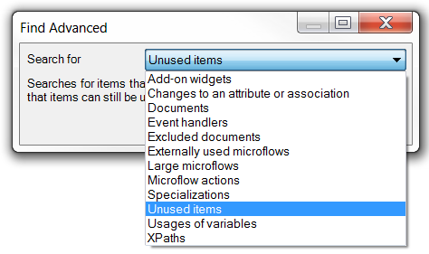
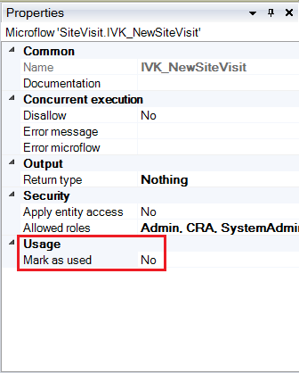
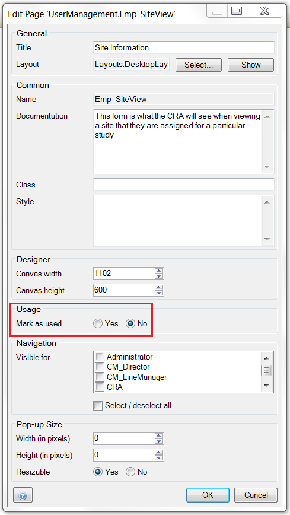

# Finding Unused Items

During the development of your application it might occur that specific functionality, pages, microflows etc. aren't applicable anymore for the final version of your application. In order to keep your model clean, clear and easy to maintain it is advised to cleanup any unused items. This How-To will teach you how you can find unused items and what you have to keep in mind dealing with unused items.

## 1\. Finding unused items

Within this part of the How-To you will learn how you can find unused items within your model.

1.  Click **Edit** in the Modeler toolbar.
2. Click **Find Advanced...**
    

    You can also open the **Find Advanced** popup by using the shortcut **Ctrl+Shift+F**.

3. Select **Unused items** as **search for** option
    
4.  Click on **Find**.
5.  The results will show up under the **Find Results** tab.

You can filter the results by clicking on the 'Show all' button on the topright of the result table. To learn more about filtering the find results, please have a look at the How-To: Filter a result set.

Keep in mind that by deleting any unused items the actual list of unused items might grow. For example, if you delete an unused page any microflow which is only used on that page will become an unused item itself. If you are cleaning up your application regularly refresh the unused items list.

Modules downloaded from the Appstore might contain a lot of unused items. If you remove those items and the module is updated later, those items will be back in your model. It is advised that you don't remove any unused items from an Appstore module.

Any objects which are excluded from the project won't show up in the unused items list.

## 2\. Set unused objects to 'Used' 

Some pages and microflows are only used from Java code and will be listed as an unused item because the Modeler can't look into Java source code. To prevent anyone from removing these objects you can mark the page or microflow as 'used'. In this part of the How-To you will learn how to do so.

1.  Open the page or microflow which needs to be marked as 'used'.
2.  Change the **Mark as used** property from **no** to **yes** in the properties table of the Modeler.
    
3.  **Save** the object.

To mark a page as 'used' you can also use the properties popup by clicking the right mouse button on the page and select 'Properties'.

## 3\. Related content

*   [Finding Object Activities](finding-object-activities)
*   [Finding Unused Items](finding-unused-items)
*   [Finding your way through a project](finding-your-way-through-a-project)
*   [Querying over self-references](querying-over-self-references)
*   [Showing a Project in the Directory in Explorer](showing-a-project-in-the-directory-in-explorer)
*   [Translatable Validation Messages](translatable-validation-messages)
