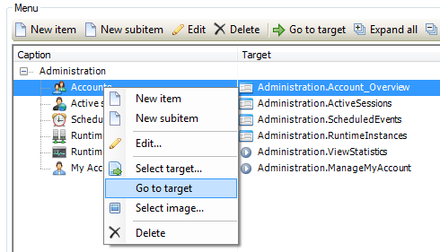
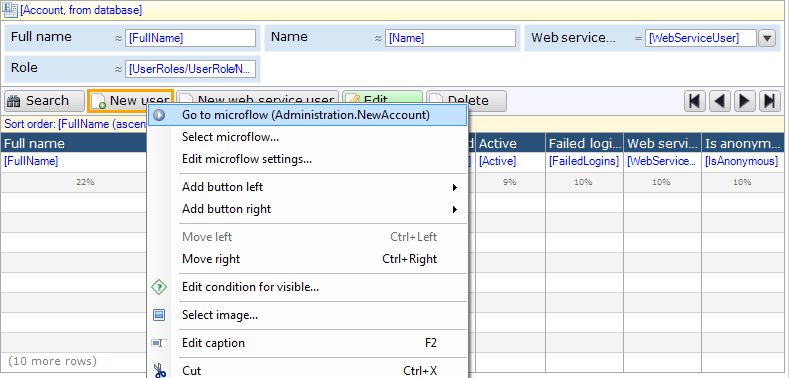
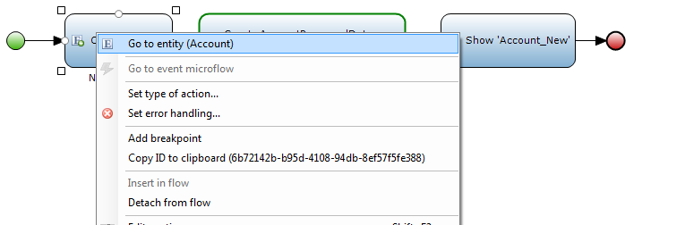
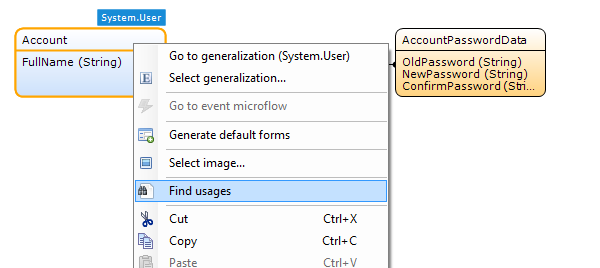
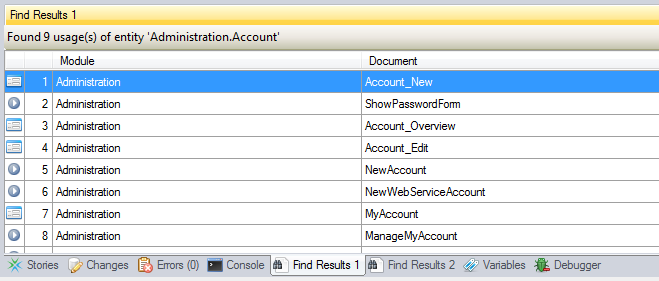
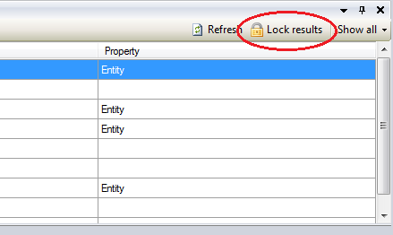

This how-to explains how you can find your way through a project in the Mendix Modeler. At many places in the Mendix Modeler you can access a handy menu by clicking the right mouse button. Two options are commonly used to find your way through a project and they are called "Go to" and "Find usages." The "Go to," for example, allows you to navigate to the target of a button or to the source of data grid. The "Find Usages" option, for example, allows you to find all buttons that are opening a certain page.

## 1\. "Go to" Options

1.  Select **Project** > **Navigation**.
2.  Right-click a menu item and select **Go to target**. The Modeler now opens the corresponding target of the menu item, in this case a page.
    
3.  Now right-click any of the buttons in the data grid and select **Go to microflow**. The Mendix Modeler opens the corresponding microflow.
    
4.  Right click any of the activities in the Microflow and select 'Go to entity'. The Mendix Modeler now opens the corresponding domain model.
    

## 2 Finding Usages

1.  In the domain-model, right-click any of the entities and select **Find usages**. The Mendix Modeler shows all the usages of this entity in the 'Find Results' pane.
    
2.  Double click any of the items in the **Find Results** pane to open the corresponding document.
    
3.  Now click **Lock results** in the **Find Results** pane. From this moment on, if you click 'Find Usages', the results will be shown in a second 'Find Results' pane. This allows you to continue navigating while keeping your initial search results open in the first 'Find Results' pane.
    

## 3\. Related content

*   [Finding Object Activities](finding-object-activities)
*   [Finding Unused Items](finding-unused-items)
*   [Finding your way through a project](finding-your-way-through-a-project)
*   [Querying over self-references](querying-over-self-references)
*   [Showing a Project in the Directory in Explorer](showing-a-project-in-the-directory-in-explorer)
*   [Translatable Validation Messages](translatable-validation-messages)
