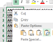
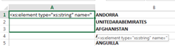
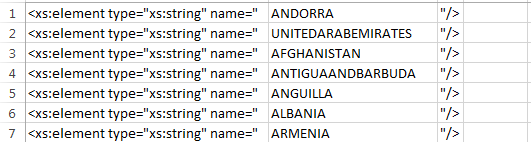
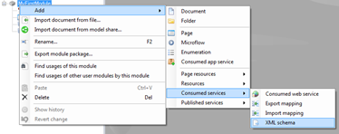
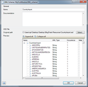
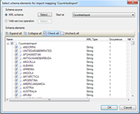
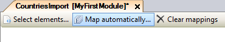
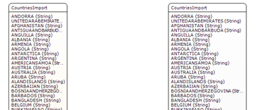
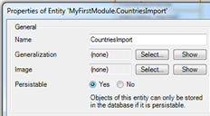

Every now and then it happens that a client asks you to import some data. It doesn’t look like a lot of effort at first glance so you add it as a task and plan to pick it up at the end of the day.

Looking at the sheet you realize that there are more than hundred columns which need to be imported into the application. This means manual labour. A lot of it. As every column represents an attribute, creating 100+ new attributes in an import entity will take ages.

…If you do it manually.

Here’s the trick:

It’s the XML to domain mapping.

We will use the XML to domain mapping to create a new import entity from an Excel sheet quickly, and semi-automated. Just follow the next steps to get the hang of it!

**After completing this how-to you will know:**

*   How to quickly import a large Excel file with many columns

## 1. Preparation

Before you can start with this how-to, please make sure you have completed the following prerequisites.

*   Have an app with the MxObject reflection and Excel Importer installed and configured from the App Store.

## 2\. Modifying your Excel sheet

The Excel sheet you received practically contains every country in the world. In every country some data is stored. The data has to be imported into your application.

You can find the Excel sheet here:[ _http://1drv.ms/1Rlh7rR_](http://1drv.ms/1Rlh7rR)

We are going to make an XSD schema from the headers in the Excel sheet, so we can import this later into our model.

1.  Select the header row with all the country names.
2.  Copy and paste them in a new sheet using the transpose function.
     
    Your headers should be listed vertically and your sheet should look like this:[ _http://1drv.ms/1Rlhd2E_](http://1drv.ms/1Rlhd2E)
    We are now ready to add some tags around the column.
3.  Add one column to the left.
4.  Place the following string in cell A1:

    ```text
    <xs:element type="xs:string" name="
    ```

5.  Now drag it down all the way to the last country.
    

6.  In cell C1 enter the following string:

    ```text
    "/>
    ```

7.  And like you did with the previous one, drag it down to the last country. The Excel sheet should look something like this now:

    [_
    http://1drv.ms/1RlhmmP_](http://1drv.ms/1RlhmmP)

    Now we have to get the three different columns into one column. This is needed because later on we want to copy the whole column into an XSD file.
8.  Select cell D1 and type the following into the formula box:

    ```text
    =(A1&B1&C1)
    ```

9.  Drag the cells down like you’ve done with column A1 and C1\. Now your column D should have all the columns A,B and C combined into one. Your sheet should look like this:[ _http://1drv.ms/1SFD7j1_](http://1drv.ms/1SFD7j1)

## 3\. Preparing your XSD file

We have used some of the basic functionalities of Excel to help us out creating the first part of our XSD structure. For a proper XSD file we still need to have an header and a footer.

This is where your favourite text editor comes in. I prefer to use Brackets.

1.  Open a new file and call it “CountriesImport.xsd”.
2.  Place this text as the header of your XSD file:

    ```text
    <?xml version="1.0"?>
    <xs:schema xmlns:xs="http://www.w3.org/2001/XMLSchema" attributeFormDefault="unqualified" elementFormDefault="qualified">
    <xs:element name="CountriesImport">
    <xs:complexType>
    <xs:sequence>
    ```

3.  Go back to your sheet, copy the content from column D and paste it underneath the header.
    Now it’s time to place the footer which will complete the XSD file. 
4.  Place this text as the footer of your XSD file:

    ```text
    </xs:sequence>
    </xs:complexType>
    </xs:element>
    </xs:schema>
    ```

    Your file should look like this:
    [_http://1drv.ms/1RlhrXy_](http://1drv.ms/1RlhrXy)

5.  Don’t forget to save it!

## 4\. Import into your application

The xsd is ready to be imported into the modeller.

1.  Open your app and create a new XSD schema.

     
2.  With the new XSD schema created, it’s time to create the XML to Domain mapping which will perform the trick for you and make your life a bit easier.

     
3.  Make sure to check all the attributes!

    After you pressed OK, you should see a mapping entity with all your countries in there. Let’s generate a real entity from it, which you can use as an import table for your Excel sheet.
4.  Simply press “Map automatically…”

    

    …and there’s your entity!

     
5.  Go to your domain model, set the entity’s property to persistable and the job is done!

    
6.  To keep your application clean, you could delete the XSD schema and XML to Domain files from your project.

Happy modelling!
