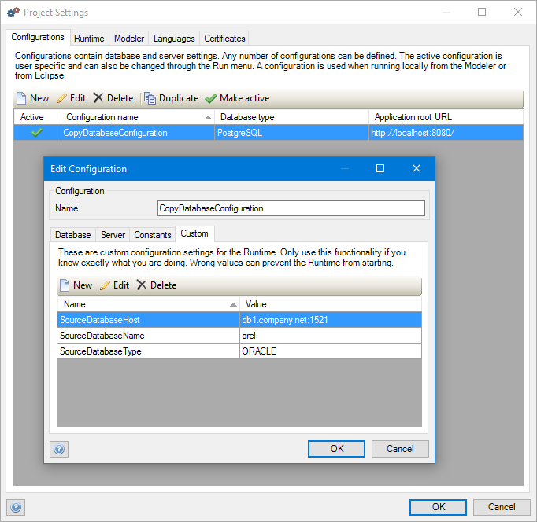
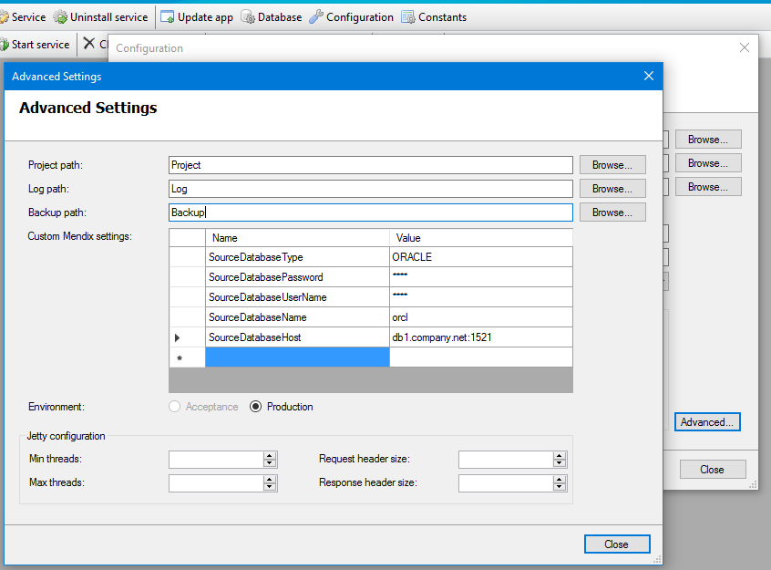

This document explains how to migrate the data in an existing Mendix database to another Mendix database. This can be useful if you want to migrate from one type of database to another, for example MS SQL Server to PostgreSQL.

**After completing this how-to you will know:**

*   How to migrate non PostgreSQL database to PostgreSQL database
*   How to export PostgreSQL database
*   How to upload exported PostgreSQL database to the Mendix cloud
*   How to export a Mendix cloud database
*   How to import into on-premise PostgreSQL database
*   How to migrate PostgreSQL database to non PostgreSQL database

## 1. Introduction

You can copy all data from any Mendix-supported database system to any other Mendix-supported database system. E.g., you can copy demo, test, and production databases from built-in to PostgreSQL, and from PostgreSQL to built-in. Or you can use this to migrate production data from SQL Server or Oracle (on-premise) to PostgreSQL in our cloud.

To perform this, start your app on the database you would like to copy the data to. This database should already exist and should be totally empty. To let Mendix know from which database all data should be copied, you have to configure some custom configuration settings. These custom settings define the type of the source database, the host name, the user name and password, etc.

The most commonly used custom settings for database migration are:

*   SourceDatabaseType (HSQLDB, MYSQL, ORACLE, POSTGRESQL, SQLSERVER)
*   SourceDatabaseHost
*   SourceDatabaseName
*   SourceDatabaseUserName
*   SourceDatabasePassword

See [Custom Settings](/refguide6/custom-settings) for more information about the list of all available settings. These settings can be configured as follows:

*   Modeler: in Project Explorer, expand Project, double-click Settings, edit a configuration, go to the right-most tab called Custom.
     
*   Service Console: click on an app on the left pane, click Configuration, click Advanced, see Custom Mendix settings.
     
*   m2ee-tools: add the custom settings to the mxruntime section. See [https://github.com/mendix/m2ee-tools/blob/develop/examples/full-documented-m2ee.yaml](https://github.com/mendix/m2ee-tools/blob/develop/examples/full-documented-m2ee.yaml)

You can migrate databases using either the Modeler, the Service Console or m2ee-tools. The Service Console gives you the advantage of seeing a progress bar during the copy process, which is handy if you copy a lot of data which takes a long time to execute.

{}

Database migration is handled by Mendix as a normal database synchronization phase during the start-up process of an app. As a consequence, it is possible that during the start-up process you will get to see messages like ‘The database has to be synchronized’ or you will see an empty message. In the future, tools like the Service Console and m2ee-tools will recognize this phase better and give more appropriate messages. However, these tools already correctly handle the database migration.

{}{}

Before the data copy process starts, the source database will also be synchronized with the model, just like the main database. This is necessary to enable copying all the data without problems.

{}

## 2. How to migrate a non-PostgreSQL database to a PostgreSQL database

In the Mendix cloud environment we only use PostgreSQL as database server. The recommended way is to migrate your existing on-premise non-PostgreSQL source database to a new on-premise PostgreSQL target database. 

The source database is the database with the data that you would like to migrate to the cloud. The target PostgreSQL database should be completely empty, i.e. it should not contain any tables. In the Mendix project the active configuration in Settings should point to the target database, and you should add the Custom configuration settings for the source database as explained above in the introduction.

Having configured the Mendix project, just run the application locally and it will automatically migrate the database schema and all the data from the source database to the target database. Before exporting the target database, you should always validate it first by viewing the application in a browser. 

### 2.1 How to export a PostgreSQL database

In order to export a PostgreSQL database, refer to either the [pg_dump](https://www.postgresql.org/docs/9.5/static/backup-dump.html) command line tool or the [PG Admin](https://www.pgadmin.org/docs/1.22/backup.html) visual tool documentation to understand how to create a backup of your new PostgreSQL database.

### 2.2 How to upload an exported PostgreSQL database to the Mendix cloud database

Use Cloud Portal to upload the migrated, exported database backup to the . This can be accessed using the Nodes page in Sprintr: select your app and environment, click Details, click on the Backup tab and use the Upload Data button to upload your Database using the file chooser to select the exported database file from your local file system.This will stop and clear your existing environment.

## 3\. How to export a Mendix cloud database

The same procedure can be used to export an existing Mendix cloud database, import it into an on-premise PostgreSQL source database and migrate that to an on-premise non-PostgreSQL target database.

Export the Mendix cloud database via Cloud Portal. This can be accessed using the Nodes page in Sprintr: select your app and environment, click Details, click on the Backup tab, select an existing Backup from the list, and click the Download Backup button to download the database to your local file system using the Database URL shown in the dialogue. A fresh backup with recent data could also be created first using the Create Backup button.

### 3.1 How to import into on-premise PostgreSQL database

In order to import a PostgreSQL database using the downloaded database file, refer to either the [pg_dump](https://www.postgresql.org/docs/9.5/static/backup-dump.html) command line tool or the [PG Admin](https://www.pgadmin.org/docs/1.22/restore.html) visual tool documentation to understand how to restore your downloaded database file.

### 3.2 How to migrate PostgreSQL database to non PostgreSQL database

The source database is the PostgreSQL database with the downloaded database from the Mendix cloud. The target non-PostgreSQL database should be completely empty, i.e. it should not contain any tables. In the Mendix project the active configuration in Settings should point to the target database, and you should add the Custom configuration settings for the source PostgreSQL database as explained above in the introduction.

Having configured the Mendix project, just run the application locally and it will automatically migrate the database schema and all the data from the source database to the target database. You should always validate it first by viewing the application in a browser.
