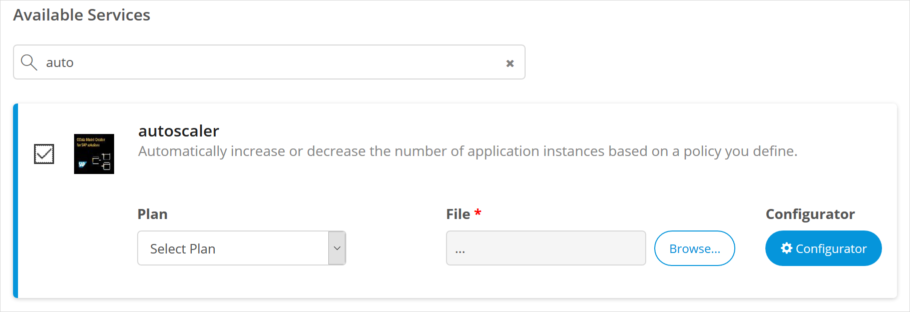
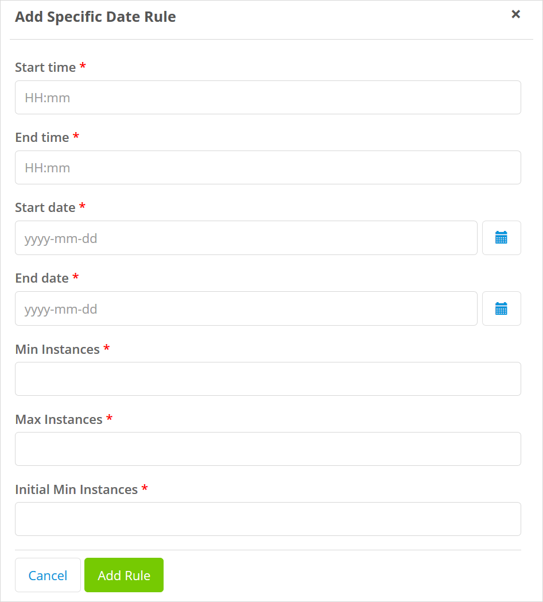
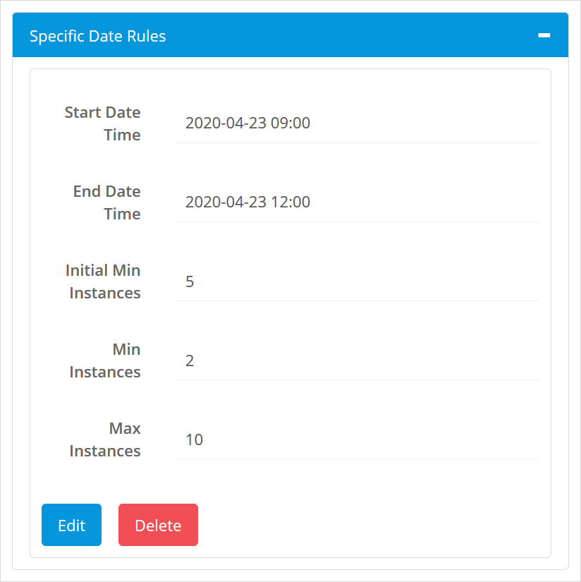
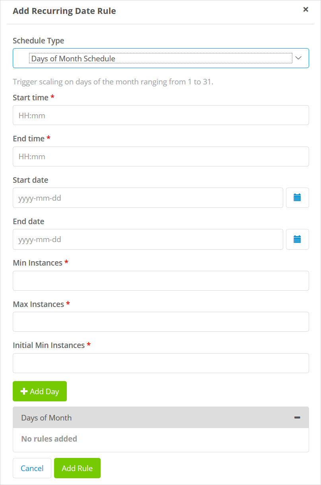
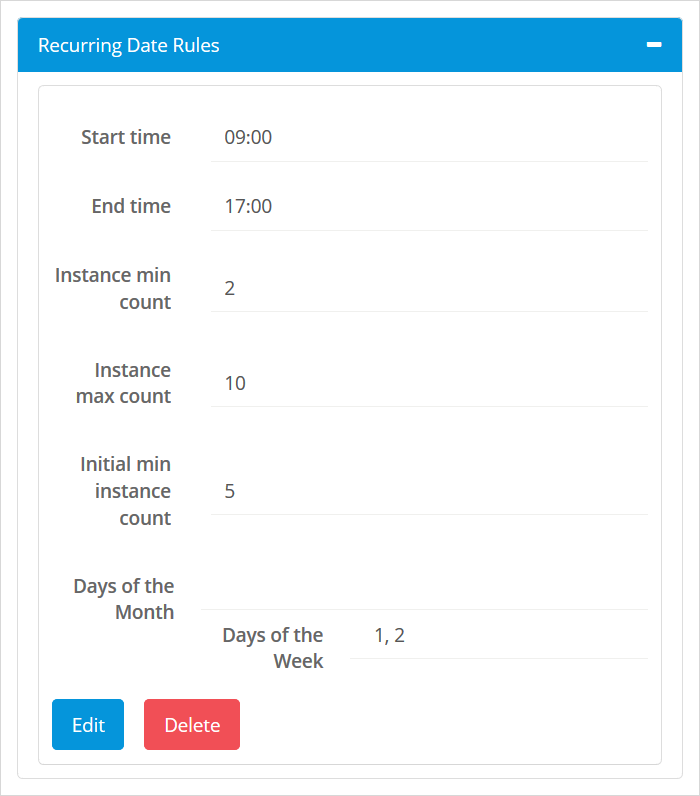
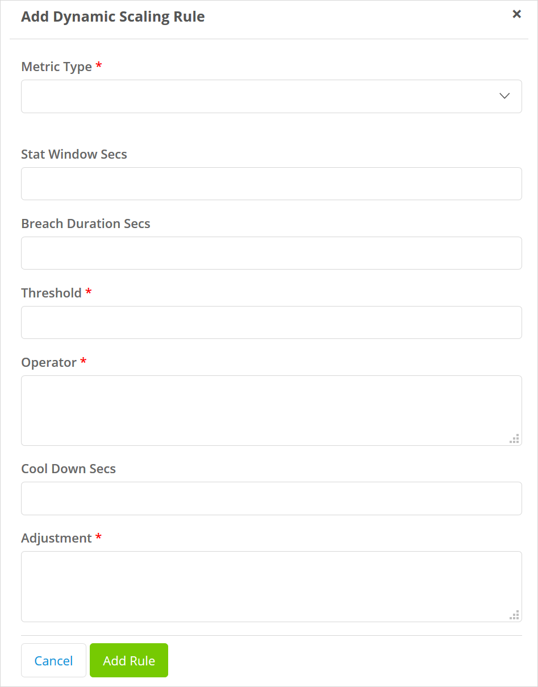
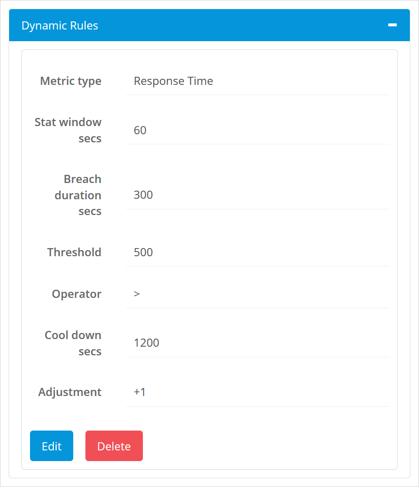

## 1 Introduction

The **Application Autoscaler** service for SAP Cloud Platform enables applications to automatically increase or decrease the number of instances of your app. This can be based on a schedule, or based on the value of a metric.

For more information on the Application AutoScaler see [Application Autoscaler Service](https://help.sap.com/viewer/7472b7d13d5d4862b2b06a730a2df086/Cloud/en-US/4ad999a0be664160a08514ba4ce6430c.html) on the *SAP Help Portal*.

## 2 Binding the Application Autoscaler{#binding}

The autoscaler service can be found on the [services tab](/developerportal/deploy/sap-cloud-platform#binding-services) of the environment details page of your app's environment.

Selecting the autoscaler service will expand the entry to allow you to enter more details about the service you wish to bind, namely the **Plan** and the **File** which contains the configuration.

You will need to specify the following:

* **Plan** – the plan you wish to use for the autoscaler, either *Lite* or *Standard*
* **File** – the file which contains the JSON to configure the autoscaler — more information, including the contents of the configuration file can be found in [Application Autoscaler Service](https://help.sap.com/viewer/7472b7d13d5d4862b2b06a730a2df086/Cloud/en-US/4ad999a0be664160a08514ba4ce6430c.html) on the *SAP Help Portal*

Having provided this information, you can click **Connect Services** to connect the autoscaler to your app.

You will see from the documentation on the SAP website that the structure of the configuration file can get quite complex. Mendix therefore provides you with a tool to help you create the correct configuration.

Click **Configurator** to start the **Autoscaler Configurator**.

## 3 Using the Autoscaler Configurator

The **autoscaler configurator** provide a user friendly interface to create the JSON required to configure the application autoscaler.

{}
The configurator will only create a JSON file from scratch. It does not have access to your existing autoscaler settings on SAP Cloud Platform, and you cannot import any existing JSON files.
{}

There three options available:

* Scheduled Scaling – the app is scaled according to a fixed schedule
* Dynamic Scaling – the app is scaled depending on the value of a metric
* Custom – a combination of both scheduled and dynamic scaling

The metrics you can use to trigger dynamic scaling are as follows:

* Memory consumed: monitors memory consumption in megabytes (memoryconsumed) or in percentage (memoryutil)
* CPU Utilization in percentage
* Response time: monitors response time in milliseconds
* Throughput: monitors requests per seconds (RPS)

{}
The configurator does not support adding custom metrics as triggers.
{}

Open the autoscaler configurator by clicking **Configurator** next to the autoscaler service in the Services tab of Environment Details.

You will first need to decide the sort of scaling you want to apply.

For **Scaling** select one of:

* Schedule-based scaling – scaling based on a schedule, see [Scheduled Scaling](#schedule), below
* Dynamic scaling – scaling based on the values of metrics, see [Dynamic Scaling](#dynamic), below
* Custom – you will need to set up both [Dynamic Scaling](#dynamic) and [Scheduled Scaling](#schedule) as described in the sections below

You will then be asked to set up the requested type of scaling. A summary of the information required is shown in the sections below and more information is available in [Application Autoscaler Service](https://help.sap.com/viewer/7472b7d13d5d4862b2b06a730a2df086/Cloud/en-US/4ad999a0be664160a08514ba4ce6430c.html) documentation on the *SAP Help Portal*.

When you have added all the rules, click **Generate Configuration File** to create a file containing the correct JSON for your autoscaler configuration.

You can then upload this file as the configuration of your autoscaler service.

## 3.1 Scheduled Scaling{#schedule}

{}
Do not attempt to enter overlapping schedules as this will cause the scaling to fail.
{}

Firstly you need to choose whether to set up a [Recurring Schedule](#recurring) or a schedule based on a [Specific Date](#specific). You can also choose to set up a **Custom** combination of the two.

For all the types of schedule you will need to set the following:

* **Min Instances** – minimum number of application instances that always run
* **Max Instances** – maximum number of application instances that can be provisioned as part of application scaling
* **Timezone** – the timezone in which to run the schedule

{}
For custom schedules you will see these values on the screen more than once, but changing them in one place will automatically set them in the others.
{}

Other information will depend on the type of schedule you are making. You can add multiple rules and all the rules you have already set up in the configurator will be displayed. See the sections below for more information.

### 3.1.1 Specific Date{#specific}

Click **Add rule** or **Add another rule** (if rules already exist) to add a new rule.

You will need to enter the information requested on the following screen. A tooltip explains what needs to be entered for each value:

Click **Add Rule** to add this rule.

The new rule, and any existing rules will be shown in the configurator as shown below.

You can collapse the view of existing rule by clicking **-** and expand it again with the **+**.
You can also edit an existing rule by clicking **Edit** and delete an existing rule by clicking **Delete**.

### 3.1.2 Recurring Schedule{#recurring}

Click **Add rule** or **Add another rule** (if rules already exist) to add a new rule.

Select whether you want to add a rule for days of the week (for example every Monday) or days of the month (for example on the 4th of every month). You can change this on the next screen if necessary.

You will need to enter the information requested on the following screen. A tooltip explains what needs to be entered for each value:

Click **Add Day** to add the days to which this recurring schedule applies. If it is a rule for days of the week, day 1 is always Monday irrespective of any local conventions. You can add several days by using **Add Day** multiple times.

Click **Add Rule** to add this rule.

The new rule, and any existing rules will be shown in the configurator as shown below.

You can collapse the view of existing rule by clicking **-** and expand it again with the **+**.
You can also edit an existing rule by clicking **Edit** and delete an existing rule by clicking **Delete**.

## 3.2 Dynamic Scaling{#dynamic}

First you will need to set the following:

* **Min Instances** – minimum number of application instances that always run
* **Max Instances** – maximum number of application instances that can be provisioned as part of application scaling

{}
For custom schedules you will see these values on the screen more than once, but changing them in one place will automatically set them in the others.
{}

Click **Add rule** or **Add another rule** (if rules already exist) to add a new rule.

You will need to enter the information requested on the following screen. A tooltip explains what needs to be entered for each value:

Click **Add Rule** to add this rule.

The new rule, and any existing rules will be shown in the configurator as shown below.

You can collapse the view of existing rule by clicking **-** and expand it again with the **+**.
You can also edit an existing rule by clicking **Edit** and delete an existing rule by clicking **Delete**.

