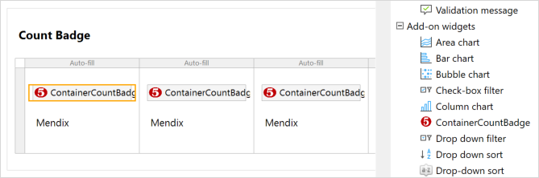
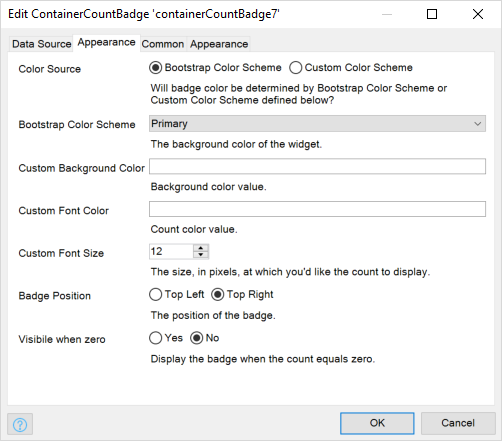

<!-- NOTES
Check all links
Should we have a section on the "Shell Bar"?

-->

## 1 Introduction

SAP Fiori 3 is SAP's target design system used to give your SAP C4/HANA application a consistent look and feel. The [SAP Fiori 3 UI Resources](#wrong) module in the Mendix App Store allows you to apply this look and feel to your Mendix apps running on SAP C4/HANA.

The Mendix module gives you access to designing your pages with SAP Fiori-styled widgets and building blocks as part of your layout. You can also allow end-users to select a theme and apply it immediately. The module supports SAP Quartz Light and Dark themes.

You can experience the SAP Fiori 3 design by using the [SAP Fiori 3 Starter App](#wrong) as the basis for a new app, or by including the [SAP Fiori 3 UI Resources](#wrong) module in your app.

More information on using SAP Fiori 3 design in your Mendix app is available in the following sections:

* [Widgets](#widgets) – Mendix core widgets have SAP Fiori 3 styling
* [Building Blocks](#building-blocks) – groups of widgets which can be used to quickly create SAP Fiori styled pages
* [Layouts](#layouts) – different styles of page which can be used in your app — for example, Master/detail or Pop-Up
* [Page Templates](#page-templates) – readily-available page templates which are already styled ready for you to use in your Mendix app
* [Theme Selector](#theme-selector) – switch between different theme — for example *light* and *dark*

## 2 Widgets{#widgets}

The majority of Mendix widgets have been styled to match SAP Fiori 3 styles by default. Examples are shown below.

There are a few cases where you will need to apply some extra CSS classes manually to achieve the correct SAP Fiori look and feel. These are described in [Applying CSS Classes Manually](#apply-css).

There are also a few SAP Fiori components which are not supported by Mendix core widgets. These are listed in [Unsupported SAP Fiori Components](#unsupported-components), below.

### 2.1 Examples of Mendix Core Widget Styling

You can see examples of the Fiori 3 styling of the Mendix Core Widgets by going to the **Mendix_Core_Elements** page of the SAP Fiori 3 UI Resources App Store Module.

Most widgets work the same way as they do in other Mendix styles based on Atlas UI, but there are some changes which are listed in the sections below.

#### 2.1.1 Buttons

You can choose different types of button by setting the appropriate **Button style**. The SAP Fiori styles are mapped as follows:

| **SAP Fiori Style** | **Mendix Button Style** |
| --- | --- |
| Default | Default |
| Emphasized | Primary |
| Positive | Success |
| Negative | Danger |
| Attention | Warning |
| Transparent | *this can be added using a building block* |

{{% image_container width="75%" %}}

{}

For the **Link button**, see [Applying CSS Classes Manually](#apply-css), below*.

#### 2.1.2 Container Count Badge

The **container count badge** allows you to add a count badge to containers on Mendix pages as shown in the following example.

You can create this style by adding the **ContainerCountBadge** widget inside a container.

The number which is displayed in the badge is supplied by a microflow which you can specify in the **Data Source** tab of the badge properties. The microflow must return an integer value.

You can specify the appearance of the count badge in the **Appearance** tab of the badge properties. If you want to maintain the correct SAP Fiori theme, you should choose the **Color Source** *Bootstrap Color Schema*.

#### 2.1.3 List Views

Standard Mendix **List view** widgets can be used on your pages. However, these cannot be borderless. You can add a borderless list from a building block.

### 2.2 Applying CSS Classes Manually{#apply-css}

Some SAP Fiori styling requires you to add some additional CSS classes manually for the styles to be implemented correctly. These cases are described in the following tables.

| SAP Component Style | Mendix Class(es) |
| --- | --- |
| Disabled Link | link-disabled |
| Emphasized Link | link-emphasized |
| Inverted Link | link-inverted |
| Right Icon Link | link right icon |
| Left Icon Link | *this is the default* |

### 2.3 Unsupported SAP Fiori Components{#unsupported-components}

* Avatar – you can mimic this using a **List 3** building block
* Message Strip – we suggest you use one of the **Notifications** building blocks 
* Message Toast/Short message on actions
* Time
* Timepicker
* StepInput

In addition, there are some limitations on supporting other components:

* In **Menus** you cannot have:
    * two icons
    * a slider showing sub-menus
* In **Calendars** you cannot:
    * highlight multiple dates such as holidays or other special days
* In **Tables**
    * you cannot use icons on tables
    * you cannot select rows using checkboxes, you can only select rows using the standard Mendix selection methods
* In **Tabs** you cannot have
    * icons with a counter
    * only icons

## 3 Building Blocks{#building-blocks}

You can see examples of the Fiori 3 building blocks by going to the **Building Blocks** page of the SAP Fiori 3 UI Resources App Store Module. The building blocks are categorized by type.

## 4 Layouts{#layouts}

You can see examples of the Fiori 3 navigation layouts by going to the **Layout** page of the SAP Fiori 3 UI Resources App Store Module. These layouts are designed for use in *Responsive (Web)* applications, designed to run in a browser.

The guidelines for the use of each layout are:

* Use the **PopupLayout** to create a page which appears in front of the existing page.
* Use the **SAP_Launchpad** layout when you want to create a SAP Fiori Launchpad. See [SAP Fiori Launchpad – Overview](https://experience.sap.com/fiori-design-web/launchpad/) on the *SAP Fiori Design Guidelines* site for more information.
* Use a *Default* layout to display information in a single panel.
* Use a *MasterDetail* layout to display information in two panels side-by-side such as an *Order* with multiple *Order Lines*.
* Use a *Sliding* layout to display dynamic side content. See [Dynamic Side Content](https://experience.sap.com/fiori-design-web/dynamic-side-content/) on the *SAP Fiori Design Guidelines* site for more information.
* Use a *Letterbox* layout use Letterboxing display to restrict your layout to a certain width. See [Letterboxing](https://experience.sap.com/fiori-design-web/letter-boxing/) on the *SAP Fiori Design Guidelines* site for more information.
* Use an *Embedded* layout when you are using this page inside a page which already contains a Header.

Here is a list of the layouts you can use.

* PopupLayout (SAP_3_0_UI_Resources) 
* SAP_MasterDetail_Embedded (SAP_3_0_UI_Resources) 
* SAP_Launchpad (SAP_3_0_UI_Resources) 
* SAP_Default_Letterbox (SAP_3_0_UI_Resources) 
* SAP_MasterDetail_Sliding (SAP_3_0_UI_Resources)
* SAP_MasterDetail_Sliding_Letterbox (SAP_3_0_UI_Resources)
* SAP_Default_Embedded (SAP_3_0_UI_Resources)
* SAP Default (SAP_3_0_UI_Resources)
* SAP_MasterDetail_Letterbox (SAP_3_0_UI_Resources)
* SAP_MasterDetail (SAP_3_0_UI_Resources) 

## 5 Page Templates{#page-templates}

There are many different page templates which you can use to base your page on. These provide you with the building blocks and widgets already arranged to provide an SAP Fiori-style page.

Note that these pages work best when combined with the appropriate **Navigation layout**. For example, the **Fiori Launchpad** page template works best with the *SAP_Launchpad (SAP_3_0_UI_Resources)* **Navigation Layout**.

## 6 Theme Selector{#theme-selector}

You can give the end-use the option to choose their own theme. There is an example of this on the **Home** page of the SAP Fiori 3 UI Resources App Store Module. The end-user can click a button to switch between a *Dark Theme* or a *Light Theme*.

To do this you need to trigger a nanoflow which passes a variable containing the name of the theme to the **ChangeTheme_JavaScript_Action** JavaScript action. This changes the theme and implements it directly on your app's pages.

The themes available are:

* **light** *(default)* – the SAP Quartz Light theme
* **dark** – the SAP Quartz Dark theme
* **belize**
* **belizeDeep**

## 7 Demo Apps

The SAP Fiori 3 UI Resources App Store Module contains a number of different skeleton apps which you can review or copy to use as the basis for your own apps.

The demo apps are:

* Shopping Cart – a demo app which allows you to display products by category and view product details
* Browse Orders – a searchable list of orders with the ability to switch from the searchable list to a master/detail view
* Manage Products – a list of products which demonstrates the use of the count badge and navigation to see the product details
* Bulletin Board – a list of items with navigation to see the details of each item
* Shopping Cart Master Slider – the same as the Shopping Cart demo but using dynamic side content
