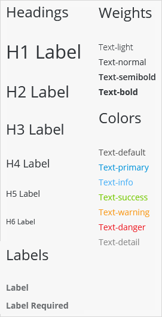

<!-- NOTES
Check all links
Should we have a section on the "Shell Bar"?

-->

## 1 Introduction

SAP Fiori 3 is SAP's target design system used to give your SAP C4/HANA application a consistent look and feel. The [SAP Fiori 3 UI Resources](#wrong) module in the Mendix App Store allows you to apply this look and feel to your Mendix apps running on SAP C4/HANA.

The Mendix module gives you access to designing your pages with SAP Fiori-styled widgets and building blocks, together with support for using integration cards as part of your layout. You can also allow end-users to select a theme and apply it immediately.

You can experience the SAP Fiori 3 design by using the [SAP Fiori 3 Starter App](#wrong) as the basis for a new app, or by including the [SAP Fiori 3 UI Resources](#wrong) module in your app.

More information on using SAP Fiori 3 design in your Mendix app is available in the following sections:

* [Widgets](#widgets) – 
* [Building Blocks](#building-blocks) – 
* [Layouts](#layouts) – 
* [Page Templates](#page-templates) – 
* [Theme Selector](#theme-selector) – 

## 2 Widgets{#widgets}

The majority of Mendix widgets have been styled to match SAP Fiori 3 styles by default. Examples are shown below.

There are a few cases where you will need to apply some extra CSS classes manually to achieve the correct SAP Fiori look and feel. These are described in [Applying CSS Classes Manually](#apply-css).

There are also a few Mendix widgets which do not support SAP Fiori 3 styles. These are listed in [Unsupported Widgets](#unsupported-widgets).

### 2.1 Examples of Mendix Widget Styling

#### 2.1.1 Text Widgets

These are standard Mendix text widgets. You can format them using the following properties:

* Headings – set the **Render mode** to the appropriate heading level
* Weights – set **Font Weight** to the desired weight
* Colors – set **Color** to the appropriate color, either *Brand {color}* or *Header* or *Detail* color
* Labels – for a *required* label, set **Class** to *required*

{{% image_container width="50%" %}}

{}

#### 2.1.2 Buttons

You can choose different types of button by setting the appropriate **Button style**. The SAP Fiori styles are mapped as follows:

| **SAP Fiori Style** | **Mendix Button Style** |
| --- | --- |
| Default | Default |
| Emphasized | Primary |
| Positive | Success |
| Negative | Danger |
| Attention | Warning |
| Ghost | *requires manual CSS class, see [Applying CSS Classes Manually](#apply-css), below* |

{{% image_container width="75%" %}}

{}

### 2.2 Applying CSS Classes Manually{#apply-css}

Some 

### 2.3 Unsupported Widgets{#unsupported-widgets}

## 3 Building Blocks{#building-blocks}

## 4 Layouts{#layouts}

## 5 Page Templates{#page-templates}

## 6 Theme Selector{#theme-selector}
