## 1 Introduction

This document contains a summary of the building blocks you can use to create an SAP Fiori themed app.

To use these building blocks, you can either

* use the **Blank App for SAP Fiori themed apps** app template; this can chosen when creating a new app, or be downloaded from the Marketplace here – https://marketplace.mendix.com/link/component/53585/

* add the *UI Package for SAP Fiori themed apps* to your app: this can be downloaded from the Marketplace here – https://marketplace.mendix.com/link/component/107625/

## 2 Building Blocks

### 2.1 Datagrid fullpage border

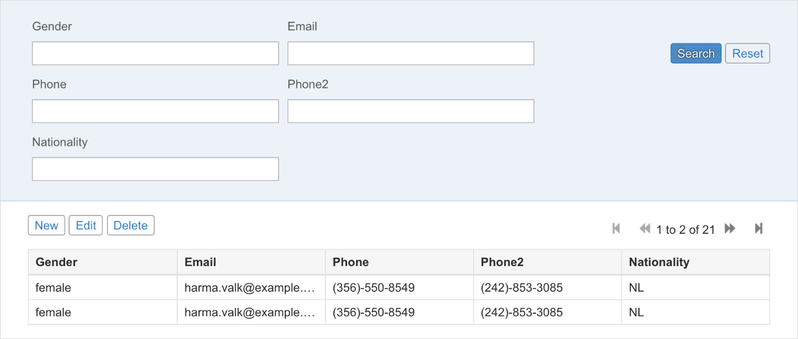

### 2.2 Datagrid fullpage

### 2.3 flex container left center

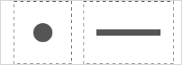

### 2.4 flex container left

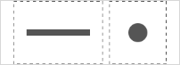

### 2.5 flex container right center

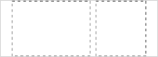

### 2.6 flex container right

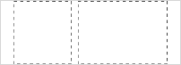

### 2.7 Footer Confirm

### 2.8 Footer Edit Delete

### 2.9 Footer Save Close

### 2.10 Footer Accept Reject Edit Delete

### 2.11 Footer Icons

### 2.12 Footer Text Icons

### 2.13 Form horizontal columns

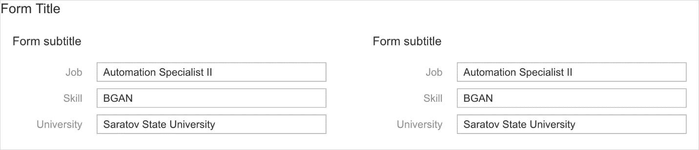

### 2.14 Form horizontal line

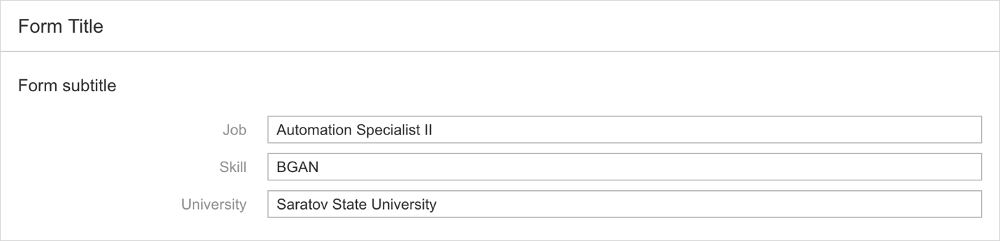

### 2.15 Form horizontal

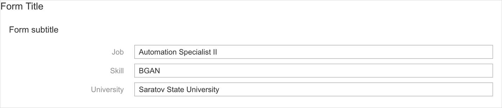

### 2.16 Form readonly compact

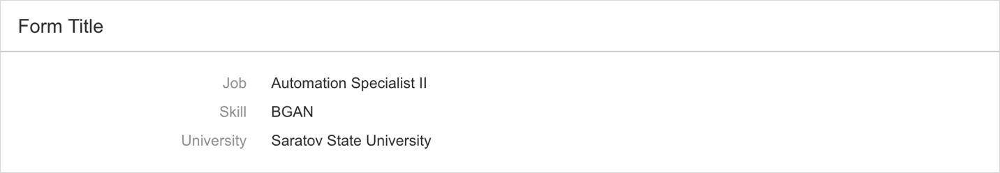

### 2.17 Form vertical columns

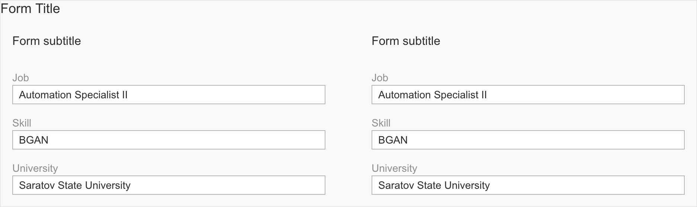

### 2.18 Form vertical line

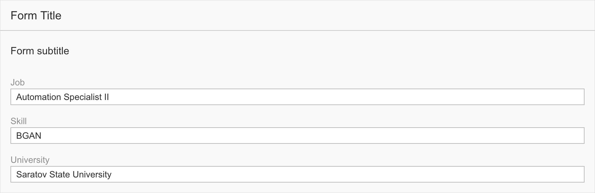

### 2.19 Form vertical

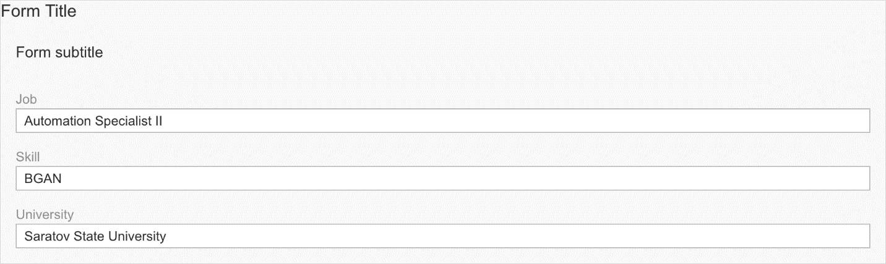

### 2.20 List border header

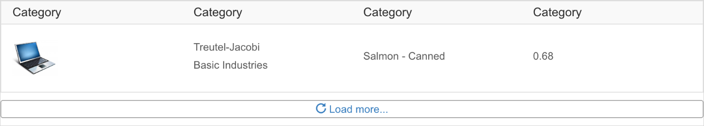

### 2.21 List border

### 2.22 List header

### 2.23 List item default

### 2.24 List item description

### 2.25 List item icon

### 2.26 List item info

### 2.27 List item multiline

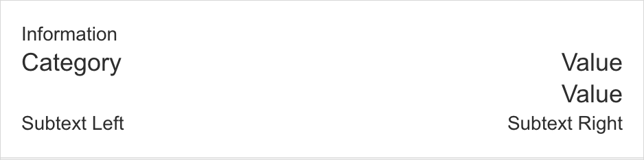

### 2.28 list

### 2.29 mainheader columns

### 2.30 mainheader

### 2.31 object status

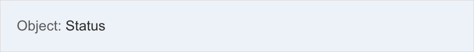

### 2.32 pageheader columns title

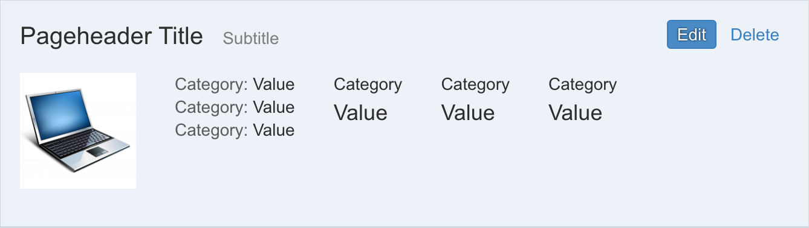

### 2.33 pageheader columns

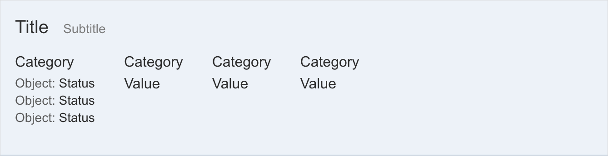

### 2.34 pageheader content item

### 2.35 pageheader content

### 2.36 pageheader default

### 2.37 pageheader space between

### 2.38 pageheader title buttons

### 2.39 tile

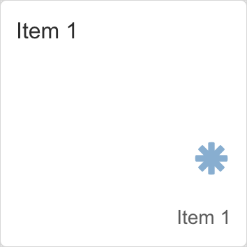

### 2.40 wizard step active

### 2.41 wizard step visited

### 2.42 wizard step

### 2.43 wizard

