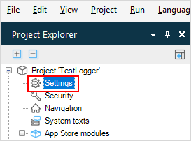
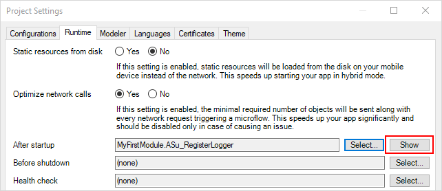
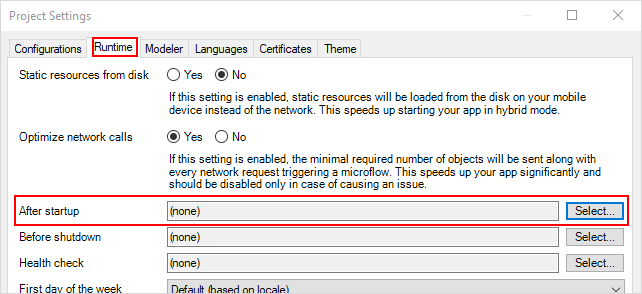
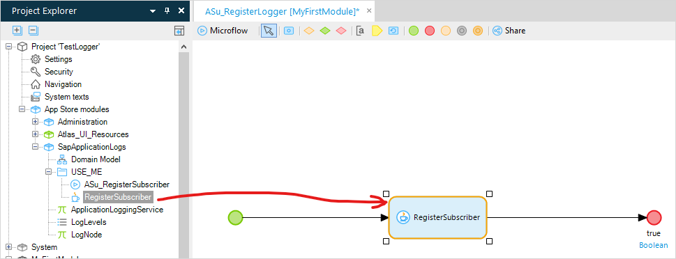
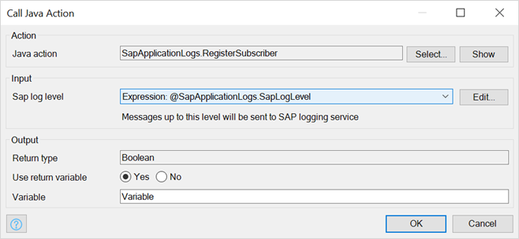
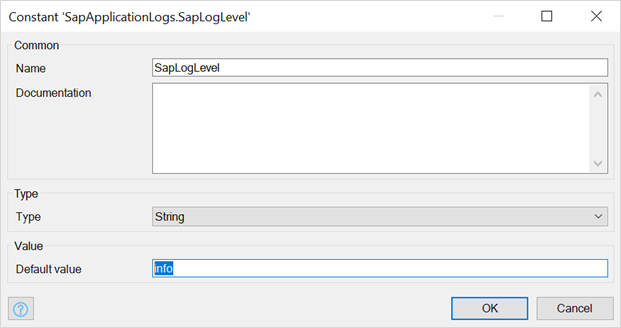

## 1 Introduction

The SAP Logging Connector allows a Mendix app to output logs in a format supported by the Kibana dashboard provided by the _SAP Cloud Platform Application Logging_ service. Without this connector, logs sent to Kibana will not have the correct structure and log level.

By using this connector, logs will be output in a JSON format with the following fields:

* `msg` - the actual log message
* `level` - the log level
* `written_at` - the log timestamp as reported by the Mendix app
* `written_ts` - the log timestamp which can be used for ordering the logs
* `stacktrace` - the stack trace attached to the log message (if it exists)

In addition, the Connector supports multiline log messages.

## 2 Getting the SAP Logging Connector

To use the [SAP Logging](https://appstore.home.mendix.com/link/app/110219/) connector, you need to import it into your app from the App Store. For more information on importing modules from the App Store, see [How to Use App Store Content](/appstore/general/app-store-content).

## 3 Using the Connector

To format all the log messages, the SAP Logging Connector needs to be initialized during the startup of the Mendix application<small>[1]</small>.

To initialize the connector, do the following:

1. Open **Project … > Settings** in the **Project Explorer**:

    

2. Switch to the **Runtime** tab.

3. Go to the **After startup** microflow by clicking **Show** next to the **After startup** microflow:

    

    {}If there's no existing microflow (as indicated by the text `(none)`, instead of a microflow name), click **Select…** and create a new microflow by clicking **New**:    
    {}

4. Drag and drop the **RegisterSubscriber** action at the end of the *After startup* microflow:

    

5. Double-click the **RegisterSubscriber** action make sure that **Log level** is set to the constant *SapLogLevel*:

    
	
6. Edit the constant **SapLogLevel** to select the minimum log level which you want to send to the *SAP Cloud Platform Application Logging service*. The supported log levels (case-insensitive) are `Debug`, `Trace`, `Info`, `Warning`, `Error`, and `Critical`.

    
 
Now, when the application is started, it will produce logs in the JSON format supported by Kibana.

## 4 Notes

* Due to technical limitations, the **SAP Logging Connector** is activated with a 5 second delay. This means that logging configuration is updated after the *RegisterSubscriber* action is completed.
* The *RegisterSubscriber* action checks to see if the Mendix application is running in an SAP environment with the *SAP Cloud Platform Application Logging* service. If the *SAP Cloud Platform Application Logging* service cannot be found, *RegisterSubscriber* assumes that the app is running locally and doesn't change the logging configuration.
* When log messages are generated rapidly, it is possible that Kibana will display them in the wrong order. The `written_at` field can be used to sort the log messages.
