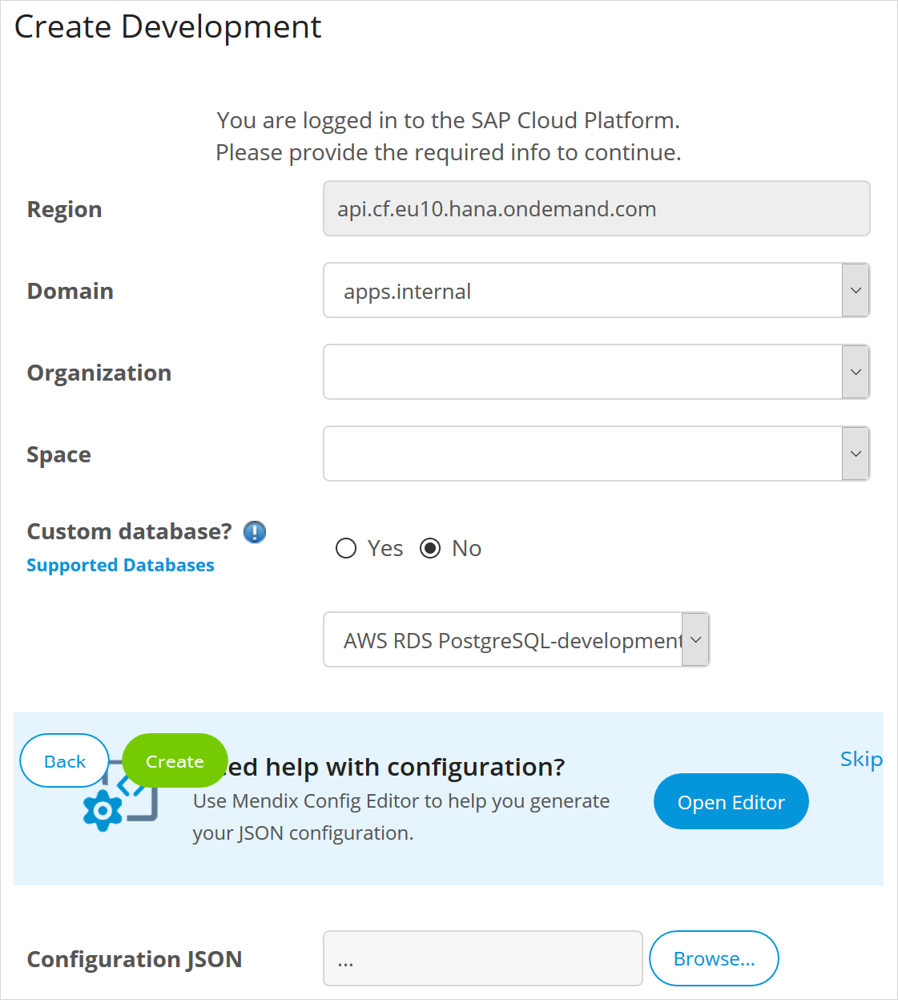
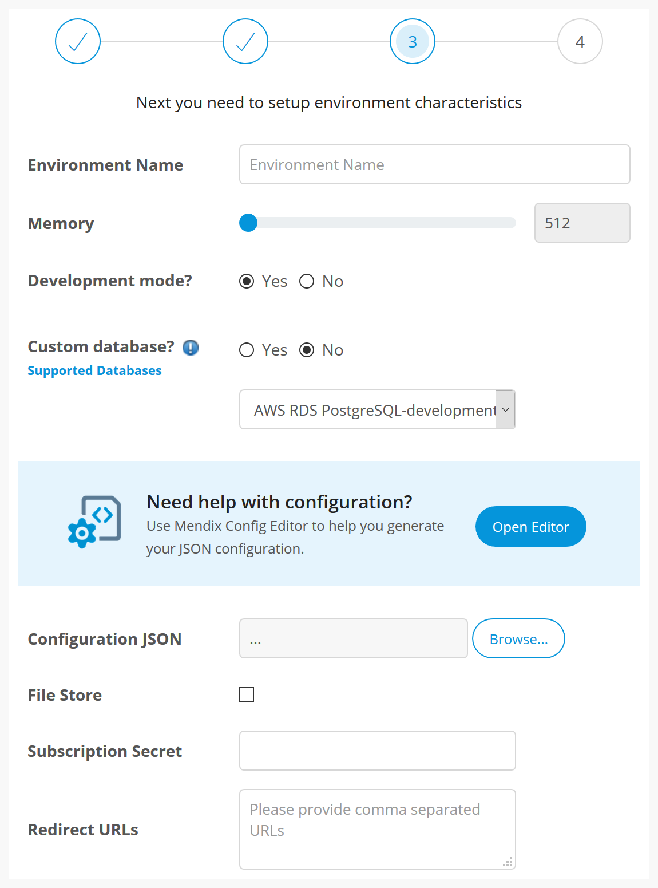
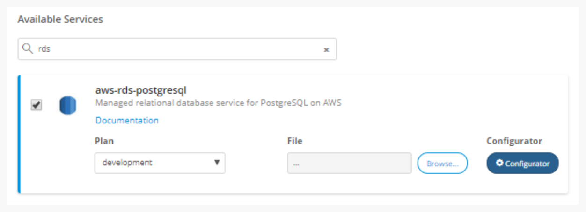
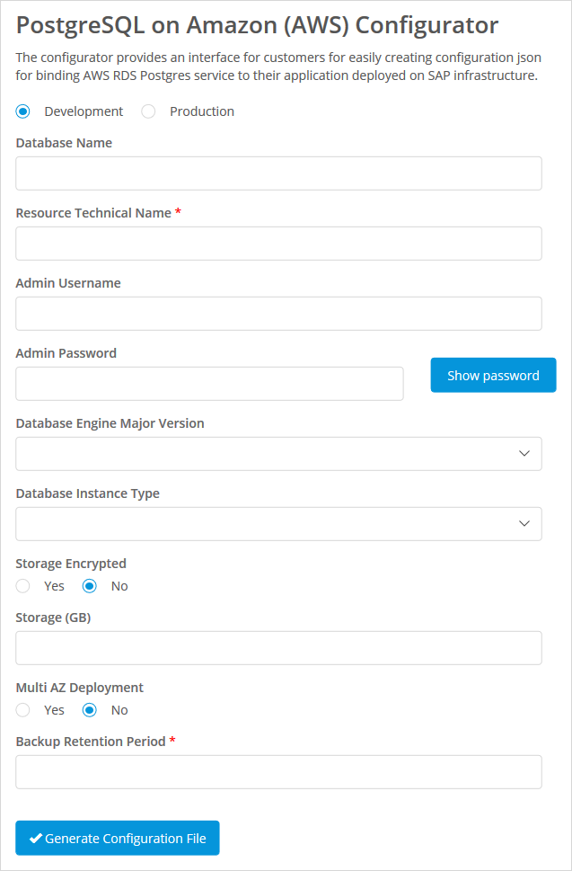

## 1 Introduction

The **PostgreSQL on Amazon (AWS)** service for SAP Cloud Platform allows you to use a PostgreSQL database, hosted on Amazon Web Services (AWS) as the database for your Mendix app.

## 2 Binding PostgreSQL on Amazon (AWS){#binding}

### 2.1 Service Location in Developer Portal

The PostgreSQL on Amazon (AWS) service can be found and configured in three places within the Mendix Developer Portal.

#### 2.1.1 Creating a New SAP App

You can choose the **AWS RDS PostgreSQL-development** standard database when you are creating your new SAP app.

#### 2.1.2 Creating an SAP Environment for an App

You can choose the **AWS RDS PostgreSQL-development** standard database when you are creating an environment from the Environments page for your app in the Developer Portal.

#### 2.1.3 Services Tab

PostgreSQL on Amazon (AWS) can also be found on the [services tab](/developerportal/deploy/sap-cloud-platform#binding-services) of the environment details page of your app's environment under *aws-rds-postgresql*.

### 2.2 Specifying the Configuration

Selecting PostgreSQL on Amazon (AWS) in one of the three places described above, will expand the entry to allow you to enter the name of the **File** which contains the configuration.

You will need to specify the **File** which contains the JSON to configure PostgreSQL on Amazon (AWS).

When you have specified the configuration, this will be bound to the app environment you are creating. If you are adding the service through the Services tab, you can click **Connect Services** to connect the PostgreSQL database to your app.

Many of the options for configuring PostgreSQL on Amazon (AWS) can be generated automatically. Mendix therefore provides you with a tool to help you create the correct configuration.

Click **Open Editor** or **Configurator** to start the **PostgreSQL on Amazon (AWS) Configurator**.

## 3 Using the PostgreSQL on Amazon (AWS) Configurator

The **PostgreSQL on Amazon (AWS) configurator** provide a user friendly interface to create the JSON required to configure PostgreSQL on Amazon (AWS).

{}
The configurator will only create a JSON file from scratch. It does not have access to your existing database settings on SAP Cloud Platform, and you cannot import any existing JSON files.
{}

The configurator has tooltips for each of the fields to explain what should be entered. Most of the fields can be left blank and the configurator will generate the information automatically.

The only two pieces of information you need to provide are:

* **Resource Technical Name** – The technical name of the AWS Resource Provider to use for provisioning the PostgreSQL RDS instance
* **Backup Retention Period** – The number of days for which automated  backups for the instance are retained

You can also specify the **Database Instance Type**. The list of possible database types will change depending on whether you choose **Development** or **Production**. If you do not specify the database type, the configurator will choose a default depending on the environment type:

* Development – `db.t2.micro`
* Production – `db.m4.large`

When you have entered all the information, click **Generate Configuration File** to create a file containing the correct JSON for your database configuration.

You can then upload this file as the configuration of your PostgreSQL on Amazon (AWS) service.
