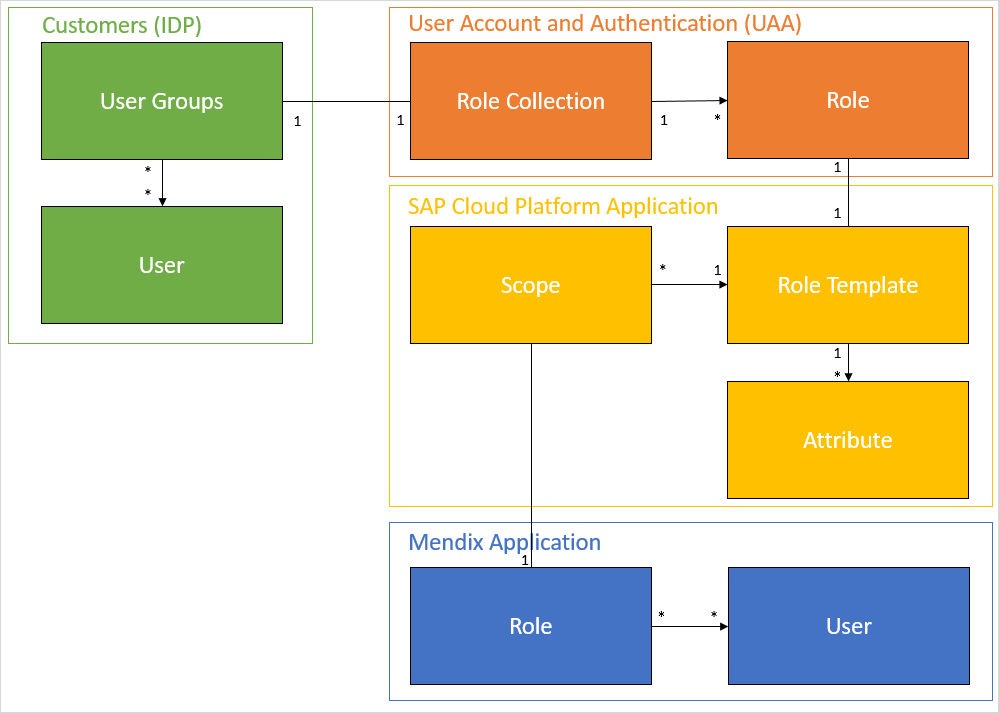
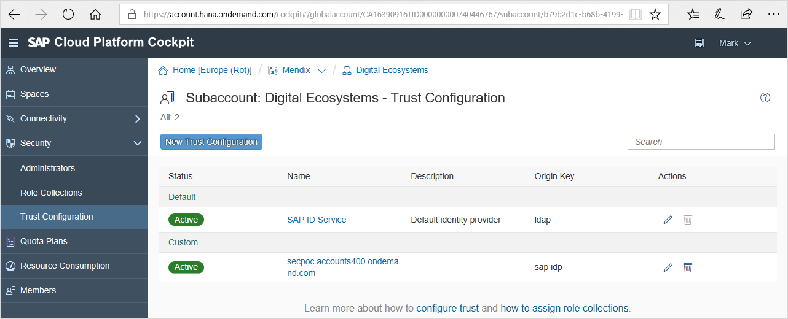

## 1 Introduction

XSUAA is a service provided by the SAP Business Technology Platform (SAP BTP) that will bind to the Mendix application as soon as the application is deployed within the SAP Business Technology Platform (SAP BTP) using the deployment features in the Mendix Developer Portal.

Out of the box, SAP BTP has the SAP external identify provider (IDP) configured as the default IDP. It is possible to use your own (corporate) IDP as an alternative so that you can automatically give access to all the employees of your organization.

{}
Version 2.1.1 of the XSUAA Connector for SAP Business Technology Platform uses a new user administration module called **SapAuthentication**. If you are upgrading from version 2.0.0 or below, you will need to migrate your existing users from **Administration.Account** to **SapAuthentication.SapUser** using the [User Migration](/appstore/modules/user-migration-module) Marketplace module.
{}

## 2 Setup

In this diagram, the relationship is shown between groups, roles, and users in relation to the Mendix application and the IDP:

A Mendix application is role-based by default. When deploying a Mendix app to SAP BTP using the the deployment features in the Mendix Developer Portal, the SAP BTP application configuration is automatically created (identified in the yellow section of the diagram above). This configuration reflects the roles that are defined in the Mendix app (identified in the blue section of the diagram).

To assign users from the IDP to these roles generated by the model, the account admin needs to add the mapping between the IDP user groups and the role templates (identified in the orange section of the diagram).

## 3 Working

When XSUAA is enabled on SAP BTP and the *XSUAA Connector for SAP Business Technology Platform* is part of the Mendix application (for details on this connector, see [How to Use the XSUAA Connector for SAP Business Technology Platform](/partners/sap/use-sap-xsuaa-connector)), an IDP user automatically becomes a Mendix application user. They will be assigned to the roles in the Mendix application based on the scopes they have received from the XSUAA service. The scopes are defined by the mapping between the role templates and the role collections.

## 4 Read More

* [How to Use the XSUAA Connector for SAP Business Technology Platform](/partners/sap/use-sap-xsuaa-connector)
