## 1 Introduction

SAP data models reflect an OData service from SAP back-end systems like SAP Business Suite (SAP ERP 6.0), SAP S/4HANA, and SAP S/4HANA Cloud. OData services are exposed via SAP Gateway and are described in a `$metadata` file, which describes all the entities, relationships, and functions that are exposed for that service.

Handcrafting a Mendix domain model for these OData services would be a lot of work. The OData Model Creator for SAP solutions automates this process by creating a Mendix module for the selected service containing the Mendix domain model which can be imported in your project. The data model also contains additional information such as the URL of the exposed endpoint, a list of collections in the service, and a list of functions provided by the service.

There are four ways to create the data model:

* [Using the API Business Hub](#APIBusHub)
* [Selecting an API from the SAP Catalog Service](#catalog)
* [Uploading an Odata Metadata XML File](#Uploading)
* [Providing the URL to the Metadata](#URL)

## 2 Prerequisites

Before starting this how-to, make sure you have completed the following prerequisites:

* Identify the SAP back-end system and OData service you wish to use
* Create an app in Mendix Studio Pro (version 7.23.6 or above)
* Obtain authentication credentials, if needed, for the SAP Catalog Service or SAP back-end system you wish to use

{}
OData Model Creator for SAP solutions will produce a module which is in Mendix version 7.23.6. To use the module you will have to create your app in, or upgrade your app to, Mendix version 7.23.6 or above.
{}

{}
OData Model Creator for SAP solutions only supports SAP OData Gateway Services which use OData version 2 or version 3. OData version 4 is not yet supported.
{}

## 3 Generating a Data Model

The OData Model Creator for SAP solutions is an app in the App Store. Search for it in the Mendix App Store, or find it here: [OData Model Creator for SAP solutions](https://sapodatamodelcreator.mendixcloud.com/). 

{}
The OData Model Creator for SAP solutions is not currently available in the App Store within Studio Pro. It can only be run in a browser.
{}

Open the [OData Model Creator for SAP solutions](https://sapodatamodelcreator.mendixcloud.com/), where you will be asked how you want to generate your model:

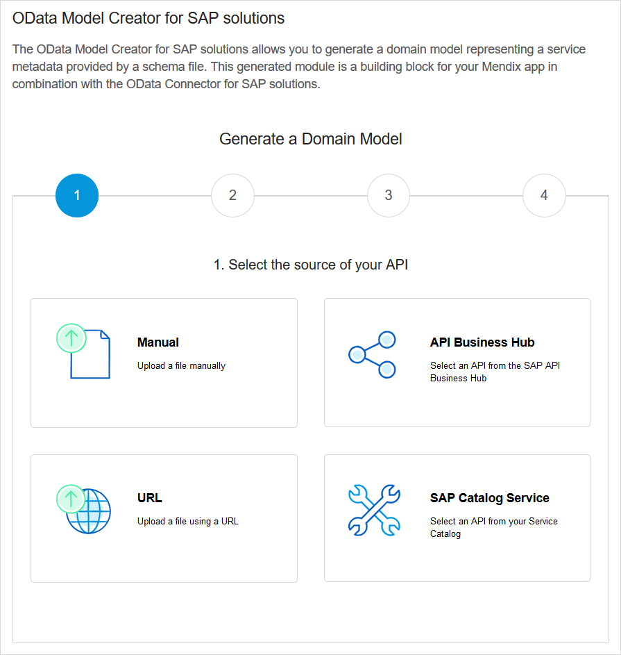

There are four ways to generate your data model.

* If your SAP back-end system stores the OData API package on the SAP API Business Hub, you can create the data model from there; select **API Business Hub** as the source and continue with [Using the API Business Hub](#APIBusHub)
* If your SAP API is in the SAP Catalog Service, you can create the data model from there; select **SAP Catalog Service** and continue with [Selecting an API from the SAP Catalog Service](#catalog)
* If you have access to the metadata file, select **Manual** and continue with [Uploading an Odata Metadata XML File](#Uploading)
* If you have the metadata URL for the OData service, select **URL** and continue with [Providing the URL to the Metadata](#URL)

### 3.1 Using the API Business Hub{#APIBusHub}

Your SAP back-end OData API is held in the API Business Hub.

{}
There may be several schemas in the packages of an API. Each of these will generate a module. Depending on the functionality of your app, you may have to generate several modules and import all of them into your app.
{}

1. Click **API Business Hub**.

    You will be presented with a list of packages containing OData API definitions. You can search this list (this includes text in the package description as well as the package name), and page through it using the paging buttons.

    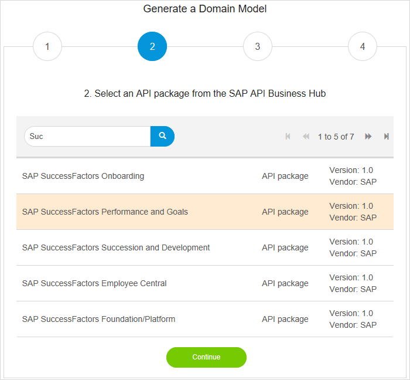

    {}You can return to any stage in this process by clicking on the relevant step number.
    {}

2. Click the package you want. It will be highlighted.

3. Click **Continue** to see the APIs within the package.

    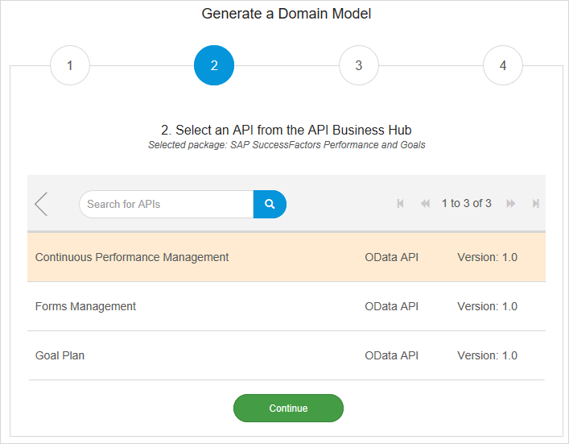

    {}This will be shown even if only one API exists.
    {}

4. Click the API you want. It will be highlighted.

5. Click **Continue** to see the schemas within the API.

    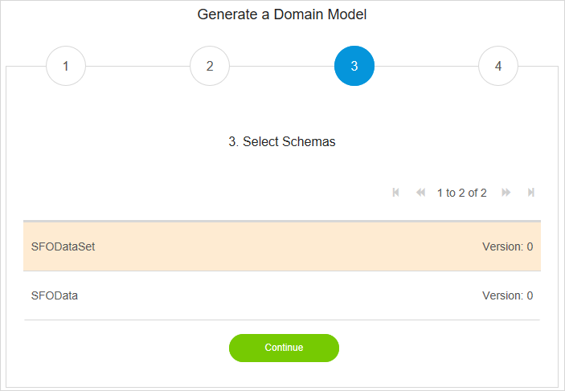

    {}This will be shown even if only one schema exists.
    {}

6. Click the schema you want. It will be highlighted.

7. Click **Continue** to proceed to the confirmation screen.

    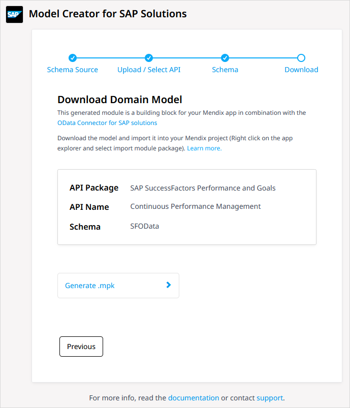

8. Click **Generate .mpk** to generate the data model module.

    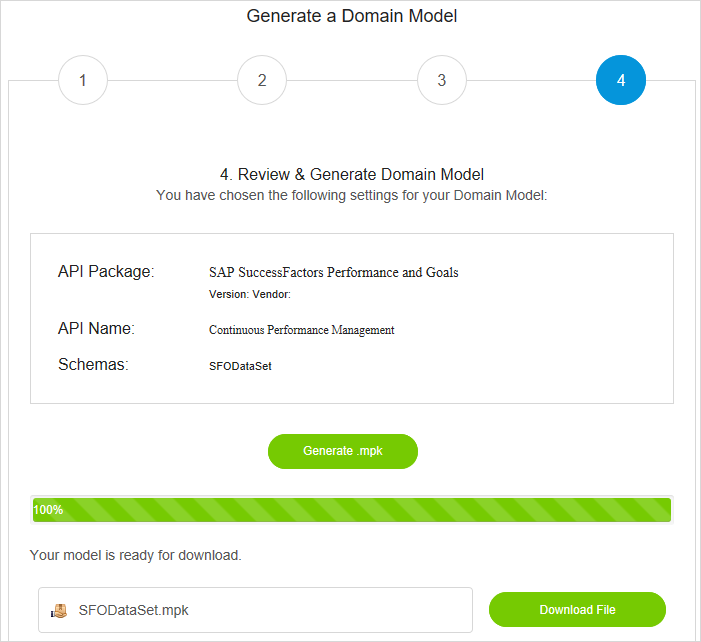

9. Click **Download File**.

    Your browser will offer options on what to do with the file.

10. Save the file locally. It is recommended that you save it in the **resources** folder of your Mendix app so that you can find it easily.

You have now created the module. The [Using the Data Model Module in a Mendix App](#Using) section, below, explains how to import it into your app.

### 3.2 Selecting an API from the SAP Catalog Service{#catalog}

Your SAP back-end OData API is held in the SAP Catalog Service.

{}
There may be several schemas in the packages of an API. Each of these will generate a module. Depending on the functionality of your app, you may have to generate several modules and import all of them into your app.
{}

1. Click **SAP Catalog Service**.

    You will be asked to sign in to you SAP Service Catalog. Enter your **User name**, **Password**, and **Server**. Select the correct protocol and **Port** if these are not the default.

    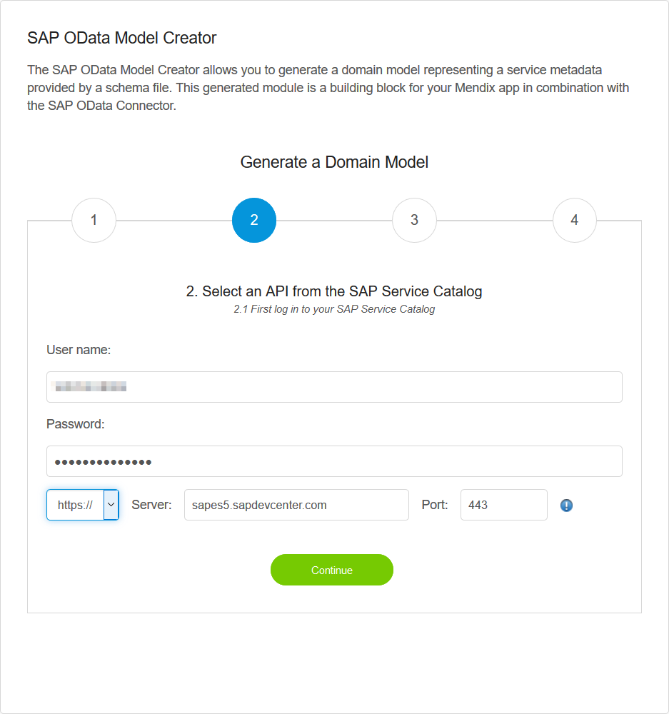

2. Click **Continue**. 

    You will be presented with a list of OData API definitions. You can search this list (this includes text in the API description as well as the API name), and page through it using the paging buttons.

    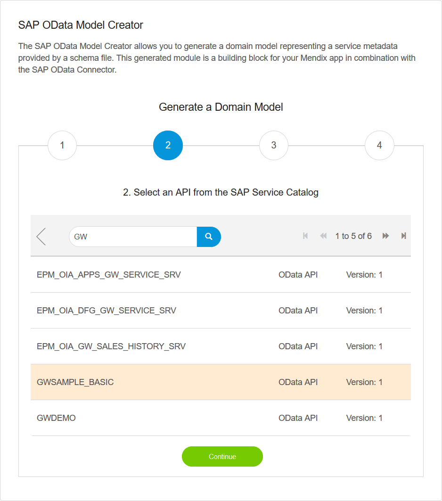

    {}You can return to any stage in this process by clicking on the relevant step number.
    {}

3. Click the API you want. It will be highlighted.

4. Click **Continue** to see the schemas within the API.

    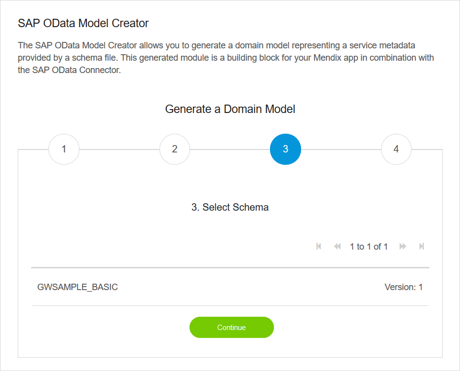

    {}This will be shown even if only one schema exists.
    {}

5. Click the schema you want. It will be highlighted.

6. Click **Continue** to proceed to the confirmation screen.

    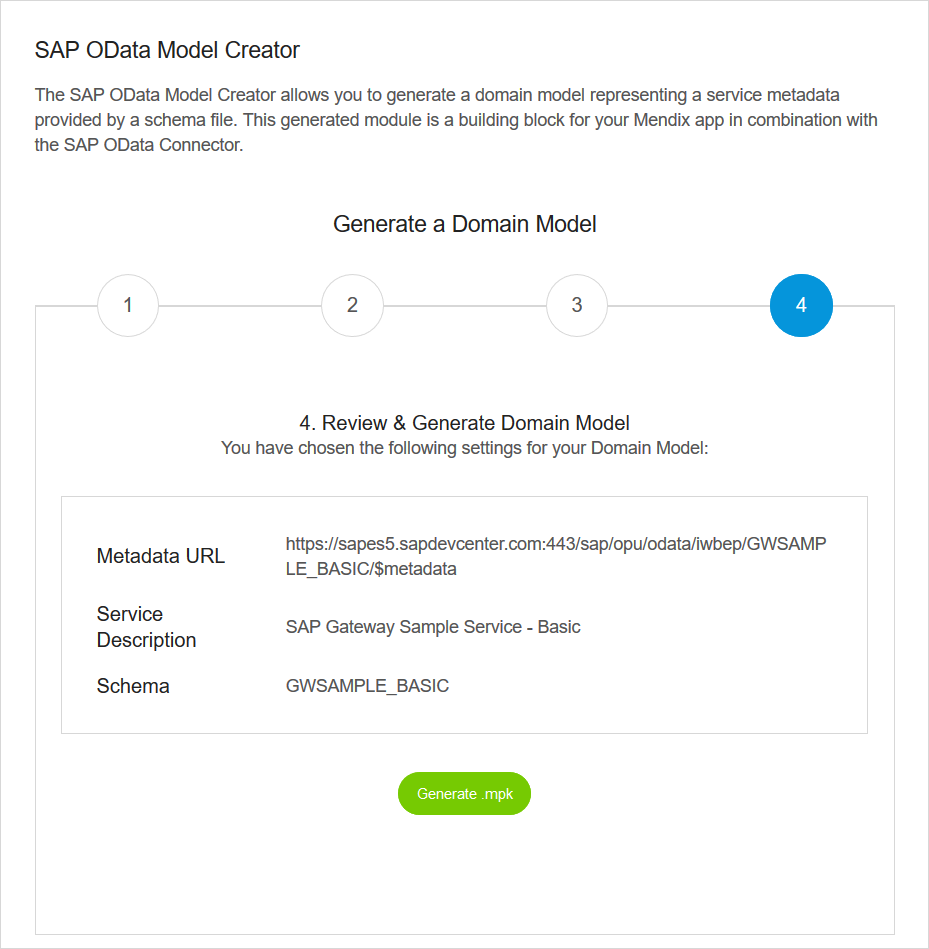

7. Click **Generate .mpk** to generate the data model module.

    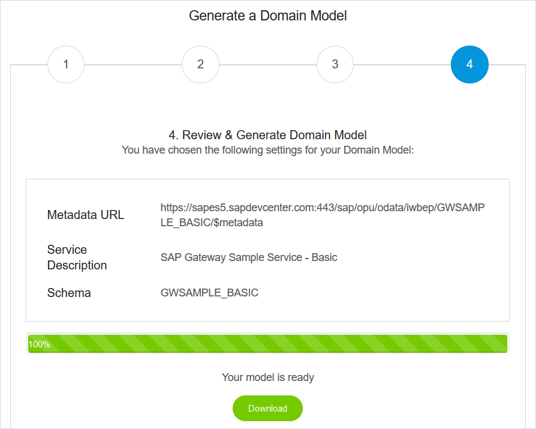

8. Click **Download**.

    Your browser will offer options on what to do with the file.
    
9. Save the file locally. It is recommended that you save it in the **resources** folder of your Mendix app so that you can find it easily.

You have now created the module. The [Using the Data Model Module in a Mendix App](#Using) section, below, explains how to import it into your app.

### 3.3 Uploading an OData Metadata XML File{#Uploading}

You may want to generate the data model by hand using the `$metadata` file directly. This may, for example, not be in the API Business Hub.

One way to do this is by getting the OData metadata XML file. This file can be download from the OData service URL directly using the `$metadata` suffix. The browser will display the XML and you can use the right mouse button in most browsers to choose to download the XML file. Save the file locally. It is recommended that you save it in the **resources** folder of your Mendix app so that you can find it easily.

1.  Download the XML metadata file to your local drive.

    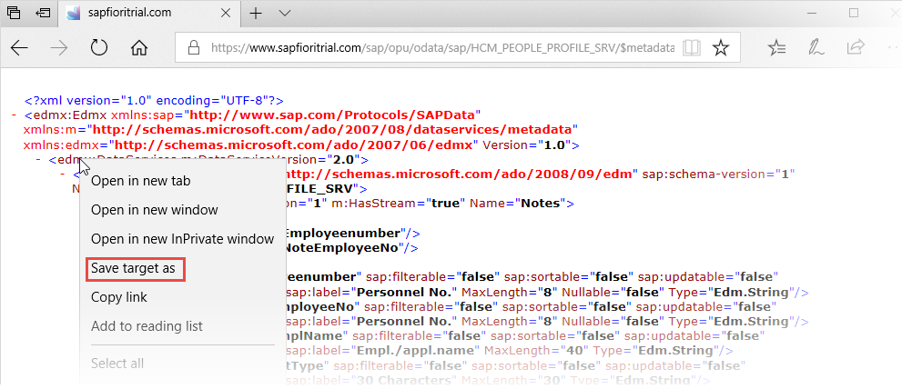

2. Open the OData Model Creator for SAP solutions

    

3. Click **Manual**.

    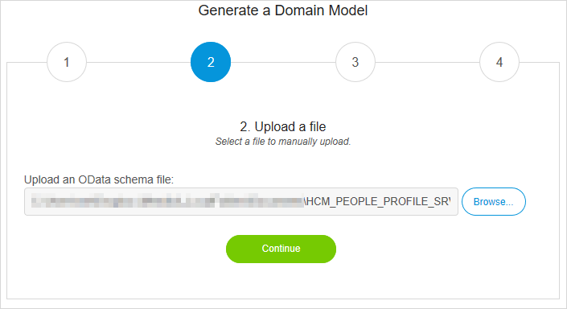

4. Click **Browse** and navigate to the XML file you want to use.

5. Select the XML file you want to use.

6. Click **Continue** to see the schemas within the metadata.

    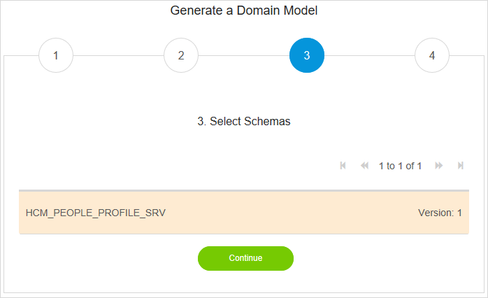

    {}This will be shown even if only one schema exists.
    {}

7. Click the schema you want. It will be highlighted.

8. Click **Continue** to proceed to the confirmation screen.

    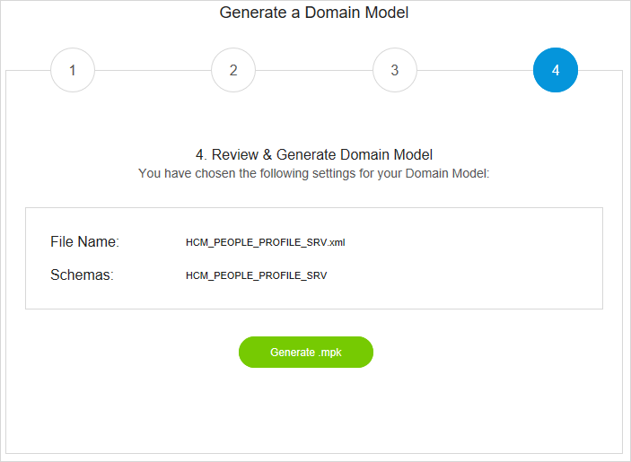
    
9. Click **Generate .mpk**. A progress bar will be shown during the parsing and generation of the module.

10. Once the generation is complete, the **Download File** button appears. Notice that the file name of your data model module is extracted from the metadata file itself.

    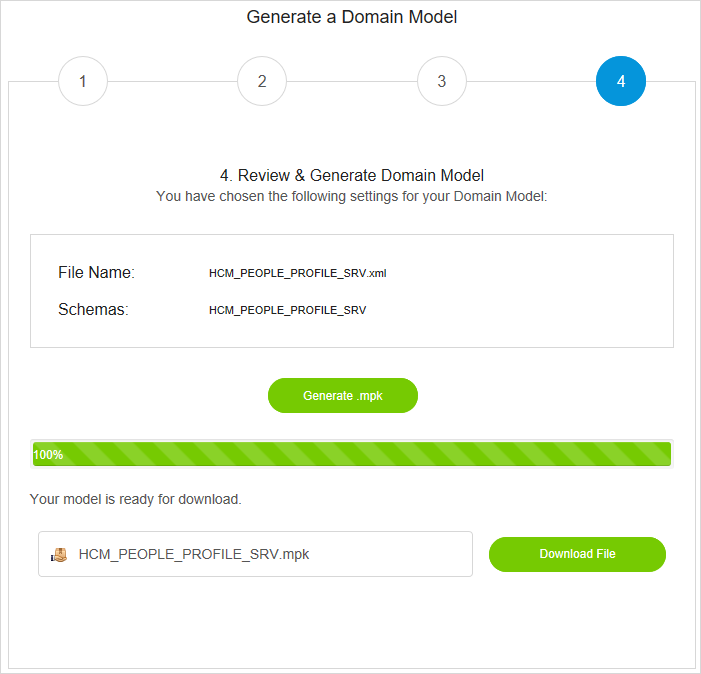

11. Click **Download File**.

    Your browser will offer options on what to do with the file.

12. Save the file locally. It is recommended that you save it in the **resources** folder of your Mendix app so that you can find it easily.

You have now created the module. The [Using the Data Model Module in a Mendix App](#Using) section, below, explains how to import it into your app.

### 3.4 Providing the URL to the Metadata{#URL}

You can also generate the data model from the metadata by providing the URL to the OData Model Creator for SAP solutions.

{}
This method does not work where the destination needs authentication. You cannot use it, for example, to generate a data model for a service on the ES5 Gateway Demo.
{}

1. Click **URL** on the first page of the OData Model Creator for SAP solutions.

    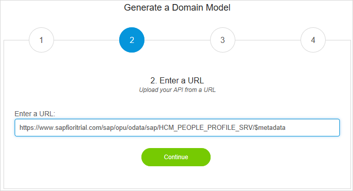

2. Enter the URL of the service metadata which you want in **Enter a URL**.

3. Click **Continue** to see the schemas within the metadata.

    

    {}This will be shown even if only one schema exists.
    {}

4. Click the schema you want. It will be highlighted.

5. Click **Continue** to proceed to the confirmation screen.

    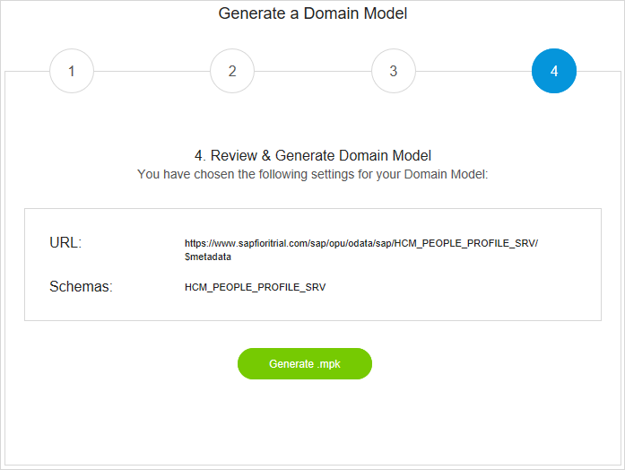
    
6. Click **Generate .mpk**. A progress bar will be shown during the parsing and generation of the module.

7.  Once the generation is complete, the **Download File** button appears. Notice that the file name of your data model module is extracted from the metadata file itself.

    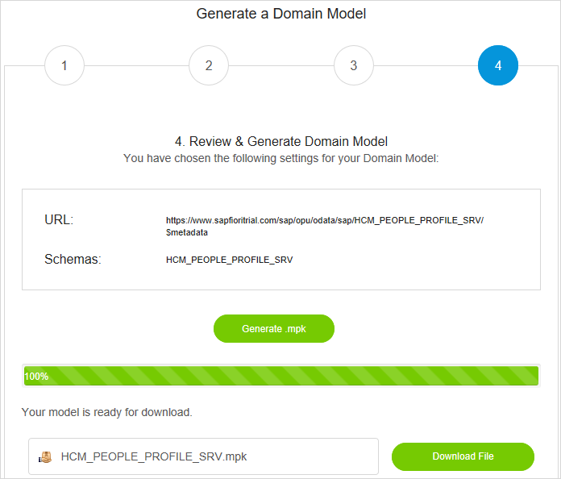

8. Click **Download File**.

    Your browser will offer options on what to do with the file.

9. Save the file locally. It is recommended that you save it in the **resources** folder of your Mendix app so that you can find it easily.

You have now created the module. The [Using the Data Model Module in a Mendix App](#Using) section, below, explains how to import it into your app.

## 4 Using the Data Model Module in a Mendix App{#Using}

Now you have a Mendix module ready to import into your project.

1. Open the project which you created as a prerequisite.

2. Right-click your project in the **Project Explorer** and select **Import module package...**.

    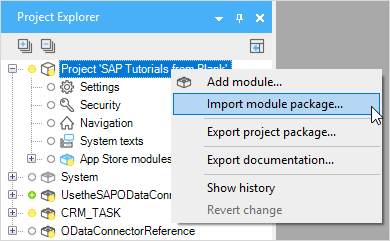

3. Use the navigation dialog to find your module, which will have the suffix **.mpk**.

    You now have your service module, for example **GWSAMPLE_BASIC**, available in your project ready to use in combination with the OData Connector for SAP solutions.

    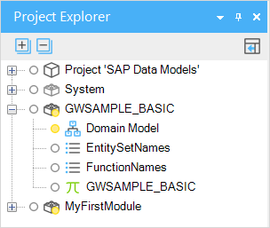

{}
Do not change the names of entities, attributes, or associations in the Domain Model of the module; they need to match the names used by the SAP OData service for the OData Connector for SAP solutions to work correctly.
{}

For more information on how to use the imported data model together with the OData Connector for SAP solutions, see [How to Use the OData Connector for SAP Solutions](use-sap-odata-connector).

## 5 Read More

* [How to Use App Store Content](/appstore/general/app-store-content)
* [How to Use the OData Connector for SAP Solutions](use-sap-odata-connector)
* [OData Model Creator for SAP Solutions](https://sapodatamodelcreator.mendixcloud.com/)
