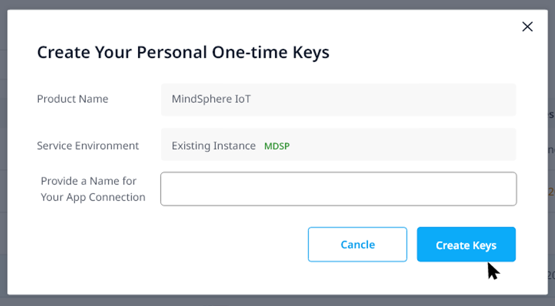
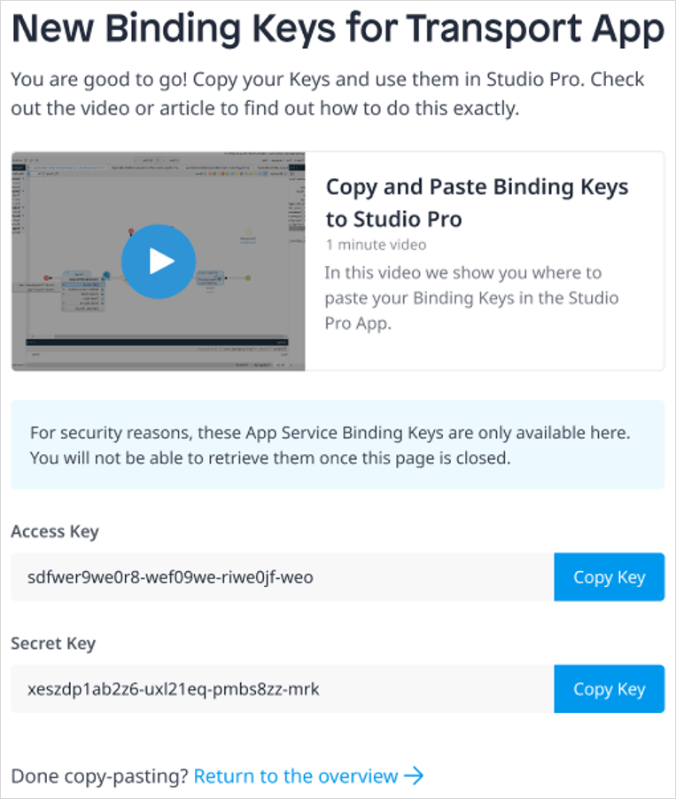
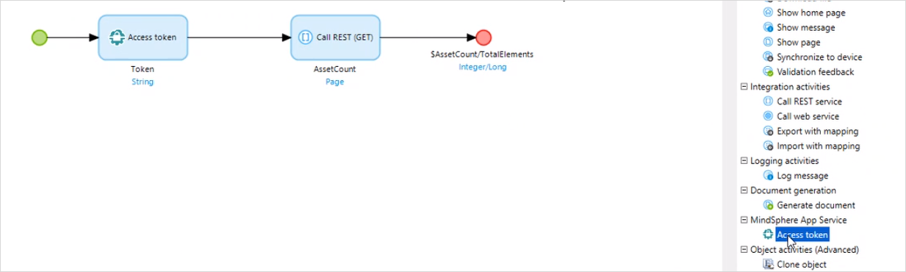
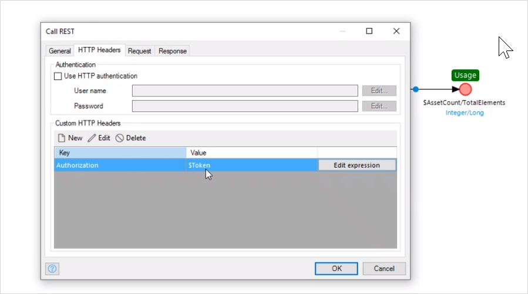

## 1 Introduction

**MindSphere IIoT for Makers** provides you with an account to connect Industrial equipment and consume the IoT data in Mendix applications.
With MindSphere IIoT for Makers you can:

* Easily connect and manage Industrial machinery
* Build or extend a Mendix application with MindSphere IIoT for Makers capabilities
* Use standard IoT applications in MindSphere
* Use a seamless single-sign-on between MindSphere and Mendix accounts
* Simply consume IoT data from MindSphere in your Mendix applications

With the use of MindSphere IIoT for Makers, you have an integrated developer experience to build and integrate personalized Industrial IoT applications with Mendix.

MindSphere IIoT for Makers packages come in various sizes. Please see the [Product Sheet](https://siemens.mindsphere.io/content/dam/mindsphere/terms/pdf/MindSphere_MindSphereIIoTforMakers_ProductSheet_SpecificTerms_v1.0.pdf) for full details.

### 1.1 Limitations

MindSphere IIoT for Makers is easy to add to your app but has the following limitations:

* Currently, you can only communicate with [MindSphere Services](https://developer.mindsphere.io/apis/index.html) using *REST APIs* — support for OData using Mendix Data Hub will be provided in a matter of weeks.
* You cannot make your app multi-tenant – see [Multi-tenancy](mindsphere-development-considerations#multitenancy) in *MindSphere Development Considerations* for more information on multi-tenancy
* Your app cannot be deployed to the MindSphere platform and cannot be added to the MindSphere Developer Cockpit
* End users cannot use MindSphere credentials to sign in to your app, so MindSphere does not know anything about individual app end users — you must design your app to handle any required security for each end user

## 2 Setting Up MindSphere IIoT for Makers

### 2.1 Requesting the MindSphere IIoT for Makers

Contact your Customer Success Manager (CSM) or the Mendix Sales organization to request MindSphere IIoT for Makers.

Once your order is processed, your entitlement to MindSphere IIoT for Makers will be confirmed.

### 2.2 Provisioning a MindSphere Tenant

On receipt of your confirmation, a [Mendix Administrator](/developerportal/control-center/index#company) for your company will need to initiate the creation of a dedicated tenant account within MindSphere.

Once all the resources have been provisioned, the Mendix Administrator for your company will receive an email confirming that your MindSphere account has been created. The email will also contain the following:

* The name of your MindSphere account – this is the client URI
* A link to enable you to [create the binding keys](#binding-keys) – see below for more information

### 2.3 Linking to Asset Manager

Once you have the name of your MindSphere account, you can use this to link your account to the required assets. You will be able to sign in to this account using your Mendix account credentials (userid and password).

To set up new assets, follow the [Workflow for creating assets](https://documentation.mindsphere.io/resources/html/asset-manager/en-US/113658277515.html) instructions in the MindSphere Asset Manager documentation. There is also an example of how to do this in [How To Use the Siemens MindSphere Pump Asset Example App](mindsphere-example-app#create-assets).

Full information can be found in the [MindSphere Asset Manager](https://documentation.mindsphere.io/resources/html/asset-manager/en-US/index.html) documentation on the MindSphere site.

## 3 Using MindSphere IIoT for Makers

MindSphere IIoT for Makers can be used in any Mendix app, for example an app which is based on the Mendix **Blank App**. However, it is not suitable for apps which are designed to be deployed to MindSphere, such as the **Siemens MindSphere Starter Application**, the **Siemens MindSphere Pump Asset Example**, or an app which is using the **Siemens MindSphere SSO** module.

Unless you are adding features to an existing app, it is recommended that you start with the Mendix **Blank App**.

### 3.1 Downloading the IIoT Authenticator Module

To extract data from MindSphere, your calls to the MindSphere API need to be authenticated. This is done through the [MindSphere IIot Authenticator Module](https://appstore.home.mendix.com/link/app/117578).

For instructions on downloading the **MindSphere IIot Authenticator Module**, see the [Downloading Content from the Marketplace](/appstore/general/app-store-content#downloading) section in *How To Use Marketplace Content in Studio Pro*.

### 3.2 Creating Binding Keys{#binding-keys}

To authenticate your calls you will need to provide the MindSphere IIoT Authenticator Module with the binding keys: an clientID and a clientSecret. You need to create these in the Mendix Marketplace once the MindSphere tenant has been provisioned. This can be done as follows:

1. Open the **Service Management Dashboard** of the [Mendix Marketplace](https://marketplace.mendix.com/) using the link provided in your confirmation email.

2. Choose the **Product** *MindSphere IoT*.

3. Click **Generate Keys**.

4. In **Provide a Name for Your App Connection** enter a name so that you can retrieve this pair of keys from the Developer Portal in future.

5. Click **Create Keys**.

    

    You will see a pop-up containing three pieces of information: **clientID**, **TokenURL**, and **clientSecret**.

6. Click **Copy** for each of these pieces of information and save them somewhere safe – you will not be able to access them again.

    

You can find more information about managing binding keys in the [Service Management Dashboard](/appstore/general/app-store-overview#service-management) section of *Marketplace Overview*.

### 3.3 Authenticating MindSphere REST Calls {#authenticating}

Calls to MindSphere are made through REST calls which can be made using the standard Mendix [Call REST Service](/refguide/call-rest-action) functionality. See [How To Consume a REST Service](/howto/integration/consume-a-rest-service) for a full walkthrough on doing this. For calls to MindSphere, these calls need to be authenticated.

This is done by adding an **Access token** action before each **Call REST** action in your microflows. The **Access token** action returns a string which contains an access token which can be used in the **Call REST** action. In the example below, the token string is given the name *Token*.

In the REST call, an HTTP Header is added called *Authorization* and this is given the value of the access token.

However, authentication will only be successful if the correct credentials are provided to the **Access token** action. This requires the following to be set in the **_Use me** folder of the *MindSphereIotAuthenticator* module:

* **TokenURL** – this is the *TokenURL* from the binding keys you generated
* **ClientID** – this is the *clientID* from the binding keys you generated
* **ClientSecret** – this is the *clientSecret* from the binding keys you generated

#### 3.3.1 Authenticating During Development

When you are developing your app, you can set the **ClientID** and **ClientSecret** constants within the app. You can also override these by using different [Configurations](/refguide/configuration) within your project settings.

For security, the values of these constants should not be included when you deploy the app.

#### 3.3.2 Authenticating for Deployment

When you deploy your app, you should remove the values of **ClientID** and **ClientSecret** from the app model for security reasons. You should then set the correct value as a constant (Cloud Foundry environment variable) during the deployment.

For the Mendix Cloud, this can be done by setting the value of the constants on the [Model Options](/developerportal/deploy/environments-details#model-options) tab of the **Environment Details**. See [Constants](/refguide/constants) for information on how to set these values on other deployment platforms.

## 4 MindSphere Widgets

If you want to use the [Siemens MindSphere Web Components Widgets](https://marketplace.mendix.com/link/component/110119) in your app, these will need to use the *MindSphere API Reverse Proxy*.

To enable this, you will have to do two things:

1. Ensure that the constant **EnableMindSphereApiReverseProxy** is set to *true* to ensure this can happen.
2. Add the microflow **Register ApiReverseProxy** to the [After Startup](/refguide/project-settings#after-startup) microflow(s) which are run when the app is started.
