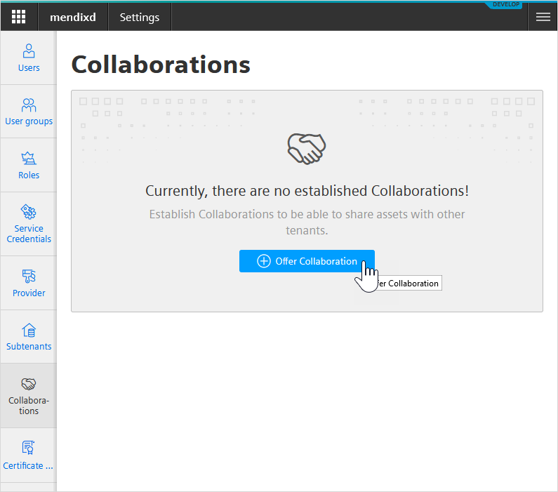
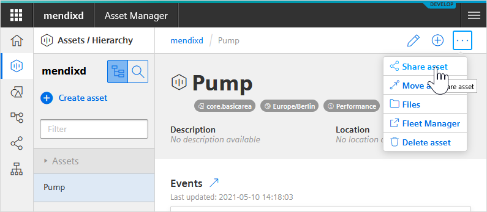
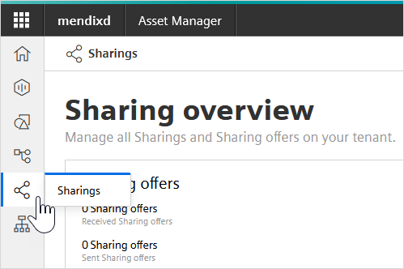

## 1 Introduction

The MindSphere App Service is the ideal solution if you want to add MindSphere information to an existing app which runs in the Mendix Cloud or another platform. It makes it easy to combine MindSphere data with information from other sources, such as SAP.

### 1.1 Limitations

The MindSphere App Service is easy to add to your app but has the following limitations:

* You can only communicate with [MindSphere Services](https://developer.mindsphere.io/apis/index.html) using *REST APIs*
* You cannot make your app multi-tenant – see [Multi-tenancy](mindsphere-development-considerations#multitenancy) in *MindSphere Development Considerations* for more information on multi-tenancy
* Your app cannot be deployed to the MindSphere platform and cannot be added to the MindSphere Developer Cockpit
* You cannot use MindSphere credentials to sign in to your app, you must handle app security yourself within your app

{}[Add correct link to product sheet - contact Rima Fetzer]{}

App Service packages come in various sizes. Please see the [Product Sheet](https://example.com) for full details.

## 2 Setting Up MindSphere App Service

### 2.1 Requesting the MindSphere App Service

Contact your Customer Success Manager (CSM) or the Mendix Sales organization to request the MindSphere App Service.

Once your order is processed, your entitlement to the MindSphere App Service will be confirmed.

### 2.2 Provisioning a MindSphere Tenant

On receipt of your confirmation, a [Mendix Administrator](/developerportal/control-center/index#company) for your company will need to initiate a tenant needs to be created within MindSphere.

{}[How is this triggered - there is no link in the latest flow (16 April)]{}

Once all the resources have been provisioned, the Mendix Administrator for your company will receive an email confirming that your MindSphere account has been created. The email will also contain the following:

* The name of your MindSphere account – this is the client URI
* A link to enable you to [create the binding keys](#binding-keys) – see below for more information

{}[How do they get the password for the tenant?]{}

### 2.3 Linking to Asset Manager

Once you have the name of your MindSphere account, you can use this to link your account to the required assets.

You can either set up new assets by following the [Workflow for creating assets](https://documentation.mindsphere.io/resources/html/asset-manager/en-US/113658277515.html) instructions in the MindSphere Asset Manager documentation. There is an example of how to do this in [How To Use the Siemens MindSphere Pump Asset Example App](mindsphere-example-app#create-assets).

Alternatively, you can share existing assets.

To do this, you need to set up a **Collaboration** between the tenant owning the assets and the tenant in your new MindSphere account, as given in the email you have received. You can then share assets with your new tenant. The steps are as follows:

1. Sign in to the MindSphere Launchpad using the credentials of the tenant which owns the assets.
2. Go to **Settings**.
3. Click **Collaborations**.
    
4. Click **Offer Collaboration**, enter the **Tenant name** of your new tenant, and click **Offer**.

    You now need to accept the collaboration offer.
5. Sign in to the MindSphere Launchpad using the credentials of your new tenant.
6. Go to **Settings > Collaborations**.
7. Accept the offer to collaborate.

    You now need to share the asset(s)
8. Sign in to the MindSphere Launchpad using the credentials of the tenant which owns the assets.
9. Click  **Asset Manager** and then view your assets.
10. Choose the asset you want to share and, in the advanced settings, select **Share asset**.
    
11. Choose your new tenant as the collaboration you want to share the asset with and click **Share**.

    To confirm the share, you will need to sign in to MindSphere with the credentials of your new tenant and go to the **Asset Manager** there. You will see the offer in the **Sharings** tab.
    

Full information on this can be found in the [MindSphere Asset Manager](https://documentation.mindsphere.io/resources/html/asset-manager/en-US/index.html) documentation on the MindSphere site.

## 3 Using the MindSphere App Service

The MindSphere App Service can be used in any Mendix app, for example an app which is based on the Mendix **Blank App**. However, it is not suitable for apps which are designed to be deployed to MindSphere, such as the **Siemens MindSphere Starter Application**, the **Siemens MindSphere Pump Asset Example**, or an app which is using the **Siemens MindSphere SSO** module.

Unless you are adding features to an existing app, it is recommended that you start with the Mendix **Blank App**.

### 3.1 Downloading the IIoT Authenticator Module

{}[Need a link to the authenticator module]{}

To extract data from MindSphere, your calls to the MindSphere API need to be authenticated. This is done through the [MindSphere IIot Authenticator Module](https://example.com).

Download the **MindSphere IIot Authenticator Module** by following the instructions [Downloading Content from the Marketplace](/appstore/general/app-store-content#downloading2) in the document *How To Use Marketplace Content in Studio Pro*.

### 3.2 Creating Binding Keys{#binding-keys}

To authenticate your calls you will need to provide the MindSphere IIoT Authenticator Module with the binding keys: an access key and a secret key. You need to create these in the Developer Portal once the MindSphere tenant has been provisioned. This can be done as follows:

1. Click the link **Create Binding Keys** in the welcome email you received.

2. Choose the **Product Name** *MindSphere IoT*.

3. Click **Create Binding Keys**.

4. In **Provide a Name for Your App Connection** enter a name so that you can retrieve this pair of keys from the Developer Portal in future.

5. Click **Create Keys**.

    

    You will see a pop-up containing your two keys: **Access Key** and **Secret Key**.

6. Click **Copy Key** for each of the two keys and save them somewhere safe – you will not be able to access them again.

    

### 3.3 Authenticating MindSphere REST Calls {#authenticating}

Calls to MindSphere are made through REST calls which can be made using the standard Mendix [Call REST Service](/refguide/call-rest-action) functionality. See [How To Consume a REST Service](/howto/integration/consume-a-rest-service) for a full walkthrough on doing this. For calls to MindSphere, these calls need to be authenticated.

This is done by adding an **Access token** action before each **Call REST** action in your microflows. The **Access token** action returns a string which contains an access token which can be used in the **Call REST** action. In the example below, the token string is given the name *Token*.

In the REST call, an HTTP Header is added called *Authorization* and this is given the value of the access token.

However, authentication will only be successful if the correct credentials are provided to the **Access token** action. This requires the following to be set in the **_Use me** folder of the *MindSphereIotAuthenticator* module:

* **TokenURL** – this is the *Token URL* which is provided in the email you receive after the MindSphere tenant is provisioned 
* **ClientID** – this is the *Client ID* which is provided in the email you receive after the MindSphere tenant is provisioned and is also the *Access Key* in the binding keys you can obtain in the Developer Portal
* **ClientSecret** – this is the *Client Secret* which is provided in the email you receive after the MindSphere tenant is provisioned and is also the *Secret Key* in the binding keys you can obtain in the Developer Portal

#### 3.3.1 Authenticating During Development

When you are developing your app, you can set the **ClientID** and **ClientSecret** constants within the app. You can also override these by using different [Configurations](/refguide/configuration) within your project settings.

For security, the values of these constants should not be included when you deploy the app.

#### 3.3.2 Authenticating for Deployment

When you deploy your app, you should remove the values of **ClientID** and **ClientSecret** from the app model for security reasons. You should then set the correct value as a constant (Cloud Foundry environment variable) during the deployment.

For the Mendix Cloud, this can be done by setting the value of the constants on the [Model Options](/developerportal/deploy/environments-details#model-options) tab of the **Environment Details**. See [Constants](/refguide/constants) for information on how to set these values on other deployment platforms.

## 4 MindSphere Widgets

If you want to use the [Siemens MindSphere Web Components Widgets](https://marketplace.mendix.com/link/component/110119) in your app, these will need to use the *MindSphere API Reverse Proxy*.

To enable this, you will have to do two things:

1. Ensure that the constant **EnableMindSphereApiReverseProxy** is set to *true* to ensure this can happen.
2. Add the microflow **Register ApiReverseProxy** to the [After Startup](/refguide/project-settings#after-startup) microflow(s) which are run when the app is started.

