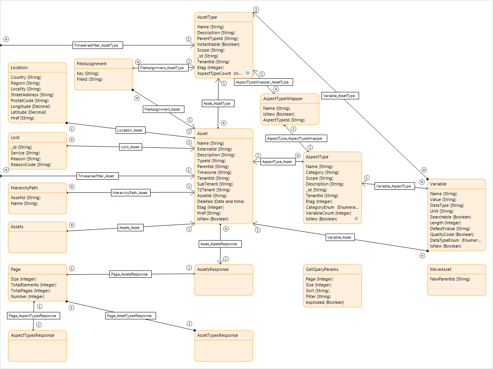
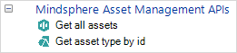
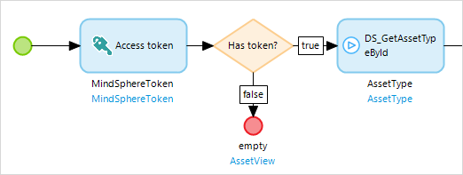
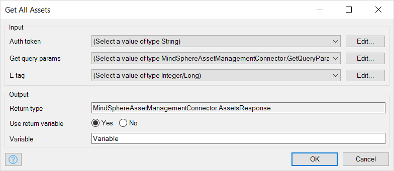
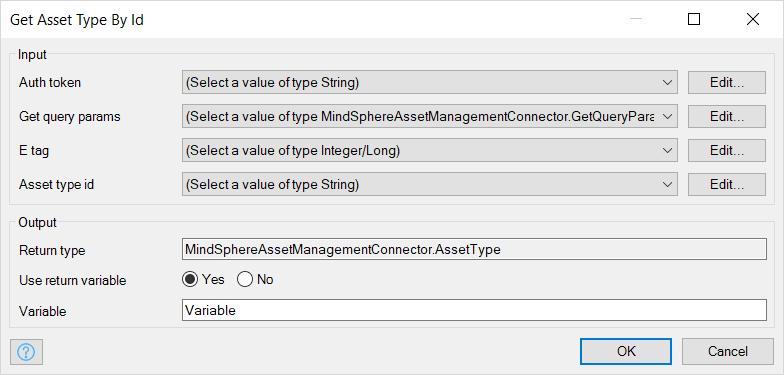

## 1 Introduction

{}
This information is for apps which are deployed to MindSphere. The MindSphere Asset Management Connector cannot be used with MindSphere IIoT for Makers.
{}

The MindSphereAssetManagementConnector module is the standard connector for managing assets within MindSphere. It is also available as a stand-alone module in the Marketplace: [MindSphere Asset Management Connector](https://marketplace.mendix.com/link/component/108806/). It is also used in the [Siemens MindSphere Pump Asset Example](https://marketplace.mendix.com/link/component/108810/). 

This module contains a Mendix domain model which maps the data structure of MindSphere assets. It also provides two microflow actions which can be used to retrieve assets and asset types from MindSphere:

* Get all assets
* Get asset type by id

These implement the *GET /assets* and *GET /assettypes/{id}* APIs described in the MindSphere documentation [Asset Management Service – API Specification Europe 1](https://developer.mindsphere.io/apis/advanced-assetmanagement/api-assetmanagement-api.html).

{}
To use these actions, the app must have at least the core role *mdsp:core:assetmanagement.standarduser* to allow it to read or update assets and images, and to read asset types and aspect types in the Asset Management Service.

For more information see the MindSphere documentation [Roles & Scopes for Applications](https://developer.mindsphere.io/concepts/concept-roles-scopes.html#asset-management).
{}

## 2 Asset Management Domain Model{#assetdm}

The two microflow actions populate the Asset Management Domain Model:

This domain model mirrors the asset manager data model, which is described in detail in the MindSphere documentation here: [Asset Management Service](https://developer.mindsphere.io/apis/advanced-assetmanagement/api-assetmanagement-overview.html). In addition, there is a **GetQueryParams** entity which is used to pass additional parameters to the microflows.

### 2.1 GetQueryParams

A **GetQueryParams** object is used to control which objects which are returned. This object needs to be populated and passed to the microflow action. If no GetQueryParams object is passed, then the defaults are used.

GetQueryParams has the following attributes, which match the parameters of the APIs described on the MindSphere developer site here: [Asset Management Service – API Specification Europe 1](https://developer.mindsphere.io/apis/advanced-assetmanagement/api-assetmanagement-api.html).

| **Attribute** | **Description**                                                                                                    | **Default** | **Example**          |
| ------------- | ------------------------------------------------------------------------------------------------------------------ | ----------- | -------------------- |
| Page          | The page of objects requested – this enables you to retrieve a different page of objects                            | 0           | 2                    |
| Size          | The number of objects returned for each page – this allows you to control the number of items returned in each call | 10          | 15                   |
| Sort          | The name of the object attribute to sort the objects                                                               | name        | description          |
| Filter        | Additional filtering criteria                                                                                      | —           | Name contains "pump" |
| exploded      | For AssetType objects, specifies if all inherited Variables and Aspects should be included                         | false       | false                |

More information on pagination is available here: [Asset Management Service – Pagination](https://developer.mindsphere.io/apis/advanced-assetmanagement/api-assetmanagement-references-pagination.html).

More information on filtering functions is available here: [Asset Management Service – Filtering](https://developer.mindsphere.io/apis/advanced-assetmanagement/api-assetmanagement-references-filtering.html)

## 3 Using the Connector

The module adds two actions which a developer can use to retrieve *Asset* and *AssetType* objects, together with their associated *Variable* objects, from MindSphere using the API. You can find these actions in the **Toolbox** under *MindSphere Asset Management APIs*.

To use the MindSphere API, you must have an *Access token*. The *MindSphere SSO* module creates one for you by linking the Mendix user to a user set up in MindSphere and creating an access token which authorizes the user. For more information, see [Siemens MindSphere – deployment](/developerportal/deploy/deploying-to-mindsphere).

{}
The MindSphere asset management actions should always be preceded by the **Access token** action, to ensure that the access token does not expire.

{}

### 3.1 Get All Assets

The **Get All Assets** microflow action retrieves assets which, optionally, match a query. It returns a single object, of type *AssetsResponse*, which is associated with all the **Asset** objects which match the query. It also retrieves objects of type **Location**, **AspectType**, and **Variable** which are associated with the assets.

It implements the API call .../api/assetmanagement/v3/assets?{Get query params}.

*Get All Assets* uses the following parameters:

* **Auth token** – a string containing an access token, retrieved by the *Access token* action
* **Get query params** (optional) – an object of type **GetQueryParams** containing additional parameters for the query (see the [Asset Management Domain Model](#assetdm), above, for more details)
* **E tag** (optional) – an integer which acts as a counter for optimistic locking

It returns the following:

* **Variable** (AssetsResponse) – an object of type **AssetsResponse** which is associated with retrieved objects of type **Asset**, **Location**, **Page**, **Lock**, **FileAssignment**, **AspectType**, and **Variable** which contain additional information about these assets

This populates the following entities in the domain model:

* AssetsResponse
* Page
* Asset
* Location
* Lock
* FileAssignment
* AspectType
* Variable

For more information about these entities, and what is returned by the *GET /assets* API call, see the *Models* and *GET /assets* sections of the [Asset Management Service – API Specification Europe 1](https://developer.mindsphere.io/apis/advanced-assetmanagement/api-assetmanagement-api.html).

{}
By default, MindSphere limits the data returned to the first ten assets. This behavior can be modified through a GetQueryParams object.
{}

### 3.2 Get Asset Type by ID

The **Get Asset Type By ID** microflow action gets a single **AssetType** object, using its **AssetTypeId**. It also retrieves all the following associated objects:

* Variable
* AspectType
* AspectTypeWrapper

It implements the API call .../api/assetmanagement/v3/assettypes/{Asset type id}?{Get query params}.

The parameters are as follows:

* **Auth token** – a string containing an access token, retrieved by the *Access token* action
* **Get query params** (optional) – an object of type **GetQueryParams** containing additional parameters for the query (see the [Asset Management Domain Model](#assetdm), above, for more details)
* **E tag** (optional) – an integer which acts as a counter for optimistic locking
* **Asset type id** – a string containing the value which should be matched to the _id attribute of the asset type required. This should be in the format {tenant}.{asset type}

It returns the following:

* **Variable (AssetType)** – an object of type **AssetType** which is associated with retrieved objects of type **AspectTypeWrapper**, **AspectType**, and **Variable** which contain additional information about this asset type

## 4 Read More

* [How to Use the Siemens MindSphere Pump Asset Example App](/partners/siemens/mindsphere-example-app)
