## 1 Introduction

You can write Mendix apps which analyze data held in MindSphere, the open, cloud-based, IoT operating system from Siemens. To help you build your app, the [Siemens MindSphere Pump Asset Example](https://appstore.home.mendix.com/link/app/108810/) app is available in the Mendix App Store and can be used as the starting point for a new Mendix app.

This documentation provides more explanation of the MindSphere example app. Please note that this app is not production-ready. It is designed as an example of how you might begin to build a Mendix/MindSphere app.

You can get more detailed information on how to deploy your app to the MindSphere Platform in [Siemens MindSphere – deployment](/developerportal/deploy/deploying-to-mindsphere).

## 2 Prerequisites

To deploy your app to MindSphere, you need to complete the prerequisites described below.

### 2.1 Roles

You need a MindSphere user account on a developer tenant. This account needs the following core roles:

* mdsp:core:Developer
* mdsp:core:StandardUser
* mdsp:core:TenantUser

### 2.2 Assets

This example app displays information about pumps. If there are no pump assets created yet for your tenant, you will need to create them using the MindSphere **Asset Manager** in the launchpad.

For this example app you must create Pump assets based on a **Pump** aspect with the following properties:

| **Name**       | **Data type** | **Unit** |
| -------------- | ------------- | -------- |
| Motor_Current | DOUBLE        | amps     |
| Pressure_In   | DOUBLE        | psi      |
| Pressure_Out  | DOUBLE        | psi      |

To create your assets, perform the following steps:

1.  Login to MindSphere and go to the **MindSphere Asset Manager**.

    {{% image_container width="25%" %}}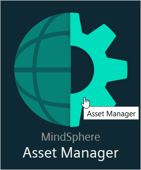{}

2.  Select **Aspects**.

3.  Click **Create aspect**.

4.  Create a *dynamic* aspect called *Pump*.

5.  Set up the following variables:

    | **Name**       | **Data type** | **Unit** |
    | -------------- | ------------- | -------- |
    | Motor_Current | DOUBLE        | amps     |
    | Pressure_In   | DOUBLE        | psi      |
    | Pressure_Out  | DOUBLE        | psi      |

    The result should look like:

    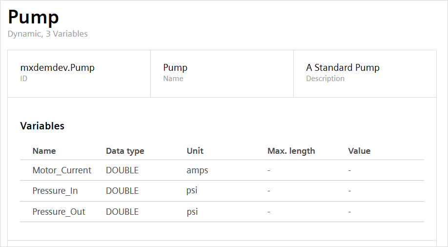

6.  Select **Types**.

7.  Click **Create Type**.

8.  Create a **BasicAsset** called *Pump*.

9.  Add the aspect *Pump* to the asset type.

    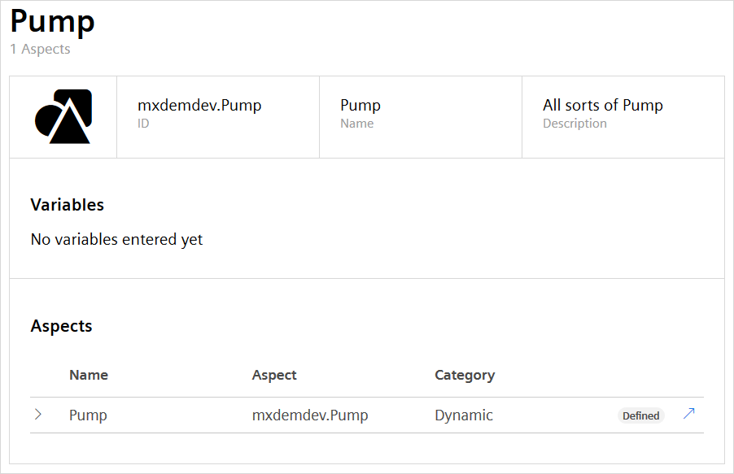

10. Select **Assets**.

11. Click **Create asset**.

12. Select the type *Pump*.

13. Type the *Name* and click **Save**. Location information is optional.

14. Create more assets if required.

    You should now have one or more Pump assets which you can use in the example app:

    {{% image_container width="25%" %}}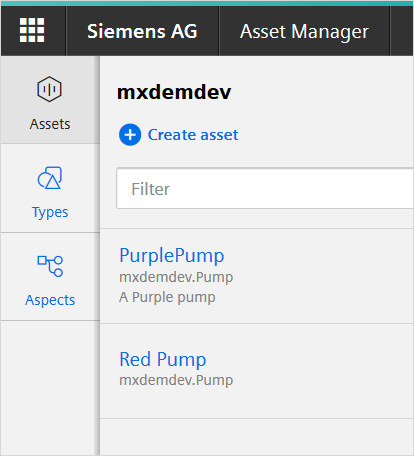{}

More information on creating assets is available in the MindSphere [Asset Manager – System Manual](https://documentation.mindsphere.io/resources/html/asset-manager/en-US/index.html).

## 3 Opening the App in Studio Pro

Open Studio Pro without opening an app and follow these steps:

1. Click the icon in the top-right of the menu bar to open the Mendix App Store:

	

2. Enter *MindSphere* in the search box, and click the magnifying glass icon.

3. Select **Siemens MindSphere Pump Asset Example** from the search results:

	

4. Click **Download** to create a new app project using this app:

	

5. To start the new app project, confirm where to store the app, the app name, and the project directory, then click **OK**:

	

## 4 Deploying the Example App

To deploy the example app, you will need to configure the app, push it to Cloud Foundry, and set it up in the MindSphere launchpad.

More detailed instructions are available in the deployment documentation: [Siemens MindSphere – deployment](/developerportal/deploy/deploying-to-mindsphere).

The following sections summarize the settings and values you need to enter to successfully run this example app.

### 4.1 App Configuration

Within the app, you will need to set the following constants correctly:

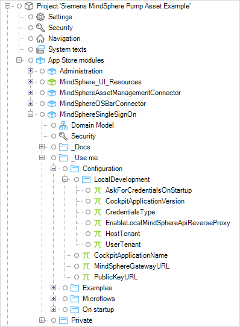

* CockpitApplicationName (the *Name* of your app in the MindSphere Developer Cockpit)
* MindSphereGatewayURL
* PublicKeyURL

To deploy locally, you will need to configure the three constants above plus:

* CockpitApplicationVersion
* CredentialsType
* HostTenant
* UserTenant

### 4.2 Scopes and Roles

The scopes and roles need to be set up as shown in the image below.

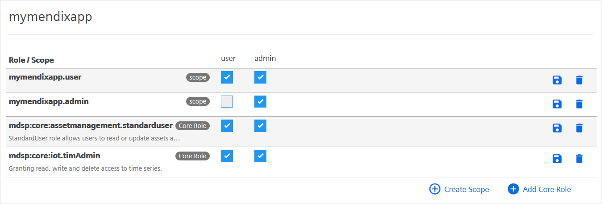

The following sections give more information on how these settings apply to the example app.

#### 4.2.1 User Scopes{#userscopes}

The example app has two Mendix user roles, *Admin* and *User*. These are mapped to the two application scopes *admin* and *user*. The MindSphere *user* role should be mapped to the *user* scope. The MindSphere *admin* scope should be mapped to both the *user* and *admin* scopes.

This means that a MindSphere user who is given the **Admin Role** for the app will be given the *admin* and *user* scopes and will therefore have the Mendix user roles *admin* and *user*.

#### 4.2.2 Core Roles

To access the MindSphere APIs, the app needs to be given **Core Roles**. This Asset Management example app needs the following core roles:

* assetmanagement.standarduser – this allows the app to read or update assets and images, and to read asset types and aspect types in the Asset Management Service
* iot.timAdmin – this gives the app read, write and delete access to time series

{}
Without these core roles, the app will not have access to the asset management or time series APIs of MindSphere.
{}

For more information see the MindSphere documentation [Roles & Scopes for Applications](https://developer.mindsphere.io/concepts/concept-roles-scopes.html#asset-management).

## 5 Siemens MindSphere Pump Asset Example App

The **PumpAssetExample** module within the app uses the *MindSphere Asset Management Connector* and MindSphere APIs, via Mendix native REST, to create and view time series information for an asset.

This is based on a standard Mendix app template. It also has additional modules which are required for integrating with and deploying to MindSphere. These additional modules are:

* MindSphere SSO
* MindSphere Theme Pack
* MindSphere OS Bar Connector

The use of these modules is covered in more detail in [Siemens MindSphere – deployment](/developerportal/deploy/deploying-to-mindsphere).

It also uses the **MindSphere Asset Management Connector**. This is described in [MindSphere Asset Management Connector](/partners/siemens/mindsphere-asset-management-connector).

To use the app:

1.  View the app either from the MindSphere launchpad, or by running the app locally from Studio Pro and clicking **View**.

2.  Click **Go to Assets** to view a list of assets.

    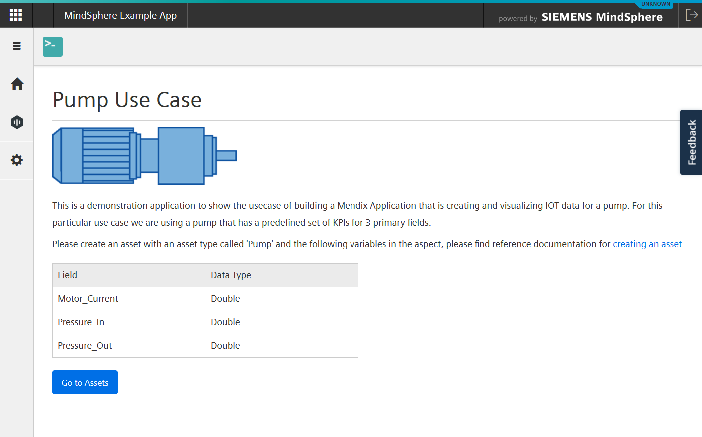

3.  If you are running locally, you will need to provide *Client ID* and *Client Secret* credentials for your app. See [MindSphere Development Considerations](/partners/siemens/mindsphere-development-considerations) for more information on how to do this.

    If you are running in the MindSphere launchpad, you will be logged on using Single Sign-on.

4.  The assets are displayed using the **Get asset type by id** and **Get all assets** actions of the *MindSphere Asset Management Connector*.

5.  Click an asset.

    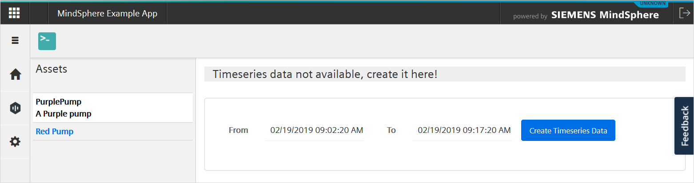

6.  If no time series data is available, you will be asked to create it; click **Create Timeseries Data**.  
    This creates some sample data and uploads it to MindSphere using the REST API through Mendix's native REST functions.

7.  You will see the time series data which has been generated. This is retrieved from MindSphere, again using Mendix's native REST functions.

8.  Click on a magnifying glass to enlarge a time series chart.

    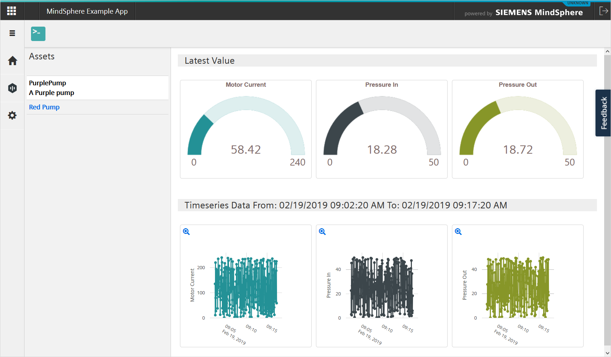

    The enlarged chart can display three limit lines: Info, Warn, and Error. If you have an admin role in the app, you can configure these for your tenant.

9. Click the settings icon in the menu. You will only see this if you have the *admin* role.

    {{% image_container width="50%" %}}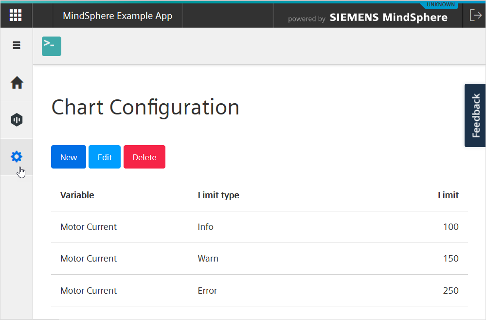{}

    These values are held in the **LimitConfig** entity of the *PumpAssetExample* module domain model. When this entity is accessed, a constraint is used so that only the limits for the user's tenant are displayed. This enables the app to be multi-tenant.

## 6 Notes on App Design

### 6.1 Single Sign-On

The app uses Single Sign-on (SSO) to identify the user. This is initiated in the *Runtime* tab of the Project Settings, where the microflow *MindSphereSingleSignOn.RegisterSingleSignOn* is called on startup. This microflow sets up two configurations for the user.

#### 6.1.1 User Role

The user is given the role of *user* or *admin* within MindSphere. These roles are translated to MindSphere scopes which are matched to the Mendix user role. With the recommended mapping, a user with the app role *user* in MindSphere will be given the Mendix user role *user*.

For a more complete description, see the [User Scopes](#userscopes) section.

#### 6.1.2 Multi-Tenant Support

The user is also connected to their MindSphere tenant. This enables security to be placed on persistable Mendix entity objects.

MindSphere SSO provides the user’s tenant as the **Name** attribute in the **Tenant** entity.

{{% image_container width="75%" %}}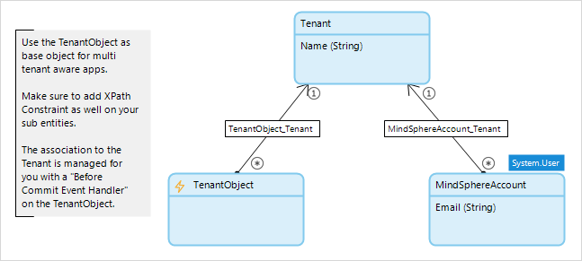{}

By utilizing this value when an entity is accessed, the Mendix app can be made multi-tenant. Note that security has to be applied explicitly in the action which accesses the entity, it cannot be applied to the entity itself.

In this app there is a **LimitConfig** entity which is a specialization of **MindSphereSingleSignOn.TenantObject**. This holds a set of limits which should be displayed on the time series chart. The limits are set for each tenant individually.

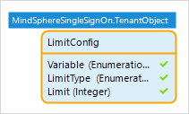

When the app needs to get a list of limits, it calls the sub-microflow DS_GetLimitConfigs which returns a list of all limits for this tenant. The **Retrieve Objects** action applies an XPath constraint to ensure that only objects for this user’s tenant are retrieved.

{{% image_container width="75%" %}}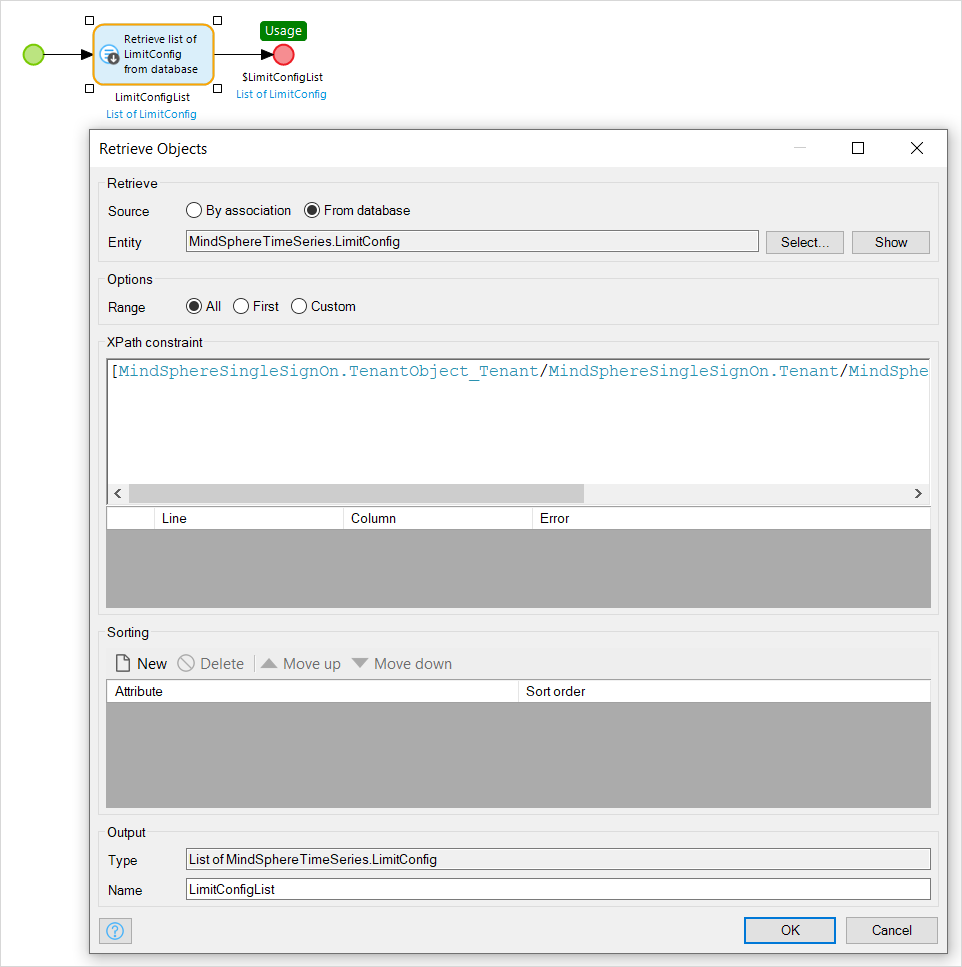{}

When the list of limits is required, this microflow is called to ensure that tenant-based security is applied.

### 6.2 Access Token

The *Access Token* action is called at the start of every microflow which accesses MindSphere. This refreshes the access token and ensures that errors are not introduced because the access token has expired.

### 6.3 Asset Management

Asset Management (retrieving assets and asset types) is performed using the MindSphere Asset Management Connector. This is described in [MindSphere Asset Management Connector](/partners/siemens/mindsphere-asset-management-connector).

### 6.4 Native REST

The time series information is accessed using Mendix native REST. Native REST can also call other APIs which access MindSphere.

For instructions on how to use Mendix native REST see [How To Consume a REST Service](/howto/integration/consume-a-rest-service).

### 6.5 PUT Time Series

In ACT_PutTimeSeriesData, the timeseries data is created as a MindSphere time series using a native REST(PUT) action. It this is successful, MindSphere returns a 204 code and this is checked in the decision *Put request completed successfully?*

However, MindSphere will queue this request internally and the data will not be available until MindSphere has processed the queue. To ensure that this does not impact the app flow, the sub-microflow DS_GetTimeSeriesDataWithRetry is called. This attempts to read the time series data back from MindSphere until either it is successful, or it reaches the maximum number of retries (set in the constant *MaxRetryAfterPutTimeSeries*). There is a delay between each retry which follows an increasing arithmetic series.

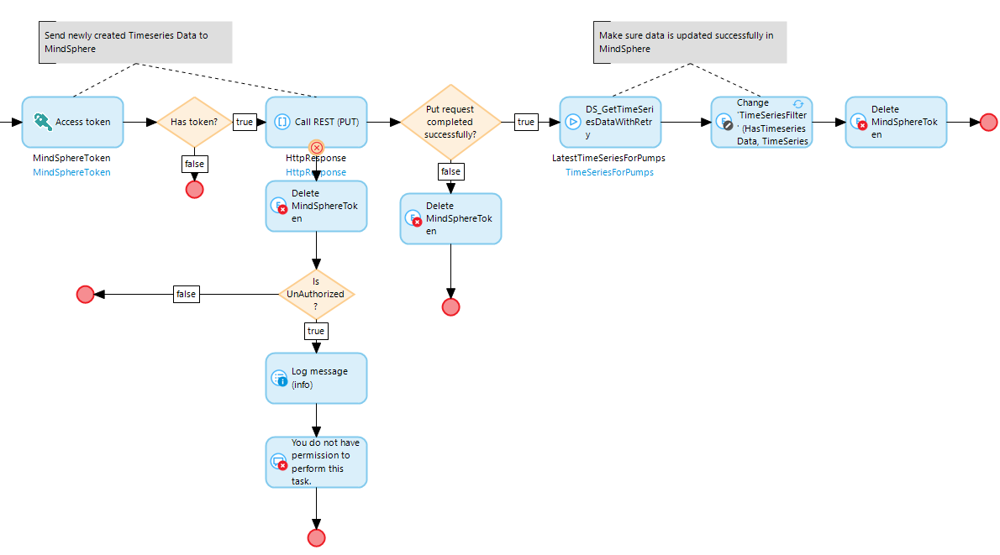

## 7 Read More

* [MindSphere Asset Management Connector](/partners/siemens/mindsphere-asset-management-connector)
