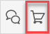
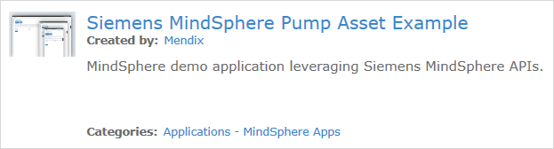
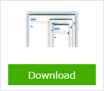
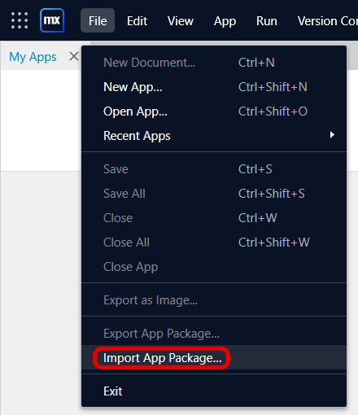
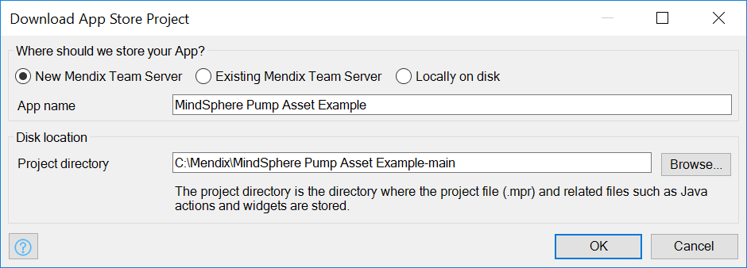
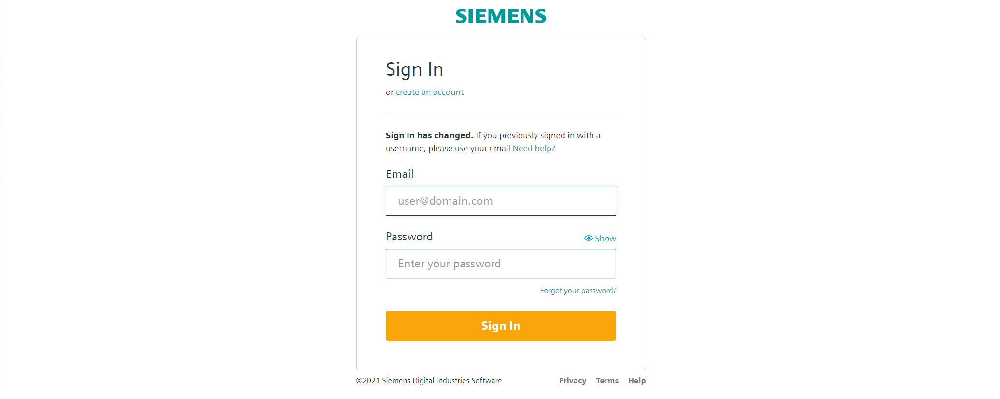
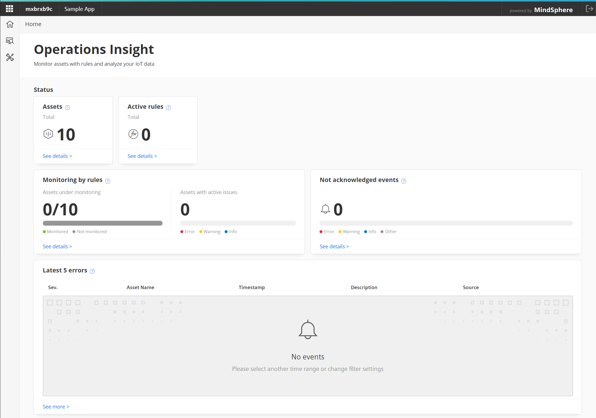
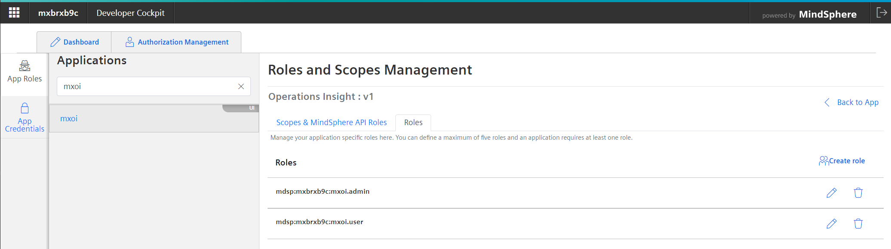
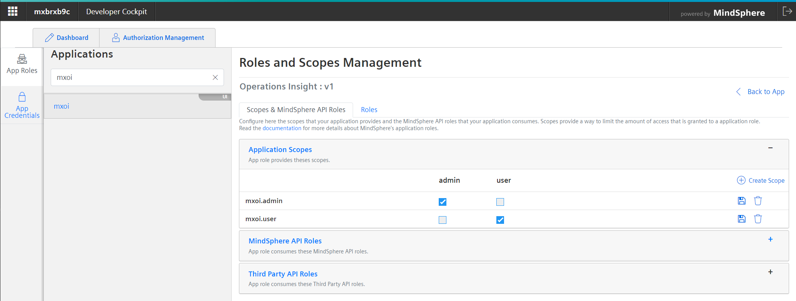
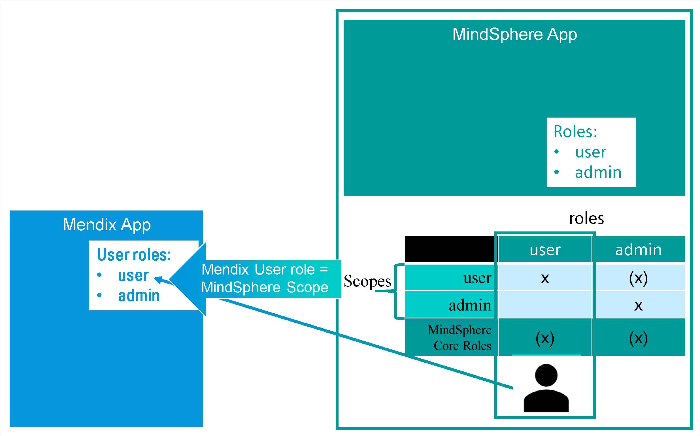

## 1 Introduction

{}
This information is for the Siemens MindSphere Operations Insight Example App. This app cannot be used with MindSphere IIoT for Makers.
{}

You can write Mendix apps which analyze data held in MindSphere, the open, cloud-based, IoT operating system from Siemens. To help you build your app, the [Siemens MindSphere Operations Insight Example](https://marketplace.mendix.com/link/component/117954) app is available in the Mendix Marketplace and can be used as the starting point for a new Mendix app.

This documentation provides more explanation of the MindSphere example app. Please note that this app is not production-ready. It is designed as an example of how you might begin to build a Mendix/MindSphere app.

You can get more detailed information on how to deploy your app to the MindSphere Platform in [Siemens MindSphere – deployment](/developerportal/deploy/deploying-to-mindsphere). If your are interested in how to develop a MindSphere app with Mendix we recommend to visit our learning path [Build a MindSphere app with Mendix](https://academy.mendix.com/link/path/80/Build-a-MindSphere-app-with-Mendix).

## 2 Prerequisites

To run your app on MindSphere, you need to complete the prerequisites described below.

### 2.1 Roles

You need a MindSphere user account on a tenant including a Developer Cockpit - e.g. a **[Start for free](https://siemens.mindsphere.io/en/start)** tenant. This account needs the following core roles:

* mdsp:core:Developer
* mdsp:core:StandardUser
* mdsp:core:TenantUser

## 3 Opening the App in Studio Pro

Open Studio Pro without opening an app and follow these steps:

1. Open the *Switch to* menu in the top bar of Studio Pro and click the Marketplace icon to open the Mendix Marketplace in the Browser:

	

2. Enter *MindSphere Operations* in the search box and select **Siemens MindSphere Operations Insight** from the search results:

	

3. Click **Download** and store the **Siemens_MindSphere_Operations_Insight_Example.mpk** on your pc.

	

4. Go back to your Studio Pro and open the *File* menu and Import the downloaded app package.

    

5. Confirm the app name, and the app directory, then click **OK**:

	

## 4 Deploy and Run the Example App

A Mendix based application for MindSphere can be deployed to Mendix or to MindSphere. Deploying to Mendix is quite easy and is the preferred option as you than also can use the Auto Registration process.
More information about the deployment options see [Deploying to MindSphere](./developerportal/deploy/deploying-to-mindsphere#5-deploying-your-app).

To start the Auto Registration process just hit the  button. Once your app is deployed to Mendix hit the  button. Your default Browser will open and your app start will start the registration process.

### 4.1 Auto Registration

All apps running within MindSphere needs to be registered. When you opening your app for the first time, it will recognize that is unregistered yet and ask you to perform the registration. You can do this manually in the Developer Cockpit, but the easier way is the Auto Registration process we follow here.

Click **Start Auto Registration**. The process now tries to figure out on which tenant your app should be registered. Therefore you have to login:

{}
If you have more then one tenant, with an Developer Cockpit option, on MindSphere you will get a list of those tenants. Choose the tenant where you want to register your app.

If you have only one tenant on MindSphere, the process will automatically select this tenant for you.
{}

Give a name, internal name, and, optionally, a description in order to register your app.

On a **Start for Free** tenant the **admin** role will be assigned automatically to your account. For all other tenants, you have to select at least one application role which will be assigned to your account automatically.

Click **Register** to start the registration process on your tenant. After a few seconds, a summary page is shown.
Please do **not** launch your application directly. The MindSphere Operation Insights is using quite a lot of MindSphere APIs. When you register an application you also have to grant access to each API you like to use in your application. Therefore you have to do this for the Operation Insight application as well. To do so, click the the **Developer Cockpit** link.

A new tab opens showing the registration detail of your app. Click **Configure** to add the required MindSphere roles.

Add the following MindSphere API Roles to your app and assign it to the application roles **admin** and **user**, as shown in the picture below, accordingly:

* mdsp:core:assetmanagement.standarduser
* mdsp:core:em.eventcreator
* mdsp:core:em.eventmanager
* mdsp:core:em.eventviewer
* mdsp:core:iot.filAdmin
* mdsp:core:iot.filUser
* mdsp:core:.iot.tsaUser
* mdsp:core:.iot.timUser
* mdsp:core:mindconnect.fullaccess
* mdsp:core:mindconnect.readonly
* mdsp:core:tm.tenantUser
* mdsp:core:tsm.full-access
* mdsp:core:tsm.read-only

The app configuration is finished now. Switch back to the **Registration completed!** browser tab and hit **Launch your application** which will start the app.  

### 4.2 Scopes and Roles{#scopesroles}

The auto registration process has created two MindSphere application Roles *admin* and *user*:

You can assign these application roles to users in the *Settings* app found on the launchpad.

In addition, the auto registration process has created two MindSphere application Scopes *admin* and *user* and assigned these to the roles as follow:

The example app has two Mendix user roles, *Admin* and *User*. These are mapped to the two application scopes *admin* and *user*.

This means that a MindSphere user who is given the **Admin Role** for the app will be given the *admin* scope and will therefore have the Mendix user roles *admin*.

For more information see the MindSphere documentation [Roles & Scopes for Applications](https://developer.mindsphere.io/concepts/concept-roles-scopes.html#available-roles-of-mindsphere-apis).

## 5 Run the app locally

To run and test your app locally follow the steps described in [Local Testing](/partners/siemens/mindsphere-development-considerations#localtesting)

## 6 Read More

* [MindSphere Development Considerations](/partners/siemens/mindsphere-development-considerations)
* [MindSphere Module Details](/partners/siemens/mindsphere-module-details)