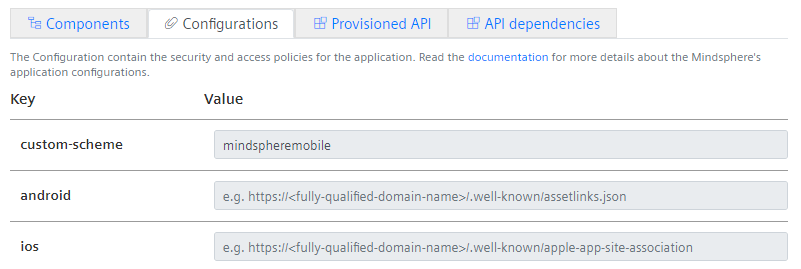
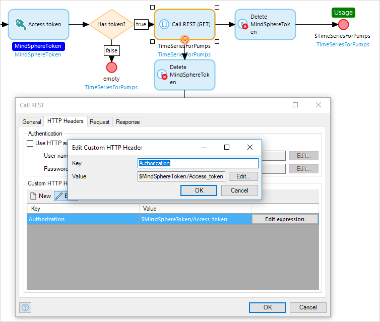

# MindSphere Mobile Native

## 1 Introduction

This documentation describes the adaptations needed to develop Mendix native mobile apps for MindSphere. Native mobile apps do not render inside a web view - they use native UI elements. This enables fast performance, smooth animations, and allows access to all native device capabilities.
Details about building native mobile apps with Mendix can be found in the [Native Mobile How Tos](/howto/mobile/native-mobile) section.

The [Siemens MindSphere Mobile Starter Application](https://marketplace.mendix.com/link/component/118164) is an app template which is based on the **Native Mobile Quickstart** from Mendix and includes all you need to start developing a native mobile app for your MindSphere tenant.

On a phone there is no MindSphere launchpad - therefore the app has to implement the login to MindSphere itself. The template contains a login page which is shown to the user at startup.
The end-user signs in to MindSphere outside the native application, in a browser, and your app is started after a successful login via a "Deep Link". Details about this process can be found in [Developing Mobile Apps for MindSphere](https://developer.mindsphere.io/howto/howto-develop-mobile-app-with-mdsp.html) in the MindSphere documentation. But do not worry - the implementation is already part of the app template - just use it.
To support deep links in your app, you have to create your own [Custom Development App](/howto/mobile/how-to-devapps) and register a deep link corresponding to your app registration.

As a prerequisite, we recommend that you follow the [build a native mobile inspection-app](https://academy.mendix.com/link/path/66/Build-a-Native-Mobile-Inspection-App) tutorial from the Mendix Academy to get yourself familiar with mobile app development.

This documentation is structured into two main parts:

* [Setup Development Environment](#setupdevenv) - explains everything to get you started
* [Module Details](#moduledetails) - describes the solution and what should be considered during development

## 2 Setup Development Environment{#setupdevenv}

The setup of your development environment consists of the following steps:

1. Register a new mobile app in Developer Cockpit
2. Create a project based on the [Siemens MindSphere Mobile Starter Application](https://marketplace.mendix.com/link/component/118164)
3. Build your own development app
4. Try it out

### 2.1 Registering your Mobile App in Developer Cockpit

The **Siemens MindSphere Mobile Starter Application** template provides the ability for a user to sign in to MindSphere from within a mobile application. To get the mobile authentication running, it is necessary that the application itself is registered within MindSphere. This registration can be done with the MindSphere Developer Cockpit by following the steps below.

1. Open the **Developer Cockpit** via the Launchpad of your *Developer Tenant*.

    

1. Click **Add application** and fill in the following:

    * ```Type = Mobile```
    * ```Infrastructure = none```
    * ```Display Name``` — give your app a nice display Name. Currently this name is only used in Developer Cockpit
    * ```Internal Name``` — give an internal name. We need this name later and will call it **internal_name**
    * ```Version = 1.0.0```

    

1. Open the tab **Configurations** and specify a value for the **custom-scheme** which is your Deep Link. Please copy the value, we will need it later again. Note: the value should be unique for your app. If another app installed on the phone is using the same value it might interfere with the authentication process. For example, use a combination of company and app name to ensure that it is unique.

    

1. Click **Save** to save your new app.

    You have to map Mendix user roles to MindSphere user roles (see a more detailed discussion of MindSphere and Mendix roles and scopes in the [Roles & Scopes](mindsphere-module-details#rolesscopes) section of *MindSphere Module Details*). The standard template will be delivered with the roles **Admin** and **User** therefore we will create the corresponding MindSphere scopes. If this does not match the roles in your application, please adapt these instructions accordingly.

    {}The standard template also includes the role **Anonymous** which will be used for the authentication process. You should not register this role in the Developer Cockpit.{}

1. Click **Configure** to open the **Roles and Scopes Management**.

    

1. Extend the **Application Scopes** section and click **Create Scope**.

1. Add a scope with name **admin** and assign it the role **admin**.

1. Click **Create Scope** again and enter **user** as the scope name and assign it to the **admin** and **user** roles.

1. The final result should look similar to:

    

1. Click **Back to App** and **Register** to finalize the registration on MindSphere:

     

1. You will see the following popup after registration:

    

    We will need the **Client ID** and the **Client Secret** later, so copy them somewhere – we will call these constants **client_id** and **client_secret**.

1. The last step is to grant yourself the *user* or *admin* role in the app **Settings**.

    

You now have successfully registered your application within the Developer Cockpit.

{}
The [MindSphere Mobile Starter Application](https://marketplace.mendix.com/link/component/118164) can be used to build applications for both native mobile apps and 'normal' web applications.

Currently you can register either a mobile app or a web app in the MindSphere Developer Cockpit but not both together. If you need access in a web browser, please push your application to the Mendix cloud and set up another registration via the Auto Registration for your web application as described in [Setting up MindSphere Launchpad](/developerportal/deploy/deploying-to-mindsphere#launchpad). This app can then be added to the MindSphere Launchpad. Please note, pushing a Mendix Mobile Native application to the MindSphere Cloud Foundry is currently not supported, as the Native applications needing an unprotected endpoint to any time.
{}

### 2.2 Start Developing your App with Mendix Studio Pro

Create a new Mendix Team Server project based on the [Siemens MindSphere Mobile Starter Application](https://marketplace.mendix.com/link/component/118164) template.

Now, you need to make some configuration changes in the app itself.

In the project explorer open the configuration of the app store module **MindsphereSingleSignOn**:


Change these constants:

* **HostTenant** = name of your tenant

If you are not working on *eu1.mindsphere.io*:

* **MindSphereGatewayURL**

* **PublicKeyURL**

In the **NativeMobile** folder:

* **ClientID** = **client_id** from app registration in Developer Cockpit

* **ClientSecret** = **client_secret** from app registration in Developer Cockpit

* **Scheme** = **custom_scheme** from app registration in Developer Cockpit

### 2.3 Building your Own Development App{#buildcustomapp}

In this section you will create your own custom development app and register a deep link.

In principle, you have to follow the description of how to create a [Custom Development App](/howto/mobile/how-to-devapps), and install it on your device or emulator as described there. There is only one additional thing required for the MindSphere integration. The **custom_scheme** specified in the Developer Cockpit app registration process needs to be provided as the **Deep link** in the **App capabilities** section.


### 2.4 Try out your application

You should now be ready to start your application for the very first time on your mobile phone. For this, click the **Run Locally** button so that your own native application can connect to your Mendix Studio Pro.
When your application is running you should see the login page of the Anonymous user role.


Please provide your developer tenant name and tap the **Login** button.
The default browser of your phone will open and show you the MindSphere credential page where you can sign in with your MindSphere credentials.


After a successful login, your app will be restarted and a session created. Then your native home page is displayed.

{}
If you have trouble signing in to your application, it is a good idea to clear the cookies of your mobile browser. See your browser's documentation for further information.
{}

### 2.5 Next steps

You now have a blank application which supports authentication for your specific MindSphere application, which is an excellent starting point for developing your app further. We also recommend investigating the basic tutorial for MindSphere web applications [Build a MindSphere app with Mendix](https://gettingstarted.mendixcloud.com/link/path/80/Build-a-MindSphere-app-with-Mendix) to learn more about MindSphere application development in general.

When you enhance your application with MindSphere API calls to use the IoT capabilities of MindSphere you must consider the following two steps:

* Authorize your MindSphere API calls.
* Add MindSphere API roles to your existing MindSphere gateway registration.

#### 2.5.1 Authorize your MindSphere API calls

With each MindSphere API call you have to ensure that the corresponding user token is part of the request. Do this by adding the **MindSphere Access Token** action before your REST calls and set the **Authorization** header accordingly.



#### 2.5.2 Extend your application registration with MindSphere API roles

As of now your application has the user roles **admin** and **user**, but none of those roles has the rights to access MindSphere APIs. Perform the following steps to achieve this.

1. Open the **Developer Cockpit** via the Launchpad of your *Developer Tenant*.

    

1. Select your application.

1. Click the **Configure** button to open the roles tab.

    

1. Open the **MindSphere API Roles section** and click the **Add MindSphere API Role** button.

    

1. Select the corresponding role you need for your particular API call and assign it to your user roles. For example:

    

    Your application has now been updated to be allowed to make API calls
    
    {}To enable this for your local test session you have to force a logout of the user. For this, tap the logout button within your mobile application and clear the cookies within your mobile browser. Afterwards sign in again. The token now includes the added API roles.{}

### 2.6 Deploying your app

Just simply press the **Run** button within your Mendix Studio Pro to use the [Free App](https://docs.mendix.com/developerportal/deploy/mendix-cloud-deploy) feature. Deployment of a Mendix Mobile native application to the MindSphere Cloud Foundry environment is currently not supported, so please use always one of the Mendix cloud environments.

## 3 Module Details{#moduledetails}

The **Siemens MindSphere SSO** module provides a couple of nanoflows which should be used to achieve a seamless integration with MindSphere. These nanoflows can be found in the folder `_Use me/NativeMobile` of the SSO module. The **Siemens MindSphere Mobile Starter Application** contains the SSO module and uses the provided nanoflows. The starter template just needs to be configured to get an application running. Nevertheless we would like to explain some details here.

### 3.1 Authentication

Authentication is based on the usage of **Anonymous** users and is enabled in the project securities.


When the application starts it will provide the **Login** page from the **Login** folder where the user can provide the tenant name they want to authenticate against. To get this to work, the **Login** page is registered as the default homepage for the Anonymous role.


Clicking the **Sign in** button calls the nanoflow **ACT_Login** which opens the browser so that the user can provide their credentials.
After a successful login, the deep link handler of the SSO module will fetch the MindSphere Mobile Token and will start the user session accordingly.
At the end of the authentication process the app will be restarted and show the home page of the corresponding user role.

If something went wrong during the authentication process, the corresponding error code will be displayed on the Login page.

### 3.2 MindSphere APIs and Token Handling

If you have already developed a Web application for MindSphere, you will be aware that you need to use the included **Access Token** action with your REST calls.


The good news for native mobile is: this do not change. You can use the same microflows for Web apps and native apps to fetch MindSphere APIs.

If you are new to MindSphere app development please check out [MindSphere Development Considerations](mindsphere-development-considerations) to learn more about this topic.

To support mobile native applications, MindSphere provides a special mobile token, which is called the **MindSphere Mobile Token**. As a Mendix developer you luckily don't have to do much with this token as this has been dealt with in the **Siemens MindSphere Mobile Starter Application**, but it is may be worthwhile to present some details to help you understand the impact on your application better.

Actually the Mobile Token is not only one token. It contains two tokens

* the **Access Token**, which you need to fetch the MindSphere APIs and which has an expiration time of half-an-hour
* the **Refresh Token**, which will be used to refresh the Access Token when this expires. The refresh token itself is valid for 12 hours. After this time the user must sign into the application again to acquire a new token.

As tokens can expire, there are some events in the lifecycle of a mobile app which need to be considered. For each event, the tokens have to be checked and one of the following three things will happen:

1. The token is still valid and nothing has to be done.
2. The access token, which is only valid for half an hour, is no longer valid but the refresh token is still valid. In this case refreshing your access token is sufficient.
3. Both the access token and the refresh token have expired. In this case the user will be logged out and has to sign in again.

As you need a valid MindSphere token to call MindSphere APIs, it is very important that these checks are done before you call a flow to access a MindSphere API. The **Siemens MindSphere Mobile Starter Application** helps you to ensure this by taking care of the following events:

* Application startup: The standard mobile homepage of the Native Mobile Application already has a Data view calling the nanoflow **OnSessionStartup**. OnSessionStartup will take care of the checks mentioned above.

    

* Application resume: an **App events** element is placed within the provided Data view which causes the **On resume** event to call the nanoflow `MindSphereSingleSignOn.OnResume` which does the checks mentioned above.

    

* Application comes online: The same as on application resume but now the **On online** event of the App events will call the `OnResume` nanoflow.

* Periodically your token needs to be checked while your app is running. Therefore the `MindSphereSingleSignOn.OnRefresh` nanoflow is configured to be called every minute.

    

{}
You will want to change the home page to fit with the rest of your app. Please do this, but do not delete the initially provided Data view and App events.
{}

### 3.3 Additional User Role Home Pages

If you want to create new home pages for different user roles, please ensure that they also include the data view with the `OnSessionStartup` nanoflow and the **AppEvents** as provided in the default mobile home page. This ensures that the MindSphere token handling also works properly for this user role.
