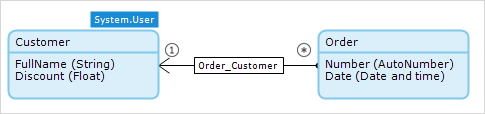

## 1 Introduction

The access rules of an entity define what a user is allowed to do with objects of the entity. Users can be allowed to create and/or delete objects, and to view and/or edit member values. A member is an attribute or an association of an entity. Furthermore, the set of objects available for viewing, editing, and removing can be limited by means of an [XPath constraint](xpath-constraints).

Every access rule is applicable to one or more [module roles](module-security#module-role). An access rule grants certain access rights to those roles. Rules are additive, which means that if multiple access rules apply to the same module role, all access rights of those rules are combined for that module role.

{}
Access rules are not inherited from an entity's generalization; rather, the security for every entity is specified explicitly. This means that when adding an access rule to an entity, always make sure that all required XPath constraints are applied. The generalization's access rules, that might already define XPath constraints, do not apply to its specializations and will therefore not limit their visibility.
{}

## 2 Properties

Access rules are defined in the entity's **Properties** > **Access rules**.


{}
The **Access rules** section is visible only if the [Project Security](project-security) is set to **Production**.
{}

### 2.1 Documentation

In this property, you can describe the intention of the access rule. This helps to keep access rules comprehensible, especially in the case of non-trivial XPath constraints.

### 2.2 Rule Applies to the Following Module Roles

The module roles to which this access rule applies have a checkmark in the box before them. All users that have at least one of the checked module roles get the access rights that the rule defines.

### 2.3 Allow Creating New Objects

If this check box is checked, users are allowed to create new objects of this entity.

### 2.4 Allow Deleting Existing Objects

If this checkbox is checked, users are allowed to delete existing objects of this entity.

The set of objects that can be deleted can be limited by using an [XPath constraint](#constraint).

### 2.5 Member Read & Write Rights

Member read and write rights define the access rights for every member (attribute or association) of the entity. These access rights indicate whether users are allowed to view and/or edit the member's value.

| Value | Description |
| --- | --- |
| - | Users are not allowed to view or edit the value of the member. |
| Read | Users are allowed to view the value of this member, but cannot edit it. |
| Read, Write | Users are allowed to view and edit the value of this member. |

{}
You cannot set *write* access to attributes which are calculated. This includes attributes of type *Autonumber* and attributes where the attribute value is set to **Calculated**.
{}

The set of objects to which the member access rights apply can be limited by using an [XPath constraint](#constraint).

For example, a customer is allowed to view the discount, but is not allowed to edit it. The access rights for the discount attribute are **Read**.


### 2.6 XPath Constraint {#constraint}

An [XPath constraint](xpath-constraints) can be used to constrain the set of objects to which the access rule applies. If the XPath constraint is empty, the rule applies to all objects of the entity.

The **Customer** entity is a specialization of the **User** entity. The **Order** entity is associated to the **Customer** entity.



A logged-in customer is allowed to view personal orders, but is not allowed to view the orders of other customers. This is accomplished by using the following XPath constraint in the access rule of the **Order** entity:

```java
[Module.Order_Customer = '[%CurrentUser%]']
```

Because of this XPath constraint, the access rule only applies to orders of which the customer is the currently signed-in user.

{}
The **Show XPath constraint** check box only indicates whether you can see the XPath constraint in the access rule dialog box, it does not influence the behavior of your application.
{}

{}
XPath constraints can only be applied to persistable entities as they are computed in the database. Defining XPath constraints for non-persistable entities results in consistency check errors.
{}
