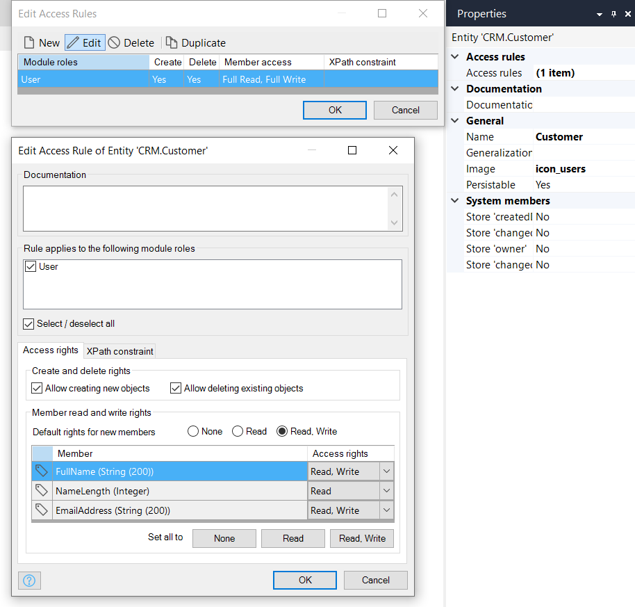

## 1 Introduction

The **access rules** of an entity define what a user is allowed to do with objects of the entity. Users can be allowed to create and/or delete objects, and to view and/or edit member values. A member is an attribute or an association of an entity. Furthermore, the set of objects available for viewing, editing, and removing can be limited by means of an [XPath constraint](xpath-constraints).

Every access rule is applicable to one or more [module roles](module-security#module-role). An access rule grants certain access rights to those roles. Rules are additive, which means that if multiple access rules apply to the same module role, all access rights of those rules are combined for that module role.

{}
Access rules are not inherited from an entity's [generalization](entities#generalization), the security for every entity is specified explicitly. This means that when adding an access rule to an entity, always make sure that all required XPath constraints are applied.

If the entity has a generalization with access rules defining XPath constraints, these will not apply to its specializations and will therefore not limit its visibility.
{}


## 2 Properties

Access rules are defined via entity's **Properties** > **Access rules**, or on the **Access rules** tab of the entity dialog. 


{}
The **Access rules** section is visible only if the [App Security](project-security) is set to **Production**.
{}

An example of the access rules properties is represented in the image below:



Access rules properties consist of the following sections:

* [Documentation](#documentation)
* [Module Roles](#module-roles)
* [Access rights](#access-rights)
* [XPath constraint](#xpath-constraint)

### 2.1 Documentation Section {#documentation}

In **Documentation**, you can describe the intention of the access rule. This helps to keep access rules comprehensible, especially in the case of non-trivial XPath constraints.

### 2.2 Rule Applies to the Following Module Roles Section {#module-roles}

#### 2.2.1 Roles

All module roles are listed, and those to which this access rule applies are checked. All users that have at least one of the checked module roles get the access rights that the rule defines.

#### 2.2.2 Select / Deselect All

You can easily select, or deselect, all module roles using this check box.

### 2.3 Access Rights Tab{#access-rights}

The **Access rights** tab allows you to assign rights to users with the selected module roles.

#### 2.3.1 Create and Delete Rights Section

##### 2.3.1.1 Allow creating new objects

If **Allow creating new objects** is checked, users are allowed to create new objects of this entity.

##### 2.3.1.2 Allow deleting existing objects

If **Allow deleting existing objects** is checked, users are allowed to delete existing objects of this entity.

The set of objects that can be deleted can be limited by using an [XPath constraint](#xpath-constraint).

#### 2.3.2 Member Read & Write Rights Section

**Member read and write rights** define the access rights for every member ([attribute](attributes) or [association](associations)) of the entity. These access rights indicate whether users are allowed to view and/or edit the member's value. The set of objects to which these rights apply can be limited by using an [XPath constraint](#xpath-constraint).

| Value | Description |
| --- | --- |
| - | Users are not allowed to view or edit the value of the member. |
| Read | Users are allowed to view the value of this member, but cannot edit it. |
| Read, Write | Users are allowed to view and edit the value of this member. |

{}
You cannot set *write* access to attributes which are calculated. This includes attributes of type *Autonumber* and attributes where the attribute value is set to **Calculated**.
{}

**Default rights for new members** specifies the rights which are applied to new attributes or associations of this entity.

**Set all to** allows you to quickly set all the access rights for members to **None**, **Read**, or **Read, Write**.

For example, a customer is allowed to view the discount, but is not allowed to edit it. The access rights for the discount attribute are **Read**.


{}
If a user cannot view the value of an attribute because of security constraints, that attribute will never be sent to the Mendix Client. Because Mendix is stateless, this can lead to unexpected results (for example, loss of changes) if changes to the attribute in a microflow are not committed immediately. See [Basic CRUD Communication Pattern](communication-patterns#crud) in *Communication Patterns in the Mendix Runtime* for more information on how data is passed between the Runtime Server and the Mendix Client.
{}

### 2.4 XPath Constraint Tab {#xpath-constraint}

An [XPath constraint](xpath-constraints) can be used to constrain the set of objects to which the access rule applies. If the XPath constraint is empty, the rule applies to all objects of the entity.


For example, the **Customer** entity is a specialization of the **User** entity. The **Order** entity is associated to the **Customer** entity.

A logged-in customer is allowed to view personal orders, but is not allowed to view the orders of other customers. This is accomplished by using the following XPath constraint in the access rule of the **Order** entity:

```java
[Module.Order_Customer = '[%CurrentUser%]']
```


Because of this XPath constraint, the access rule only applies to orders for which the customer is the currently signed-in user.

{}
XPath constraints can only be applied to persistable entities as they are applied by the database. Defining XPath constraints for non-persistable entities results in consistency errors.
{}
