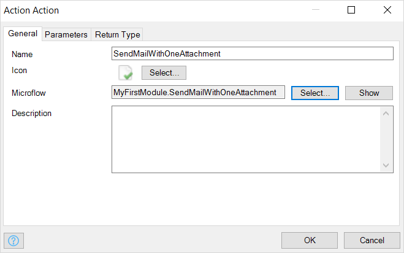

## 1 Introduction

{}
App services are deprecated and from version 8.18, are no longer supported. They are replaced by [published web services](published-web-services) and [published REST services](published-rest-services).
{}

Actions provide the actual microflow actions of the app service. Once an app service version is set to **Consumable**, its parameters and return type are no longer editable, as they are part of the app service contract.

In the **General** tab, you can set the microflow that corresponds to the action. When the microflow is set, the **Parameters** tab will be filled automatically.

An action page has the tabs below.

## 2 General

### 2.1 Name

This is the name of the action the consumer will see in their toolbox.

### 2.2 Icon

This is the icon that belongs to the action. An icon can be selected from any image documents in the app project. A new icon can be added to an image document if it is not available yet.

### 2.3 Microflow

This defines which microflow will be executed when this action is called.

### 2.4 Description

This describes the action. The consumer will see this description in their overview.

## 3 Parameters

### 3.1 Microflow Parameter

This defines the name of the parameter in the microflow.

### 3.2 Type

This defines the type of the parameter.

### 3.3 Can Be Empty

This defines whether a value can be empty as an input parameter.

### 3.4 Action Parameter

This defines the name of the parameter in the app service action call. This is initially copied from the microflow parameter name, but it can be modified. There are three reserved parameter names that are not allowed to be used:

* *username*
* *password*
* *appservicelocation* (case insensitive)

### 3.5 Exposed Attributes & Associations

A button is available for complex types (for example, an entity from your domain model) in order to define whether to include the attribute in an entity as well as to define whether an attribute can be empty as an input.

## 4 Return Type

This defines what kind of object will be returned by the action. This can be a simple type (like an integer or string), or a complex type (for example, an entity from your entity model).

### 4.1 Can Be Empty

This defines whether the return value can be empty.

For example, an **empty** ReturnObject is disallowed here:

