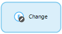
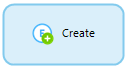
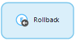
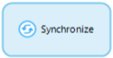
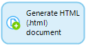

## 1 Introduction

Activities define the actions that are executed in a microflow or a nanoflow.

There are different types of activity, and these are grouped together in the Studio Pro toolbox. All the activities are listed below, follow the links for more information.

{}
Most activities can be used in both microflows and nanoflows. However, some can only be used in one of these types of flow, or the behavior may differ between microflows and nanoflows. Follow the links for more information.
{}

## 2 Object Activities

Object activities can be used to create and manipulate objects. The [domain model](domain-model) defines the object types ([entities](entities)) that can be used.

| Graphic | Name | Description |
| --- | --- | --- |
|  | [Cast object](cast-object) *(microflows only)* | Can be used in combination with an [object type decision](object-type-decision) to use the specialized members of the object. For more information on the specialized members of an object, see [Entities](entities) |
|  | [Change object](change-object) |Can be used to change the members of an object. This can be done with or without committing, and with or without events. |
|  | [Commit object(s)](committing-objects) | Can be used to commit changes to one or more objects. |
|  | [Create object](create-object) | Can be used to create an object. |
|  | [Delete object(s)](deleting-objects) *(microflows only)* | Can be used to delete an object. |
|  | [Retrieve](retrieve) | Can be used to get one (or more) associated objects of another object. Furthermore, this activity can also get one or more objects directly from a database. |
|  | [Rollback object](rollback-object) | Can be used to undo uncommitted changes that were made to an object in the part of the microflow preceding the activity. Furthermore, it deletes objects that have been created but have never been committed. |

## 3 List Activities

List activities can be used to create and manipulate lists of objects.

| Graphic | Name | Description |
| --- | --- | --- |
|  | [Aggregate list](aggregate-list) | Can be used to calculate aggregated values such as the maximum, minimum, sum, average, and total amount of objects over a list of objects. |
|  | [Change list](change-list) | Can be used to change the content of a list variable. |
|  | [Create list](create-list) | Can be used to create a (empty) list variable. |
|  | [List operation](list-operation) | Can be used to combine or compare two lists with objects of the same entity. |

## 4 Action Call Activities

Action call activities can be used to call another microflow or to call a Java action.

| Graphic | Name | Description |
| --- | --- | --- |
|  | [Java action call](java-action-call) | Can be used to call a Java action. Arguments can be passed to the action and the result can be stored in a variable. |
|  | [Microflow call](microflow-call) | Can be used to call another microflow. Arguments can be passed to the microflow and the result can be stored in a variable. |
|  | [JavaScript action call](javascript-action-call) | Can be used to call a JavaScript action. Arguments can be passed to the action and the result can be stored in a variable. |
|  | [Call nanoflow](nanoflow-call) | Can be used to call another nanoflow. Arguments can be passed to the nanoflow and the result can be stored in a variable. |

## 5 Variable Activities

Variable activities can be used to create or change a variable within a microflow.

| Graphic | Name | Description |
| --- | --- | --- |
|  | [Change variable](change-variable) | Can be used to change the value of a variable. |
|  | [Create variable](create-variable) | Can be used to create a new variable. |

## 6 Client Activities

Client activities can be used to have the web client of your application perform an action, such as showing a different page or downloading a file.

| Graphic | Name | Description |
| --- | --- | --- |
|  | [Close page](close-page) | Closes the page that was opened last by the user who called the microflow in which this activity is used. |
|  | [Download file](download-file) | Can be used to enable the browser to download a specific file. The user who calls the microflow in which this activity is used gets a download pop-up window, or the file is shown directly in the browser. |
|  | [Show message](show-message) | Can be used to show a blocking or non-blocking message to the user that calls the microflow in which this activity is used. |
|  | [Show page](show-page) | Can be used to show a page to the user that calls the microflow in which this activity is used. |
|  | [Validation feedback](validation-feedback) | Can be used to display a red text below a widget that displays an attribute or association. |
|  | [Show home page](show-home-page) | Can be used to navigate to the home page for the current user. |
|  | [Synchronize](synchronize) | Can be used to synchronize data. |

## 7 Integration Activities

Integration activities can be used to integrate with other systems, for example by calling a web service.

| Graphic                              | Name                                         | Description                                                  |
| ------------------------------------ | -------------------------------------------- | ------------------------------------------------------------ |
|  | [Call REST service](call-rest-action)         | The call REST service activity can be used to call a REST endpoint. You can use mappings to map results to entities or entities to requests. You can also use string templates and store the result in a string variable. |
|  | [Call web service](call-web-service-action)  | The call web service activity can be used to call one of the [imported web services](consumed-web-services). The content of the request can be edited. Furthermore the response of the webservice can be mapped to entities, stored in a variable or be ignored. |
|  | [Import with mapping](import-mapping-action) | The import with mapping activity can be used to parse the data in a string variable or data stored in a file document, and store them to entities defined in the [domain model](domain-model) of the database. An [import mapping](import-mappings) is used to map the incoming XML or JSON to entities. |
|  | [Export with mapping](export-mapping-action) | The export with mapping activity can be used to export the data stored in [domain model](domain-model) entities into an XML or JSON string. It can also be stored in a file document. An [export mapping](export-mappings) is used to map domain model entities into XML or JSON. |

## 8 Document Generation Activities

| Graphic | Name | Description |
| --- | --- | --- |
|  | [Generate document](generate-document) | The generate document activity can be used to create a document of a certain type based on a [template](document-templates). |
