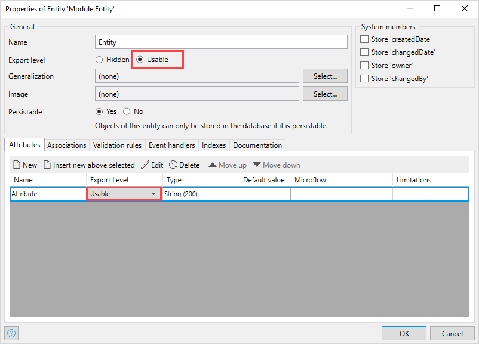

## 1 Introduction

Add-on and solution modules are a special kind of modules that add functionality to your app. They have Intellectual Property (IP) protection enabled and have the *.mxmodule* extension. For more information on IP protection, see [IP Protection](/appstore/creating-content/sol-ip-protection). 

The main *difference* between an add-on and a solution module is their purpose. An add-on module is developed to be a *stand-alone functionality* that others users can consume in the their apps, for example, an add-on can be a connector. 

Solution modules are *always part of a solution* – an app that can be used out of the box by the customers. Solution modules are dependent on each other and are inseparable.  

**Solution core** is a set of solution modules. 

## 2 Configuring Add-on and Solution Modules

You can mark an ordinary module as an add-on or solution module at any time, but we recommend to do so right-away when you start developing. All content of add-on and solution modules is set to be hidden from consumers (has IP protection enabled) by default. You can then decide what parts of the module you would like to be usable, if any. For example, you can allow consumers to see how one of the microflows is configured or allow consumers to use certain entities and attributes. 

You need to mark those document/elements as usable individually. For more information on what documents and elements are supported, see the [Supported Documents](#supported-documents) section below. 

Do the following:

1. In the App Explorer, double-click **Settings** of a module that you would like to set as an add-on or solution module. 

2. In the **Module settings** dialog box, select the type of the module and click **OK**. Add-on module will have the letter A as an icon, and solution module – the letter S. 

3. Open the document/element that you would like to make usable.

2. Navigate to its properties.

3. Set the **Export level** property to **Usable**:

   
   

You can see that documents/elements that are marked as usable have an eye icon, this means the document is part of the API. The domain model gets an eye icon if any entities are marked as usable. 

When configuring add-on or solution modules, visual indicators are available to help you identify the type of the module, as well as export level of documents and elements. At the module level, an A letter for the add-on module and S letter the solution module indicates the module type. It also activates the consistency checks for accessibility of add-on/solution module and its elements. An eye icon against a document/element shows you that they are marked as usable, this means the document is part of the API. The domain model gets an eye icon if any entity is marked as usable. 

### 2.1 Supported Documents {#supported-documents}

The following documents and elements are supported for use in add-on and solution modules:

* Domain Model:

    * Entity and attributes

    * Association
* Microflow (only the actions referring to document types that are supported in add-on and solution modules)
* Rules
* Enumeration
* Constants
* Java Action
* Integration (the **Export type** can be **Hidden** only):

    * Published rest service (Consume Rest Service microflow action is also supported)
    * Consumed web service
    * Message definitions
    * Import mapping
    * Export mapping
    * JSON structure
    * XML schema
* Scheduled Events (the **Export type** can be **Hidden** only)
* Regular expressions
* Image collections
* Custom widgets

{}

If the element or document cannot be used in the add-on or solution module, the **Export level** property will not be shown. 

{}

## 3 Exporting Add-on Modules and Solutions

### 3.1 Exporting Add-on Module Package

To export the add-on module, right-click it in the App Explorer and select **Export add-on module package**: 

It is possible to add additional files in an add-on module package. You can select them during export and they will be imported. Only included userlib (jar) files will be added to the output structure upon deployment:

The add-on module gets an *.mxmodule* extension.

### 3.2 Exporting Solution Package

Solution package is an app package that will be distributed as an out-of-the-box solution. It has a **solution core** that consists of solution modules. It can also consist of ordinary and add-on modules. For more information, see [Add-on and Solution Modules](add-on-and-solution-modules). 

To export a solution, right-click the name of the app in the **App Explorer** and select **Export app package** or open the **File** menu > **Export App Package**. For more information, see [Export App Package](export-app-package-dialog).

## 4 Updating Add-on and Solution Modules

## 5 Consuming Add-on Modules and Solutions

{}

When consuming an add-on or a solution, Studio should be disabled for your app. 

{}

An example of an add-on module is the **MS Teams Connector** module. For more information on this module, see [MS Teams Connector](/appstore/app-services/ms-teams-connector).

When you download an add-on module, it shows up in the **Add-ons** folder in the App Explorer. The main difference of the add-on module is that the implementation details of some functionality and elements, such as microflows, are *hidden* from consumers so that IP is protected. This means that add-on modules have a clear API: you know which elements you can use. For example, when you open a microflow, you will see its API including the microflow and parameter documentation. You cannot see how the microflow is built, but you are able to use it in your app, for example, you can call the microflow with protected implementation from another microflow:

You also might not see the full domain model of the module, only entities, attributes, and associations that were specifically exposed by the publisher. The visible parts of the domain model are intended to be reused; hidden elements are not needed for proper use of the module.

{}

Mendix Studio does not currently support add-on modules, you will not be able to open apps that use add-on modules in Studio.

{}

## Importing an Add-on Module to Your App

There are several ways to import an add-on module from the Marketplace. For more information, see the [Installing Marketplace Content](/appstore/general/app-store-content#install) section in *Use Marketplace Content in Studio Pro*.

You can also add an add-on module to your app not through the Marketplace. For more information, see the [Importing Module Package](/howto/integration/importing-and-exporting-objects#import-module) section in *How to Import & Export Objects*. 

## Deleting a Consumed Add-on Module from Your App

To delete an add-on module, do the following:

1. Go to  **App** > **Show App Directory in Explorer** to open the app folder.
2. Browse to the **modules** folder and remove the *mxmodule* file from there.

The module is deleted from your app.

## Read More

* [IP Protection](/appstore/creating-content/sol-ip-protection)
* [Use Marketplace Content in Studio Pro](/appstore/general/app-store-content)
* [How to Import & Export Objects](/howto/integration/importing-and-exporting-objects)

