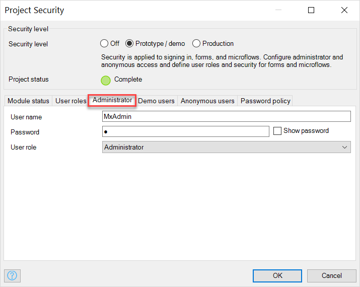

## 1 Introduction

In the **Administrator** tab of the **Project Security**, you can change the default credentials and a user role for the Administrator user:

## 2 Administrator Properties

In the **Administrator** tab the following properties are available:

* [User name](#user-name)
* [Password](#password)
* [User role](#user-role)

### 2.1 User Name {#user-name}

The user name is used to sign into the application as the Administrator.

Default: *MxAdmin* 

Since this is general knowledge, it is safer to change this to a custom username.

### 2.2 Password {#password}

The password is used to sign into the application as the Administrator. Click **Show password** to see the password. 

Default: *1*

This password is only used when Mendix is running locally. You can change the password for you other environments in [https://sprintr.mendix.com/](the Mendix portal) at your app's environment.

### 2.3 User Role {#user-role}

The user role assigned to the Administrator. For more information, see [User Roles](user-roles). 

Default: *Administrator*

{}

The administrator is always created and has the System.Administrator role by default. The System.Administrator role allows users of your application to be managed. 
For Free Apps, the user that created the application automatically has this role by default as well so you can use it to manage your users in that environment.
This role may be helpful in case you have exceeded your user license restriction in which case you can use any user that has this System.Administrator role to sign in to manage your users.

{}

## 3 Read More

* [Project Security](project-security)
* [User Roles](user-roles)
* [Demo Users](demo-users)
* [Anonymous Users](anonymous-users)
* [Password Policy](password-policy)
