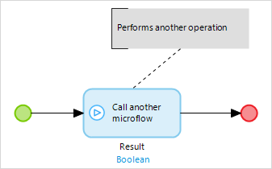

## 1 Introduction

An annotation flow is a connection that can be used to link an annotation to a flow object(s).

## 2 Example

This is an annotation flow linking an annotation and a microflow call activity:

