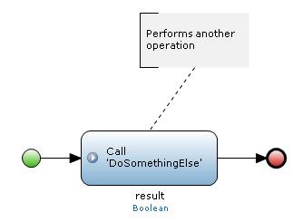

## 1 Introduction

An annotation is an element that can be used to put comments in a flow.

{}

Currently you warn users of unpaid orders with a pop-up message in the client. Later you want to extend this warning with an e-mail message send to the user. To remember this you can use an annotation and put it beside the current activity that warns the user.

{}

## 2 Common Properties

### 2.1 Caption

For details, see [Microflow Element Common Properties](microflow-element-common-properties).

## 3 Annotation Flow

An annotation flow is a connection that can be used to link an annotation to a flow object(s).

For example, this is an annotation flow linking an annotation and a microflow call activity:

