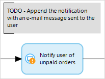

An annotation is an element that can be used to put comments in a microflow.

{}

Currently you warn users of unpaid orders with a popup message in the client. Later you want to extend this warning with an e-mail message send to the user. To remember this you can use an annotation and put it beside the current activity that warns the user.

{}

## Common Properties

### Caption

See [Microflow Element Common Properties](microflow-element-common-properties).
