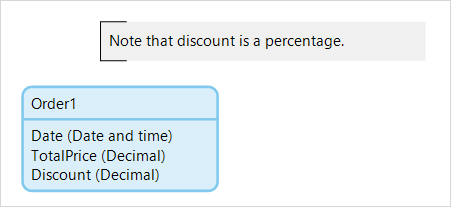

## 1 Introduction

An **annotation** can be used to add comments to a domain model.

For example, an order entity contains two decimal attributed, **TotalPrice** and **Discount** attribute. You add an annotation to note that, unlike the total price, the discount represents a percentage and not an amount of money.

## 2 Common Properties

### 2.1 Caption

The caption property contains the text of the annotation.
