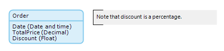

An annotation is an element that can be used to put comments in a domain model.

{}

An order entity contains both a total amount and a discount attribute. You add an annotation to mention the fact that, unlike the total price, the discount is represented by a percentage and not an amount of money.

{}

## Common Properties

### Caption

The caption property contains the text of the annotation.
