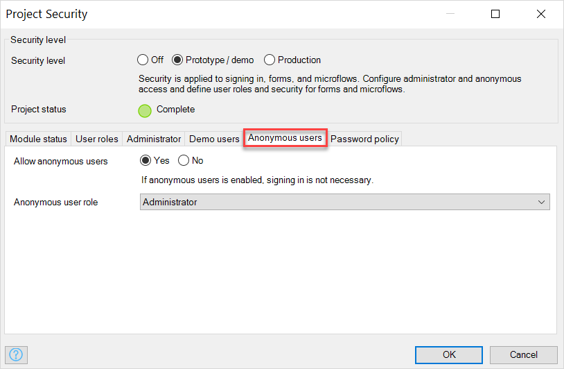

## 1 Introduction

You can use anonymous users to allow end-users access your application without having to sign in. You can restrict the data that anonymous users can view and access by assigning a specific user role to them. 

## 2 Anonymous Users Properties

Open **App Security** > the **Anonymous users** tab to access the properties:

The properties of anonymous users are described in the table below:

| Property              | Description                                                  |
| --------------------- | ------------------------------------------------------------ |
| Allow anonymous users | When **Yes** is selected, anonymous users are allowed. End-users do not have to sign in to access the application.  When **No** is selected, anonymous users are not allowed. End-users have to sign in to access the application. |
| Anonymous user role   | The user role that end-users of your application have when they are not signed in. This tells the application which role should be automatically applied to anonymous users who access the app. The **Allow anonymous users** property should be set to **Yes** to select an anonymous user role. |

## 3 Read More

* [App Security](project-security)
* [User Roles](user-roles)
* [Administrator](administrator)
* [Demo Users](demo-users)
* [Password Policy](password-policy)

