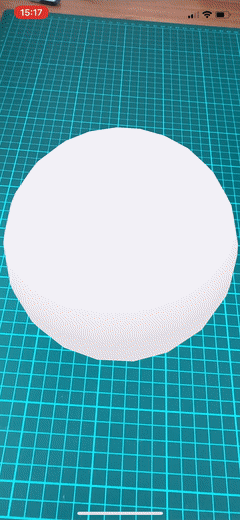

## 1 Introduction

This reference guide will place the Augmented Reality (AR) widgets into context, as well as explain how they can be used
to create AR experiences. The following terms will be used frequently:

* Augmented reality (AR): adding virtual objects to the real world, through the mobile phone camera view
* AR scene: the place where all objects are placed in
* Billboard: describes the rotation behaviour of an object, where it will always face the camera
* Origin: the starting position, specifically (0,0,0)

## 2 Overview of AR Widgets

There are 9 total AR Widgets. Some are structure widgets, while others are visual widgets:

Structure  widgets:

1.  **Containter (AR)**
2.  **Image Tracker (AR)**
3.  **Plane Selector (AR)**
4.  **Node (AR)**

Visual widgets:

5.  **3D Object (AR)**
6.  **Text (AR)**
7.  **Cube (AR)**
8.  **Sphere (AR)**
9.  **Square (AR)**

## 3 Structure Widgets 

This are the AR widgets that can contain other widgets:

* **Container (AR)**
* **Image Tracker (AR)**
* **Plane Selector (AR)**
* **Node (AR)**

These widgets do not necessarily add something visual to the AR scene. Instead, they provide functionality or allow you to group other widgets. Structure  widgets function as new starting points for the widgets embedded in them. When you start an AR app, the location of your phone serves as the origin.

### 3.1 Container (AR)

Starts the AR camera view, and contains all other AR widgets. This widget is the start of every AR app.

### 3.2 Image Tracker (AR)

**ImageTracker (AR)** takes an image to track, when this image is found in the camera view it becomes the new origin of
every AR widget that is embedded in it. For example, if you use a **ImageTracker (AR)** to recognize an image, and put a
**Cube (AR)** in it, the cube will start in the exact middle of your image:

{}{}

### 3.3 Plane Selector (AR)

**PlaneSelector (AR)** finds surfaces that could fit your specified size. A user first scans their room by walking around the room with their phone while scanning. During this, all the surfaces are found and checked for size. On the large enough surfaces, an object similar to **Square (AR)** is shown and can be clicked to be selected. This will then be the starting point of embedded widgets.

### 3.4 Node (AR)

A **Node (AR)** can help group other widgets. Everything embedded in a **Node (AR)** can be oriented with fixed distances and rotations from eachother. **Node (AR)** also has a feature that can make the objects in it 'billboard' to the camera, which is useful for UI like elements. To see an example of this, check **AR-Examples** > **Car Color Picker** and note the the spheres above the car.

## 4 Visual widgets

Visual widgets are widgets that add a virtual object to the scene.

### 4.1 Cube (AR)

### 4.2 Sphere (AR)

### 4.3 Square (AR)

### 4.4 3D Object (AR)

Beyond using simple 3D objects, there are also ways to add more complex and custom objects to your scene. The 3D object widget takes either a URL or a FileDocument (you have to upload its model later). There are currently 3 types supported: *.obj*, *.gltf*, and *.glb*. Each with their own benefits. Using a custom material like with the simple visual widgets is only supported in the *.obj* format.

### 4.5 Text (AR)

**Text (AR)** can be used to have 3D or 2D text floating in space. It is best practice to add only a few lines of text to the scene in this way. Bigger paragraphs are better communicated through a 2D textfield on another place in your app.

## 5 Common Properties

All AR widgets share these properties:

* Position
* Rotation
* Scale
* Material
* Interaction

### 5.1 Position

**Position** describes where an object should be. In AR, position can be a bit confusing. This is why most positioning is relative to a parent node.

This means that the origin of (0,0,0) is in the middle of either the **ImageTracker (AR)**, or (0,0,0) is exactly where the user tapped
on the **PlaneSelector (AR)**. 

It is possible to set a position on visual widgets that is not relative by adding the widget directly into the **Container (AR)**. The 0,0,0 position is then exactly where the camera starts at the beginning of the scene. After the scene has started, the position will not move along with the camera anymore.

### 5.2 Rotation

**Rotation** can be used to turn an object on three different axes. When using rotation for custom 3D objects it will turn around the pivot point of the 3D file — the center of the object is not automatically selected.

### 5.3 Scale

**Scale** is used for setting the size of objects. Widgets that have a set object (**Cube (AR)**, **Sphere (AR)**, or **Square (AR)**) will have a size of 1 or 2 meters. Objects that are added through the 3D Object widget might not conform to that standard unless they are correctly exported with the 1 unit = 1 meter scale. Without that standard scale, objects added with the 3D Object widget can be much larger or smaller than what the scale is set to.

### 5.4 Material

The **Material** tab sets things like color and also the realism of the object that has to be rendered. For example, setting the rendering mode to PBR will enable physically-based rendering (do not forget to set an HDR image as the reflection map and lightsource in the **Container (AR)**).

**Material** configurations actually render a 3D element in the camera view. **Cube (AR)**, **Sphere (AR)**, and **Square (AR)** each render a simple 3D object. Only the **Square (AR)** widget can sometimes be invisible from one side. The simple visual widgets come with a way to customize them through scale and material. A material for a 3D object describes what it should look like — think of it like styling. You can add a texture(image), color, different lighting, or even a video to play on the 3D object. The only difference between these objects is in appearance — the configuration is the same on each widget.

### 5.5 Interaction

Interaction is used for all actions your 3D objects can do that interact with the environment or the user.

#### 5.5.1 Physics

Physics allows your 3D object to react to the world, using gravity, or other object using the collision event. Note that the real world environment will not automatically stop your 3D object from falling when gravity is enabled. You have to add these objects yourself. These are the different physics types: 

* **Kinematic** — Objects with this physics type can only be moved by user input, not by other objects in the scene.
* **Dynamic** — Dynamic objects can be moved both by user input and by other objects in the scene. For example, if another object with gravity
falls onto this object, the object will move. 
* **Static** — Static objects will never move and cannot move through any physics interactions. Static objects can still be moved when specifically changing the position on them.

#### 5.5.2 Dragging

By enabling dragging users can move this object around in their space. The dragging type allows users to either have the
object at the same distance when they are dragging it. Effectively this means the object is 'stuck' to the phone while
they move it around. By changing the type to fixed to world, the object will now be stuck to floors and walls while the
user drags it around.

#### 5.5.3 Pinching

By enabling pinching, and selecting pinch to scale, you allow the user to scale the object through the pinching gesture.
