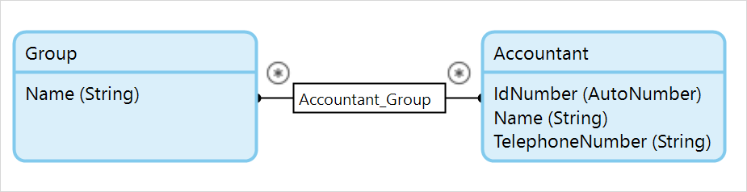

## 1 Introduction

An association describes a relation between entities. In the domain model, an association is represented by a line or arrow between two entities.

The value of the association can only be viewed or edited from the object of the entity that is the _[owner](association-properties#owner)_ of the association. Either one entity or both entities can be the owner of the association. If one entity is the owner, there is an arrow that points from the owner to the other entity. If both entities are owners, there is a line between the two entities.

The [multiplicity](#multiplicity) (or number of referred objects) of an association is indicated by the number one (`1`) or a star (`*`) at either side of the association.

In the example below, the arrow indicates that **Order** is the owner of the association, and the `1` and `*` indicate that one customer is associated with many orders:


{}
An association between a persistable entity and a non-persistable entity must start in the non-persistable entity and have the owner **Default**. For more information on persistable and non-persistable entities, see [Persistability](persistability).
{}

## 2 Editing Associations

There are two ways of editing an association.

### 2.1 Edit the Association Directly

You can edit the association itself. 


For more information see [Association Properties](associations).

### 2.2 Edit from Associations in the Entity

You can edit the associations as members of the entity.


For more information see [Association Member Properties](association-properties).

## 3 Association Examples{#examples}

### 3.1 One to Many Association

Drawing an association from the **Order** entity to the **Customer** entity results in the following:


The type property has its default value `Reference`. In this example, a customer can have multiple orders, and an order can only have one customer.

In XML, instances of these entities and their association look as follows (note that the association is only stored in the **Order** element):

```xml
<Order id="101">
	<number>1</number>
	<date>9/30/2008</date>
	<Order_Customer>id_201</Order_Customer>
</Order>

<Customer id="201">
	<fullname>Apple Inc.</fullname>
	<address>1 Infinite Loop</address>
	<telephonenumber>1-800-MY-APPLE</telephonenumber>
</Customer>

```

### 3.2 Many to Many Association (Default Ownership)

A many-to-many association with default ownership is created by drawing an association and then setting the `Type` property to `Reference set`.

In this example, a **Customer** can have multiple **Groups**, and a **Group** can have multiple **Customers**:


In XML, instances of these entities and their associations look as follows (note that the association is only stored in the **Customer** element):

```xml
<Customer id="201">
	<fullname>Apple Inc.</name>
	<address>1 Infinite Loop</address>
	<telephonenumber>1-800-MY-APPLE</telephonenumber>
	<Customer_Group>id_301 id_302</Customer_Group>
</Customer>

<Group id="301">
	<name>Multinational corporations</name>
</Group>

<Group id="302">
	<name>Hardware suppliers</name>
</Group>

```

### 3.3 One to One Association

A one-to-one association is created by setting the owner property to `Both` (while leaving the type property at its default value `Reference`).

In this example, a **Customer** can have one **Profile**, and a **Profile** can have one **Customer**:


In XML, instances of these entities and their associations look as follows (note that the association is stored both in the **Profile** element and the **Customer** element):

```xml
<Profile id="401">
	<religion>Buddhism</religion>
	<job>Chief Executive Officer</job>
	<website>http://www.apple.com/ </website>
	<Customer_Profile>id_201</Customer_Profile>
</Profile>

<Customer id="201">
	<fullname>Steve Jobs</fullname>
	<address>1 Infinite Loop</address>
	<telephonenumber>1-800-MY-APPLE</telephonenumber>
	<Customer_Profile>id_401</Customer_Profile>
</Customer>

```

### 3.4 Many to Many Association (Both Owners)

A many-to-many association where both entities are owners is created by setting the owner property to `Both` and the type property to `Reference set`.

In this example, an **Accountant** can have multiple **Groups** and a **Group** can have multiple **Accountants**:

{}
{}

In XML, instances of these entities and their association look as follows (note that the association is stored both in the **Accountant** element and the **Group** element):

```xml
<Accountant id="501">
	<idnumber>1</idnumber>
	<name>Earl Grey</name>
	<telephonenumber>1-800-EARL-GREY</telephonenumber>
	<Accountant_Group>id_301 id_302</Accountant_Group>
</Accountant>

<Accountant id="502">
	<idnumber>2</idnumber>
	<name>Scrooge McDuck</name>
	<telephonenumber>1-800-SCROOGE-MCDUCK</telephonenumber>
	<Accountant_Group>id_301 id_302</Accountant_Group>
</Accountant>

<Group id="301">
	<name>Multinational corporations</name>
	<Accountant_Group>id_501 id_502</Accountant_Group>
</Group>

<Group id="302">
	<name>Hardware suppliers</name>
	<Accountant_Group>id_501 id_502</Accountant_Group>
</Group>

```
