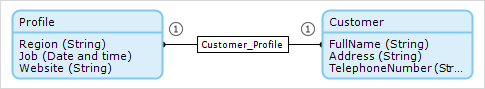

## 1 Introduction

An association describes a relation between entities. In the domain model, an association is represented by a line or arrow between two entities.

The value of the association can only be viewed or edited from the object of the entity that is the _[owner](associations#owner)_ of the association. Either one entity or both entities can be the owner of the association. If one entity is the owner, there is an arrow that points from the owner to the other entity. If both entities are owners, there is a line between the two entities.

The [multiplicity](#multiplicity) (or number of referred objects) of an association is indicated by the number one (`1`) or a star (`*`) at either side of the association.

In the example below, the arrow indicates that **Order** is the owner of the association, and the `1` and `*` indicate that one customer is associated with many orders:

{}

An association between a persistable entity and a non-persistable entity must start in the non-persistable entity and have the owner **Default**. For more information on persistable and non-persistable entities, see [Persistability](persistability).

{}

## 2 Association Properties

If you double-click an association, its properties are opened. 

Associations have the following properties:

* [Name](#name) 
* [Documentation](#documentation)
* [Multiplicity](#multiplicity)
* [Navigability](#navigability)
* [Delete Behavior](#delete-behavior)

### 2.1 Name {#name}

The name of the association is used to refer to it from forms, microflows, etcetera.

### 2.2 Documentation {#documentation}

You can write notes and documentation on this element in this field. 

### 2.3 Multiplicity {#multiplicity}

Multiplicity defines the number of possible referred objects. It is indicated by the number one (`1`) or a star (`*`) at either side of the association.

Multiplicity can be of the following types:

| Multiplicity | Meaning | Equivalent of |
| --- | --- | --- |
| One-to-one | One X object is associated with one Y object | An association of type **Reference** with owner set to **Both** |
| One-to-many | One X object is associated with multiple Y object | An association of type **Reference** with owner set to **Default** |
| Many-to-many | Multiple X objects are associated with multiple Y objects |  An association of type **Reference set** – in this case ownership is set by the **Navigability** property |

For more information about association types, see the [Type](associations#type) section in *Associations*, and for information on ownership, see the [Owner](associations#owner) section in *Associations*.

### 2.4 Navigability {#navigability}

Navigability changes the owner of many-to-many associations. Navigability has the following options:

| Navigability | Meaning | Equivalent of |
| --- | --- | --- |
| X objects refer to Y objects | The owner of the association is X | An association of type **Reference set** with owner set to **Default** |
| X and Y objects refer to each other | Both entities are owners | An association of type **Reference set** with owner set to **Both** |

This corresponds to the **Owner** property for **Reference sets** as described in the [Owner](associations#owner) section of *Associations*.

Despite it's name, navigability is usually only important when changing associations. Making one object owner of an association does not prevent you reading the association from the non-owner end.

### 2.5 Delete Behavior {#delete-behavior}

Delete behavior defines what should happen to the associated object when an object is deleted. The following options can be configured for each end of the association.

| Value | Description |
| --- | --- |
| Delete {name of entity} object but keep {name of other entity} object(s) | When an object is deleted, the associated object(s) are not deleted. |
| Delete {name of entity} object and {name of other entity} object(s) as well | When an object is deleted, the associated object(s) are also deleted. |
| Delete {name of entity} object only if it is not associated with {name of other entity} object(s) | An object can only be deleted if it is not associated with any other object(s). |

Default: *delete {name of entity} object but keep {name of other entity} object(s)*

This delete behavior is used if you want to delete any associated **Profile** when a **Customer** is deleted:

This delete behavior is used if you want to be able to delete a **Customer** only if it is not associated with any **Order**:

## 3 Read More

* [Associations](associations)
