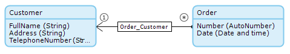
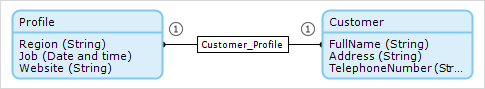
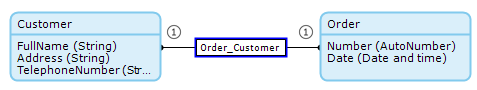

## 1 Introduction

An association describes a relation between entities. In the domain model, an association is represented by a line or arrow between two entities.

The value of the association can only be viewed or edited from the object of the entity that is the _owner_ of the association. Either one entity or both entities can be the owner of the association. If one entity is the owner, there is an arrow that points from the owner to the other entity. If both entities are owners, there is a line between the two entities.

The cardinality (or number of referred objects) of an association is indicated by the number one (`1`) or a star (`*`) at either side of the association.

The arrow here indicates that **Order** is the owner of the association, and the `1` and `*` indicate that one customer is associated with many orders:

An association between a persistable entity and a non-persistable entity must start in the non-persistable entity and have the owner **Default**. For more information on persistable and non-persistable entities, see [Persistability](persistability).

## 2 Association Properties

If you double-click an association, its properties are opened. Associations have the following properties:

* Name – the name of the association is used to refer to it from forms, microflows, XPath constraints, etcetera
* Documentation
* Multiplicity
* Navigability
* Delete Bahavior

### 2.1 Name

The name of the association is used to refer to it from forms, microflows, etcetera.

### 2.2 Documentation

### 2.3 Multiplicity

Multiplicity defines the number of possible referred objects. The cardinality (or number of referred objects) of an association is indicated by the number one (`1`) or a star (`*`) at either side of the association.

Multiplicity can be of the following types:

* One-to-one – one X object is associated with one Y object
* One-to-many – one X object is associated with multiple Y object
* Many-to-many – multiple X objects are associated with multiple Y objects

Multiplicity shows the owner and the direction of association if the association is of the one-to-many or many-to-many type. In case the association is one-to-one, both entities are owners. For more information about ownership, see

### 2.4 Navigability 

Navigability changes the owner of many-to-many associations. Navigability has the following options:

* X objects refer to Y objects  – the owner of the association is X
* X and Y objects refer to each other – both entities are owners

### 2.5 Delete Behavior

Delete behavior defines what should happen to the associated object when an object is deleted. The following options can be configured for each end of the association.

| Value | Description |
| --- | --- |
| delete {name of entity} object but keep {name of other entity} object(s) | When an object is deleted, the associated object(s) are not deleted. |
| delete {name of entity> object and {name of other entity} object(s) as well | When an object is deleted, the associated object(s) are also deleted. |
| delete {name of entity> object only if it is not associated with {name of other entity} object(s) | An object can only be deleted if it is not associated with any other object(s). |

* *Default value*: delete {name of entity} object but keep {name of other entity} object(s)

This delete behavior is used if you want to delete any associated **Profile** when a **Customer** is deleted:

This delete behavior is used if you want to be able to delete a **Customer** only if it is not associated with any **Order**:

## 3 Related Content

* [Associations](associations)