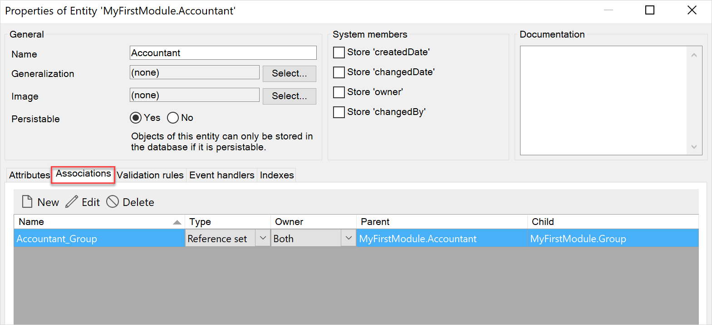
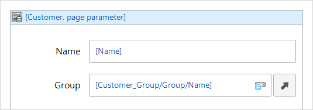
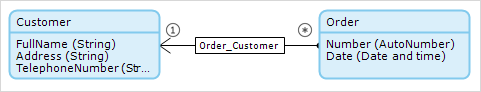
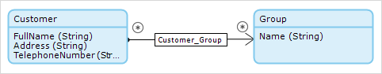
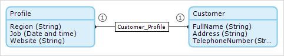
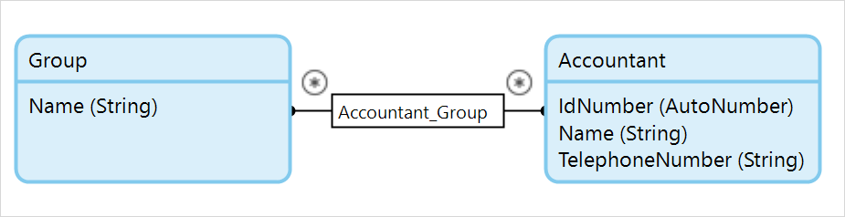

## 1 Introduction

The **Associations** tab is a tab in the entity properties and has the following settings:

* [Name](#name) 
* [Type](#type)
* [Owner](#owner)
* [Parent/Child](#parent-child)  



For more information on associations, see [Association and Their Properties](association-properties). 

## 2 Name {#name}

The name of the association is used to refer to it from forms, microflows, XPath constraints, etcetera.

## 3 Type {#type}

This property defines whether an association is a reference (single) or a reference set (plural).

| Value | Description |
| --- | --- |
| Reference *(default)* | Single: an object of the owning entity refers to zero or one objects of the other entity. |
| Reference set | Plural: an object of the owning entity refers to zero or more objects of the other entity. |

{}

The examples for this property are combined with the example of the owner property below.

{}

## 4 Owner {#owner}

This property defines whether an association has one or two owners. If there is one owner, the owner is located at the start of the arrow.

| Value | Description |
| --- | --- |
| Default *(default)* | Only one entity is the owner (the parent). |
| Both | Both entities are owners. |

Ownership is important as it defines two aspects of an association:

* how cardinality (many or one) is controlled
* where the association is recorded

### 4.1 Cardinality

Cardinality refers to counting the number of associations an object can have. To ensure that an object can count the occurrences of a particular association it needs to have ownership of the association.

So, for a one-to-many association the *many* end owns the association to ensure that it can only associate with *one* object. For a one-to-one association, both ends own the association. For a many-to-many relationship cardinality is not important.

### 4.2 Association Recording

An association is recorded in the object which owns it. If both objects own the association, then the association is recorded with both objects. You can see examples of where the associations are recorded in the [Association Examples](#examples) section, below.

Where the association is recorded has an important impact on the user of reference and reference set selectors in your app. The selector can only be inside a data view containing the _owning_ object. This is because it is only when you commit the owning object that the association is recorded.

For example, imagine you have a many-to-many association, **Customer_Group**, between **Customer** and **Group** owned by the Customer entity. You can put an input reference set selector to select Groups from within a Customer data view. However you _cannot_ put an input reference set selector to select Customers from within a Group data view.



If both ends own the association, you can overcome this limitation. However, this has to be balanced by the overhead associated with having to commit all entities where the association is recorded. Therefore, it is recommended that many-to-many relationships are owned by the **Default** entity, unless there is a strong business reason for needing to add the association from either end in your Mendix app.

Note that only recording the association on one of the entities does not affect your ability to navigate the association from both ends. However, it may be slower to navigate from the non-owning end.

## 5 Type & Owner Relation to Multiplicity & Navigability {#types}

**Type** and **Owner** properties of an entity are related to [Multiplicity](association-properties#multiplicity) and [Navigability](association-properties#navigability) properties of an association. When you change **Type** or **Owner**, you change **Multiplicity** and **Navigability** as well. 

You can find correspondence between **Type**/**Owner** and **Multiplicity**/**Navigability** in the table below.

| **Multiplicity** | **Navigability** | Type          | Owner   |
| -----------------|----------------- | ------------- | ------- |
| One-to-one     | —      | Reference     | Both    |
| One-to-many     | —     | Reference     | Default |
| Many-to-many     | X objects refer to Y objects | Reference set | Default |
| Many-to-many     | X and Y objects refer to each other | Reference set | Both    |

For more information on multiplicity and navigability, see the [Multiplicity](association-properties#multiplicity) and [Navigability](association-properties#navigability) sections in *Associations and Their Properties*.

## 6 Parent/Child {#parent-child}

Parent and child settings show you the direction of the association. Parent defines the entity the association starts from, and child defines the entity the association ends with.

## 7 Association Examples{#examples}

Drawing an association from the **Order** entity to the **Customer** entity results in the following:



The type property has its default value `Reference`. In this example, a customer can have multiple orders, and an order can only have one customer.

In XML, instances of these entities and their association look as follows (note that the association is only stored in the **Order** element):

```xml
<Order id="101">
	<number>1</number>
	<date>9/30/2008</date>
	<Order_Customer>id_201</Order_Customer>
</Order>

<Customer id="201">
	<fullname>Apple Inc.</fullname>
	<address>1 Infinite Loop</address>
	<telephonenumber>1-800-MY-APPLE</telephonenumber>
</Customer>

```

A many-to-many association with default ownership is created by drawing an association and then setting the `Type` property to `Reference set`.

In this example, a **Customer** can have multiple **Groups**, and a **Group** can have multiple **Customers**:



In XML, instances of these entities and their associations look as follows (note that the association is only stored in the **Customer** element):

```xml
<Customer id="201">
	<fullname>Apple Inc.</name>
	<address>1 Infinite Loop</address>
	<telephonenumber>1-800-MY-APPLE</telephonenumber>
	<Customer_Group>id_301 id_302</Customer_Group>
</Customer>

<Group id="301">
	<name>Multinational corporations</name>
</Group>

<Group id="302">
	<name>Hardware suppliers</name>
</Group>

```

A one-to-one association is created by setting the owner property to `Both` (while leaving the type property at its default value `Reference`).

In this example, a **Customer** can have one **Profile**, and a **Profile** can have one **Customer**:



In XML, instances of these entities and their associations look as follows (note that the association is stored both in the **Profile** element and the **Customer** element):

```xml
<Profile id="401">
	<religion>Buddhism</religion>
	<job>Chief Executive Officer</job>
	<website>http://www.apple.com/ </website>
	<Customer_Profile>id_201</Customer_Profile>
</Profile>

<Customer id="201">
	<fullname>Steve Jobs</fullname>
	<address>1 Infinite Loop</address>
	<telephonenumber>1-800-MY-APPLE</telephonenumber>
	<Customer_Profile>id_401</Customer_Profile>
</Customer>

```

A many-to-many association where both entities are owners is created by setting the owner property to `Both` and the type property to `Reference set`.

In this example, an **Accountant** can have multiple **Groups** and a **Group** can have multiple **Accountants**:

{}
{}

In XML, instances of these entities and their association look as follows (note that the association is stored both in the **Accountant** element and the **Group** element):

```xml
<Accountant id="501">
	<idnumber>1</idnumber>
	<name>Earl Grey</name>
	<telephonenumber>1-800-EARL-GREY</telephonenumber>
	<Accountant_Group>id_301 id_302</Accountant_Group>
</Accountant>

<Accountant id="502">
	<idnumber>2</idnumber>
	<name>Scrooge McDuck</name>
	<telephonenumber>1-800-SCROOGE-MCDUCK</telephonenumber>
	<Accountant_Group>id_301 id_302</Accountant_Group>
</Accountant>

<Group id="301">
	<name>Multinational corporations</name>
	<Accountant_Group>id_501 id_502</Accountant_Group>
</Group>

<Group id="302">
	<name>Hardware suppliers</name>
	<Accountant_Group>id_501 id_502</Accountant_Group>
</Group>

```

## 8 Read More

* [Associations and Their Properties](association-properties)
* [Entities](entities)
