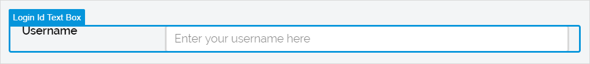
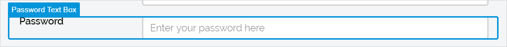
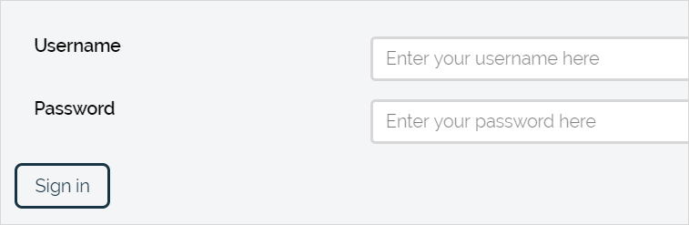
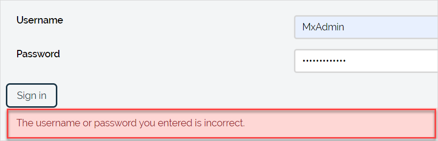

## 1 Introduction

Authentication widgets are used to sign users in and log them out. 

Use a [navigation profile setting](navigation#authentication) to direct users to the correct authentication page.

The **Authentication** category contains the following widgets:

* [Login ID text box](login-id-text-box) – allows users to provide a login id for authentication

    

* [Password text box](password-text-box) – allows users to provide a password for authentication

    

* [Sign-in button](sign-in-button) – sends a user’s login id and password to the server for authentication
    

* **Sign-out button** – signs the currently signed-in user out. The sign-out button is a button with an on-click event set to **Sign out**. For more information on on-click events, see the [On Click Event & Events Section](on-click-event). For details on button properties. see [Button Properties](button-properties).

* [Validation message](validation-message) – informs a user about authentication failures if any

    

## 2 Performing Basic Functions

{}

## 3 Read More

* [Page](page)
* [Pages](pages)